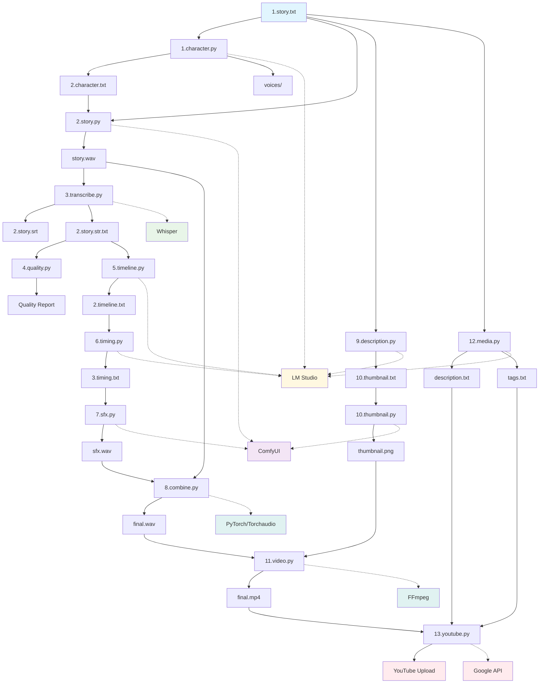
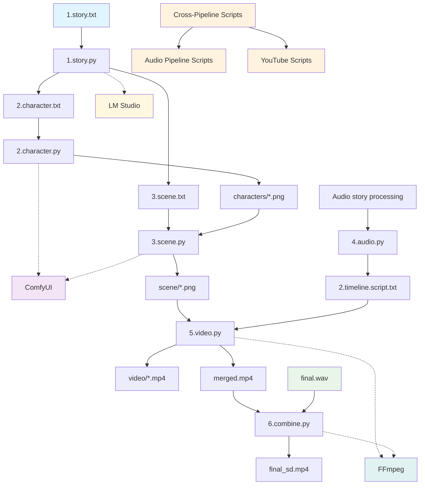
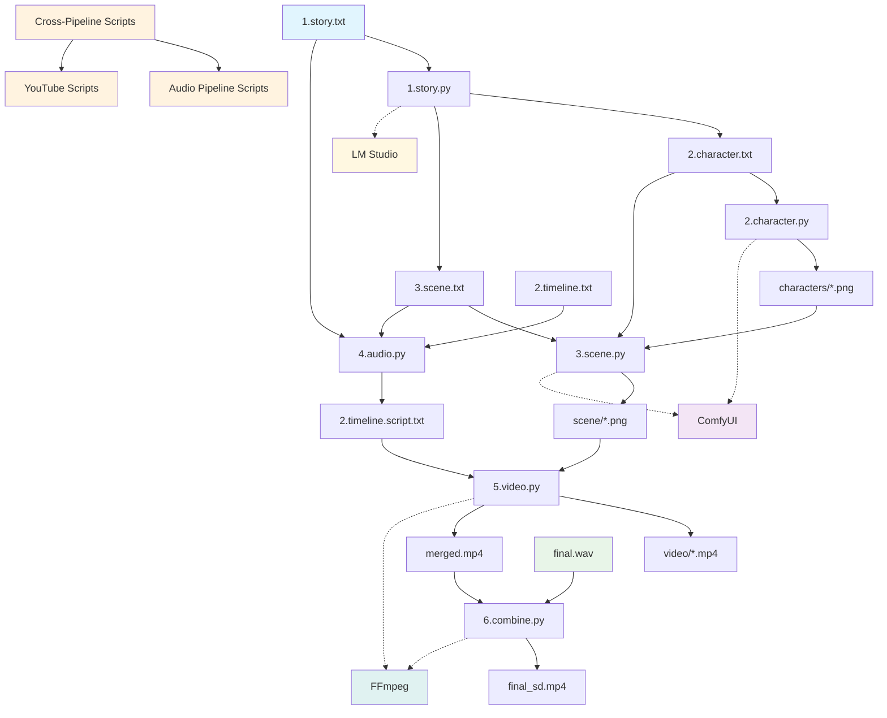
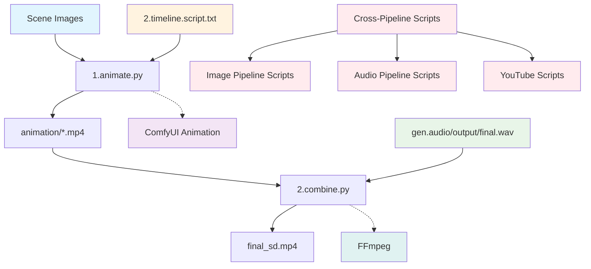
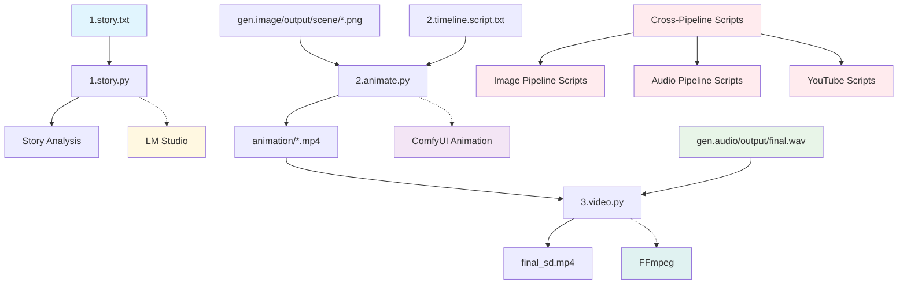

# AI Content Pipelines

A comprehensive AI-powered content generation system that creates narrated stories, character images, scene visualizations, and video content from text stories using ComfyUI workflows and LM Studio.

## 🎯 What It Does

Transform text stories into rich multimedia content:
- **🎵 Audio Stories** - Character voices, sound effects, and narration
- **🖼️ Visual Content** - Character portraits and scene images  
- **🎬 Video Production** - Animated videos with thumbnails
- **📺 YouTube Ready** - Automated upload with metadata
- **🔄 Resumable Operations** - Fault-tolerant processing with checkpoint recovery

## 🔧 System Architecture Overview

The AI Content Studio is built on a modular pipeline architecture with three main processing stages:

### Core Services
- **ComfyUI** (Port 8188) - AI model inference server for TTS, image generation, and video animation
- **LM Studio** (Port 1234) - Local language model (qwen/qwen3-14b) for text processing and content analysis
- **FFmpeg** - Video/audio processing and compilation
- **Whisper** - Audio transcription

### Pipeline Orchestration
Each pipeline (`gen.audio`, `gen.image`, `gen.video`) includes:
- **Service Management** - Automatic startup/shutdown of ComfyUI and LM Studio
- **Dependency Detection** - Smart service lifecycle management
- **Error Handling** - Graceful cleanup on failures
- **Logging** - Comprehensive execution tracking with performance metrics
- **Resumable Processing** - Checkpoint-based recovery from interruptions

## 🏗️ System Architecture

Three integrated pipelines work together:

```
Text Story → Audio Pipeline → Image Pipeline → Video Pipeline → YouTube
     ↓             ↓              ↓              ↓           ↓
 1.story.txt → final.wav → characters/*.png → animation/*.mp4 → Upload
```

### Pipeline Overview
- **Audio Pipeline** (`gen.audio/`) - 13 scripts for TTS, SFX, and video creation
- **Image Pipeline** (`gen.image/`) - 6 scripts for character/scene generation  
- **Video Pipeline** (`gen.video/`) - 3 scripts for animation and compilation

## 🔄 Resumable Processing System

The AI Content Studio features a robust resumable processing system that allows operations to be interrupted and resumed without losing progress. This is particularly valuable for expensive AI generation tasks that can take hours to complete.

### Resumable Features

#### Fault Tolerance
- **Checkpoint Recovery**: All expensive operations save progress to JSON checkpoint files
- **Interrupt Handling**: Scripts can be safely stopped (Ctrl+C) and resumed later
- **File Validation**: Cached results are validated to ensure files still exist on disk
- **Optional Cleanup**: Checkpoint files are preserved by default but can be deleted via `CLEANUP_TRACKING_FILES = True`

#### Supported Scripts
All major generation scripts now support resumable processing:

**Audio Pipeline:**
- ✅ `5.timeline.py` - SFX timeline generation
- ✅ `6.timing.py` - SFX timing refinement  
- ✅ `7.sfx.py` - Sound effect generation

**Image Pipeline:**
- ✅ `1.story.py` - Character/location generation
- ✅ `2.character.py` - Character image generation
- ✅ `3.scene.py` - Scene image generation

**Video Pipeline:**
- ✅ `2.animate.py` - Video animation generation

#### Usage Examples
```bash
# Normal resumable run
python 1.story.py

# Force start from beginning (ignores checkpoints)
python 2.character.py --force-start

# Combine with existing flags
python 7.sfx.py --force-start --auto-confirm y
```

#### Checkpoint Management
- **Location**: `../output/tracking/` directory in each pipeline
- **Naming**: Script-specific files (e.g., `1.story.state.json`, `2.character.state.json`)
- **Content**: JSON format with progress tracking and cached results
- **Lifecycle**: Automatically created, updated, and optionally cleaned up based on `CLEANUP_TRACKING_FILES` setting

#### Progress Tracking
- **Real-time Status**: Shows current progress on script startup
- **Completion Summary**: Displays completed vs. total operations
- **File Validation**: Ensures cached files still exist before skipping
- **Force Restart**: `--force-start` flag bypasses existing checkpoints

## 📁 Project Structure

```
.comfyui/
├── ComfyUI/                    # AI model server
│   ├── models/                 # AI models (TTS, image, video)
│   ├── custom_nodes/           # Extensions (TTS, GGUF, animation)
│   └── output/                 # Generated content
├── gen.audio/                  # Audio pipeline (13 scripts)
│   ├── generate.py             # Main orchestrator
│   ├── input/                  # 1.story.txt, voices/
│   ├── output/                 # final.wav, final.mp4, thumbnail.png
│   │   ├── tracking/           # Resumable checkpoints (*.state.json)
│   │   └── sfx/                # Generated SFX files
│   ├── scripts/                # Processing scripts
│   └── workflow/               # ComfyUI workflows
├── gen.image/                  # Image pipeline (6 scripts)
│   ├── generate.py             # Main orchestrator
│   ├── input/                  # Text descriptions
│   ├── output/                 # characters/, scene/, video/
│   │   └── tracking/           # Resumable checkpoints (*.state.json)
│   ├── scripts/                # Processing scripts
│   └── workflow/               # ComfyUI workflows
└── gen.video/                  # Video pipeline (3 scripts)
    ├── generate.py             # Main orchestrator
    ├── input/                  # Scene images
    ├── output/                 # animation/, final_sd.mp4
    │   ├── tracking/           # Resumable checkpoints (*.state.json)
    │   └── frames/             # Extracted frame files
    ├── scripts/                # Processing scripts
    └── workflow/               # Animation workflows
```

## 🚀 Quick Start

### Prerequisites
1. **ComfyUI** - AI model server for TTS, image, and video generation
2. **LM Studio** - Local language model (qwen/qwen3-14b) 
3. **FFmpeg** - Video/audio processing
4. **Python Dependencies** - `pip install -r requirements.txt`
5. **YouTube API** (optional) - For automated uploads

### Running Pipelines
```bash
# Audio Pipeline (13 scripts)
cd gen.audio && python generate.py

# Image Pipeline (6 scripts) 
cd gen.image && python generate.py

# Video Pipeline (3 scripts)
cd gen.video && python generate.py
```

### Resumable Operations
```bash
# Individual scripts with resumable processing
cd gen.image/scripts && python 1.story.py
cd gen.image/scripts && python 2.character.py --force-start
cd gen.audio/scripts && python 7.sfx.py --auto-confirm y

# Check progress and resume from interruptions
# Scripts automatically detect and resume from checkpoints
```

## 🎵 Audio Pipeline (13 Scripts)

**Purpose**: Generate narrated stories with sound effects and create YouTube-ready videos

**Resumable Scripts**: `5.timeline.py`, `6.timing.py`, `7.sfx.py`

### Workflow Overview
```
Story Text → Character Analysis → TTS → Transcription → SFX → Mixing → Video → YouTube
```

### Complete Script Inventory
| Script | Purpose | Input Files | Output Files | Dependencies |
|--------|---------|-------------|--------------|--------------|
| `1.character.py` | Character voice assignment & analysis | `1.story.txt`, `voices/` | `2.character.txt` | **LM Studio** |
| `2.story.py` | Generate main story audio | `1.story.txt`, `2.character.txt` | `story.wav` | **ComfyUI** |
| `3.transcribe.py` | Audio transcription | `story.wav` | `2.story.srt`, `2.story.str.txt` | Whisper |
| `4.quality.py` | Transcription quality check | `2.story.str.txt` | Quality report | None |
| `5.timeline.py` | SFX timeline generation | `2.story.str.txt` | `2.timeline.txt` | **LM Studio** |
| `6.timing.py` | SFX timing refinement | `2.timeline.txt` | `3.timing.txt` | **LM Studio** |
| `7.sfx.py` | Generate sound effects | `3.timing.txt` | `sfx.wav` | **ComfyUI** |
| `8.combine.py` | Mix audio (story + SFX) | `story.wav`, `sfx.wav` | `final.wav` | PyTorch/Torchaudio |
| `9.description.py` | Thumbnail description | `1.story.txt` | `10.thumbnail.txt` | **LM Studio** |
| `10.thumbnail.py` | Generate thumbnail image | `10.thumbnail.txt` | `thumbnail.png` | **ComfyUI** |
| `11.video.py` | Create final video | `final.wav`, `thumbnail.png` | `final.mp4` | FFmpeg |
| `12.media.py` | YouTube metadata | `1.story.txt` | `description.txt`, `tags.txt` | **LM Studio** |
| `13.youtube.py` | Upload to YouTube | `final.mp4`, `description.txt`, `tags.txt` | YouTube upload | Google API |

### Audio Pipeline Features
- **Character Voice Assignment**: Automatic gender detection and voice selection
- **TTS Generation**: Multi-character narration with voice consistency
- **SFX Integration**: AI-generated sound effects with precise timing
- **Audio Mixing**: Professional-grade audio combination using PyTorch/Torchaudio
- **YouTube Integration**: Automated upload with metadata generation

### Audio Pipeline Detailed Flowchart



## 🖼️ Image Pipeline

The image pipeline creates character portraits, scene visualizations, and processes audio timeline data for video generation.

**Resumable Scripts**: `1.story.py`, `2.character.py`, `3.scene.py`

### Image Pipeline Flowchart



### Complete Image Script Inventory

| Script | Purpose | Input Files | Output Files | Dependencies |
|--------|---------|-------------|--------------|--------------|
| `1.story.py` | Parse story and extract characters/scenes | `1.story.txt`, `9.description.txt` | `2.character.txt`, `3.scene.txt` | **LM Studio** |
| `2.character.py` | Generate character portraits | `2.character.txt` | `characters/*.png` | **ComfyUI** |
| `3.scene.py` | Generate scene images | `3.scene.txt`, `2.character.txt`, `characters/*.png` | `scene/*.png` | **ComfyUI** |
| `4.audio.py` | Process timeline for video generation | `2.timeline.txt`, `1.story.txt`, `3.scene.txt` | `2.timeline.script.txt` | None |
| `5.video.py` | Create per-scene videos from images | `scene/*.png`, `2.timeline.script.txt` | `video/*.mp4`, `merged.mp4` | FFmpeg |
| `6.combine.py` | Merge videos with audio | `merged.mp4`, `final.wav` | `final_sd.mp4` | FFmpeg |

### Image Pipeline Features
- **Character Generation**: High-quality character portraits with consistent styling
- **Scene Visualization**: Detailed scene images with character integration
- **Image Stitching**: Automatic combination of multiple character images
- **Timeline Processing**: Audio-visual synchronization for video generation
- **Video Compilation**: Per-scene video creation with FFmpeg integration

### Image Pipeline Detailed Flowchart



### Cross-Pipeline Integration

The image pipeline includes references to audio pipeline scripts:

| Script | Purpose | Dependencies |
|--------|---------|--------------|
| `../gen.audio/scripts/1.character.py` | Character voice assignment | **LM Studio** |
| `../gen.audio/scripts/2.story.py` | Story audio generation | **ComfyUI** |
| `../gen.audio/scripts/3.transcribe.py` | Audio transcription | Whisper |
| `../gen.audio/scripts/4.quality.py` | Transcription quality check | None |
| `../gen.audio/scripts/5.timeline.py` | SFX timeline generation | **LM Studio** |
| `../gen.audio/scripts/6.timing.py` | SFX timing refinement | **LM Studio** |
| `../gen.audio/scripts/7.sfx.py` | Sound effect generation | **ComfyUI** |
| `../gen.audio/scripts/8.combine.py` | Audio mixing | PyTorch/Torchaudio |
| `../gen.audio/scripts/9.description.py` | Thumbnail description | **LM Studio** |
| `../gen.audio/scripts/10.thumbnail.py` | Thumbnail generation | **ComfyUI** |
| `../gen.audio/scripts/12.media.py` | YouTube metadata | **LM Studio** |

## 🎬 Video Pipeline

The video pipeline creates animated content from static scene images using AI animation models.

**Resumable Scripts**: `2.animate.py`

### Video Pipeline Flowchart (All Scripts Including Commented)



### Complete Video Script Inventory

| Script | Purpose | Input Files | Output Files | Dependencies | Status | Resumable |
|--------|---------|-------------|--------------|--------------|--------|-----------|
| `1.story.py` | Parse story structure | `1.story.txt` | Story analysis | **LM Studio** | Active | ✅ |
| `2.animate.py` | Animate static scene images | `gen.image/output/scene/*.png`, `2.timeline.script.txt` | `animation/*.mp4` | **ComfyUI** | Active | ✅ |
| `3.video.py` | Combine animated videos with audio | `animation/*.mp4`, `gen.audio/output/final.wav` | `final_sd.mp4` | FFmpeg | Active | ❌ |

### Video Pipeline Features
- **Story Analysis**: Parse and structure story content for animation
- **Scene Animation**: AI-powered animation of static scene images
- **Video Compilation**: Combine animated scenes with audio tracks
- **Cross-Pipeline Integration**: Seamless integration with audio and image pipelines

### Video Pipeline Detailed Flowchart



### Cross-Pipeline Integration (Commented)

The video pipeline includes commented references to image and audio pipeline scripts:

| Script | Purpose | Dependencies | Status |
|--------|---------|--------------|--------|
| `../gen.image/scripts/1.story.py` | Parse story structure | **LM Studio** | 
| `../gen.image/scripts/2.character.py` | Generate character portraits | **ComfyUI** | 
| `../gen.image/scripts/3.scene.py` | Generate scene images | **ComfyUI** | 
| `../gen.image/scripts/4.audio.py` | Process audio timeline | None | 
| `../gen.image/scripts/5.video.py` | Create per-scene videos | FFmpeg | 
| `../gen.image/scripts/6.combine.py` | Merge videos with audio | FFmpeg | 
| `../gen.audio/scripts/1.character.py` | Character voice assignment | **LM Studio** | 
| `../gen.audio/scripts/2.story.py` | Story audio generation | **ComfyUI** | 
| `../gen.audio/scripts/3.transcribe.py` | Audio transcription | Whisper | 
| `../gen.audio/scripts/4.quality.py` | Transcription quality check | None | 
| `../gen.audio/scripts/5.timeline.py` | SFX timeline generation | **LM Studio** | 
| `../gen.audio/scripts/6.timing.py` | SFX timing refinement | **LM Studio** | 
| `../gen.audio/scripts/7.sfx.py` | Sound effect generation | **ComfyUI** | 
| `../gen.audio/scripts/8.combine.py` | Audio mixing | PyTorch/Torchaudio | 
| `../gen.audio/scripts/9.description.py` | Thumbnail description | **LM Studio** | 
| `../gen.audio/scripts/10.thumbnail.py` | Thumbnail generation | **ComfyUI** | 
| `../gen.audio/scripts/12.media.py` | YouTube metadata | **LM Studio** | 

## ⚙️ Configuration Constants & Settings

Each script contains various configuration constants that control behavior, quality, and output settings. Here's a comprehensive breakdown:

### Audio Pipeline Scripts

#### `1.character.py` - Character Voice Assignment
```python
# Model Configuration
MODEL_CHARACTER_CHAPTER_SUMMARY = "qwen/qwen3-14b"
MODEL_CHARACTER_TITLE_GENERATION = "qwen/qwen3-14b"
MODEL_CHARACTER_META_SUMMARY = "qwen/qwen3-14b"

# Story Processing
CHUNK_SIZE = 50  # Lines per chapter chunk
GENERATE_TITLE = True  # Auto title generation
AUTO_GENDER = "m"  # Default gender assignment
AUTO_CONFIRM = "y"  # Auto-confirm prompts
AUTO_CHANGE_SETTINGS = "n"  # Allow setting changes
```

#### `2.story.py` - Story Audio Generation
```python
# TTS Configuration
comfyui_url = "http://127.0.0.1:8188/"
output_folder = "../../ComfyUI/output/audio"
final_output = "../output/story.wav"
```

#### `7.sfx.py` - Sound Effects Generation
```python
# SFX Processing
comfyui_url = "http://127.0.0.1:8188/"
output_folder = "../../ComfyUI/output/audio/sfx"
max_workers = 3  # Concurrent processing
```

#### `8.combine.py` - Audio Mixing
```python
# Audio Processing
story_audio_path = "../output/story.wav"
sfx_audio_path = "../output/sfx.wav"
final_output_path = "../output/final.wav"
```

#### `10.thumbnail.py` - Thumbnail Generation
```python
# Image Settings
IMAGE_MEGAPIXEL = "0.3"
IMAGE_ASPECT_RATIO = "9:32 (Skyline)"
IMAGE_DIVISIBLE_BY = "64"
IMAGE_CUSTOM_RATIO = False
IMAGE_CUSTOM_ASPECT_RATIO = "1:1"

# LoRA Configuration
USE_LORA = False
LORA_NAME = "FLUX.1-Turbo-Alpha.safetensors"
LORA_STRENGTH_MODEL = 1.0
LORA_STRENGTH_CLIP = 1.0

# Sampling
SAMPLING_STEPS = 25
USE_NEGATIVE_PROMPT = False
NEGATIVE_PROMPT = "blurry, low quality, distorted..."
ART_STYLE = "Anime"
```

### Image Pipeline Scripts

#### `1.story.py` - Story Parsing
```python
# Processing Limits
CHARACTER_SUMMARY_WORD_COUNT = "30-60"
LOCATION_CHARACTER_COUNT = 1600

# Feature Flags
ENABLE_CHARACTER_REWRITE = True
ENABLE_RESUMABLE_MODE = True
CLEANUP_TRACKING_FILES = False  # Set to True to delete tracking JSON files after completion

# Model Configuration
MODEL_STORY_DESCRIPTION = "qwen/qwen3-14b"
MODEL_CHARACTER_GENERATION = "qwen/qwen3-14b"
MODEL_CHARACTER_SUMMARY = "qwen/qwen3-14b"
MODEL_LOCATION_EXPANSION = "qwen/qwen3-14b"
```

#### `2.character.py` - Character Generation
```python
# Image Resolution
IMAGE_MEGAPIXEL = "0.3"
IMAGE_ASPECT_RATIO = "9:32 (Skyline)"
IMAGE_DIVISIBLE_BY = "64"
IMAGE_CUSTOM_RATIO = False
IMAGE_CUSTOM_ASPECT_RATIO = "1:1"

# Character Settings
CHARACTER_IMAGE_WIDTH = 320
CHARACTER_IMAGE_HEIGHT = 1024
USE_CHARACTER_NAME_OVERLAY = False
CHARACTER_NAME_FONT_SCALE = 1
CHARACTER_NAME_BAND_HEIGHT_RATIO = 0.30

# LoRA Configuration
USE_LORA = False
LORA_NAME = "FLUX.1-Turbo-Alpha.safetensors"
LORA_STRENGTH_MODEL = 1.0
LORA_STRENGTH_CLIP = 1.0

# Sampling
SAMPLING_STEPS = 25
USE_NEGATIVE_PROMPT = False
ART_STYLE = "Anime"
```

#### `3.scene.py` - Scene Generation
```python
# Image Processing
CHARACTER_RESIZE_WIDTH = 512
CHARACTER_RESIZE_HEIGHT = 768
IMAGE_COMPRESSION_QUALITY = 60
ACTIVE_CHARACTER_MODE = "IMAGE_TEXT"  # IMAGE_TEXT, TEXT, IMAGE

# Image Resolution
IMAGE_MEGAPIXEL = "1.2"
IMAGE_ASPECT_RATIO = "16:9 (Panorama)"
IMAGE_DIVISIBLE_BY = "64"
IMAGE_CUSTOM_RATIO = False
IMAGE_CUSTOM_ASPECT_RATIO = "1:1"

# Image Stitching
IMAGE_STITCH_COUNT = 6  # Images per group

# LoRA Configuration
USE_LORA = True
LORA_NAME = "FLUX.1-Turbo-Alpha.safetensors"
LORA_STRENGTH_MODEL = 2.0
LORA_STRENGTH_CLIP = 2.0

# Sampling
SAMPLING_STEPS = 8
USE_NEGATIVE_PROMPT = True
NEGATIVE_PROMPT = "worst quality, low quality, blurry..."
```

### Video Pipeline Scripts

#### `2.animate.py` - Video Animation
```python
# Video Configuration
VIDEO_WIDTH = 1024
VIDEO_HEIGHT = 576
FRAMES_PER_SECOND = 24

# Feature Flags
ENABLE_MOTION = True
ENABLE_SCENE = True
ENABLE_LOCATION = True

# Paths
comfyui_output_folder = "../../ComfyUI/output"
comfyui_input_folder = "../../ComfyUI/input"
scene_images_dir = "../../gen.image/output/scene"
final_output_dir = "../output/animation"
frames_output_dir = "../output/frames"
timeline_file = "../../gen.audio/input/2.timeline.script.txt"
workflow_file = "../workflow/animate.json"
character_file = "../../gen.image/input/3.character.txt"
location_file = "../../gen.image/input/3.location.txt"
motion_file = "../input/2.motion.txt"

ART_STYLE = "Anime"
```

### Global Pipeline Settings

#### Service Management
```python
# Service URLs
COMFYUI_BASE_URL = "http://127.0.0.1:8188"
LM_STUDIO_BASE_URL = "http://127.0.0.1:1234/v1"

# Timeouts
COMFYUI_READY_CHECK_INTERVAL = 15  # seconds
LM_STUDIO_READY_CHECK_INTERVAL = 15  # seconds
SERVICE_SHUTDOWN_TIMEOUT = 10  # seconds
SERVICE_KILL_TIMEOUT = 5  # seconds
```

#### Script Arguments
```python
# Default Arguments per Script
SCRIPT_ARGS = {
    "1.character.py": ["--auto-gender", "m", "--auto-confirm", "y", "--change-settings", "n"],
    "10.thumbnail.py": ["--mode", "flux"],
    "2.character.py": ["--mode", "flux"],
    "5.timeline.py": ["../input/2.timeline.script.txt"],
    "7.sfx.py": ["--auto-confirm", "y"],
    "13.youtube.py": ["--video-file", "../output/final.mp4"]
}
```

### Environment Variables
```bash
# Service Configuration
COMFYUI_BASE_URL=http://127.0.0.1:8188
LM_STUDIO_BASE_URL=http://127.0.0.1:1234/v1
COMFYUI_DIR=/path/to/ComfyUI
LM_STUDIO_CMD=lms

# Model Configuration
LM_STUDIO_MODEL=qwen/qwen3-14b
PYTHONIOENCODING=utf-8
PYTHONUNBUFFERED=1

# YouTube Configuration (Optional)
YOUTUBE_PRIVACY_STATUS=private
YOUTUBE_CATEGORY_ID=22
```

## 🔧 Dependencies

### Core Services

#### ComfyUI
- **Purpose**: AI model inference server for TTS, image generation, and video animation
- **Port**: 8188 (default)
- **Required For**:
  - **Audio Pipeline**: `2.story.py` (TTS), `7.sfx.py` (SFX generation), `10.thumbnail.py` (thumbnail generation)
  - **Image Pipeline**: `2.character.py` (character portraits), `3.scene.py` (scene images)
  - **Video Pipeline**: `1.animate.py` (video animation)
- **Custom Nodes**:
  - **TTS Audio Suite** - Text-to-speech generation
  - **LTXV/STG** - Video animation models  
  - **Flux** - Image generation models

#### LM Studio
- **Purpose**: Local language model for text processing and content analysis
- **Model**: qwen/qwen3-14b (default)
- **Port**: 1234 (default)
- **Required For**:
  - **Audio Pipeline**: `1.character.py` (character analysis), `5.timeline.py` (SFX descriptions), `6.timing.py` (timing refinement), `9.description.py` (thumbnail prompts), `12.media.py` (YouTube metadata)
  - **Image Pipeline**: `1.story.py` (story parsing) + all cross-pipeline audio scripts
  - **Video Pipeline**: All cross-pipeline audio and image scripts

#### Whisper
- **Purpose**: Audio transcription
- **Required For**: `3.transcribe.py` (audio transcription)

#### FFmpeg
- **Purpose**: Video/audio processing and compilation
- **Required For**: `11.video.py` (final video), `5.video.py` (per-scene videos), `6.combine.py` (video merging), `2.combine.py` (video combination)

### Python Libraries

#### Core Dependencies
- **requests>=2.25.1** - HTTP API calls to ComfyUI and LM Studio
- **pydub>=0.25.1** - Audio manipulation and mixing
- **pathlib2>=2.3.5** - Enhanced path handling
- **futures>=3.1.1** - Concurrent execution support

#### AI/ML Frameworks
- **torch** - PyTorch for deep learning operations
- **torchaudio** - Audio processing and mixing (primary for `8.combine.py`)

#### Audio Processing
- **openai-whisper** - Audio transcription for `3.transcribe.py`
- **pydub** - Audio manipulation and mixing (fallback for `8.combine.py`, used for `7.sfx.py` silence generation)

#### Image Processing
- **Pillow>=10.0.0** - Image manipulation and text overlay (for `10.thumbnail.py`)

#### YouTube Integration
- **google-api-python-client==2.108.0** - YouTube API client
- **google-auth-httplib2==0.1.1** - HTTP transport for Google APIs
- **google-auth-oauthlib==1.1.0** - OAuth2 authentication

#### System Dependencies (Install Separately)
- **FFmpeg** - Video/audio processing and compilation
- **ComfyUI** - AI workflow engine
- **LM Studio** - Language model inference

## 🚀 Quick Start

### Prerequisites
1. Install ComfyUI and required custom nodes
2. Install LM Studio and load qwen/qwen3-14b model
3. Install FFmpeg
4. Install Python dependencies: `pip install -r requirements.txt`
5. Set up YouTube API credentials (optional)

## 🤖 Model Downloads & Setup

The AI Content Studio requires several AI models for different generation tasks. Here's a comprehensive guide for downloading and setting up all required models.

### LM Studio Models (Language Processing)

#### Primary Model: qwen/qwen3-14b
- **Format**: GGUF (recommended for LM Studio)
- **Size**: ~8GB (Q4_K_M quantization)
- **Download Sources**:
  - **Hugging Face**: [Qwen/Qwen2.5-14B-Instruct-GGUF](https://huggingface.co/Qwen/Qwen2.5-14B-Instruct-GGUF)
  - **GGUF Model List**: [Comprehensive GGUF Models](https://mitjafelicijan.github.io/gguf-list/)
  - **MyGGUF Repository**: [MyGGUF Models](https://mygguf.com/models/)
  - **Local AI Zone**: [Local AI Zone GGUF](https://local-ai-zone.github.io/)
  - **LM Studio Hub**: Search "qwen" in LM Studio interface
  - **Direct Download**: Use LM Studio's built-in model browser

#### Recommended Quantization Levels
- **Q4_K_M**: Best balance of quality and performance (8GB)
- **Q5_K_M**: Higher quality, larger size (9GB)
- **Q8_0**: Near full precision (15GB)

#### Alternative Models
- **Llama 3.1 8B**: 
  - [meta-llama/Llama-3.1-8B-Instruct-GGUF](https://huggingface.co/meta-llama/Llama-3.1-8B-Instruct-GGUF)
  - [Local AI Zone Llama 3.1](https://local-ai-zone.github.io/)
- **Mistral 7B**: 
  - [mistralai/Mistral-7B-Instruct-v0.2-GGUF](https://huggingface.co/mistralai/Mistral-7B-Instruct-v0.2-GGUF)
  - [GGUF List Mistral](https://mitjafelicijan.github.io/gguf-list/)
- **CodeLlama 7B**: 
  - [codellama/CodeLlama-7b-Instruct-GGUF](https://huggingface.co/codellama/CodeLlama-7b-Instruct-GGUF)
  - [MyGGUF CodeLlama](https://mygguf.com/models/)

### ComfyUI Models

#### TTS (Text-to-Speech) Models
- **XTTS-v2**: Download via ComfyUI Manager
- **Bark**: Available in ComfyUI custom nodes
- **Tortoise TTS**: High-quality but slower generation

#### Currently Installed Models

##### Image Generation (UNET Directory)
- **SD 3.5 Large**: `sd3.5_large-Q8_0.gguf` - Text-to-Image (8B params)
- **Flux Kontext**: `flux1-kontext-dev-Q8_0.gguf` - Image-to-Image editing (11.9B params)
- **Flux.1 Dev**: [city96/FLUX.1-dev-gguf](https://huggingface.co/city96/FLUX.1-dev-gguf) - Text-to-Image (12B params)
- **Flux.1 Schnell**: [city96/FLUX.1-schnell-gguf](https://huggingface.co/city96/FLUX.1-schnell-gguf) - Fast Text-to-Image (12B params)
- **Flux.1 Kontext Dev**: [QuantStack/FLUX.1-Kontext-dev-GGUF](https://huggingface.co/QuantStack/FLUX.1-Kontext-dev-GGUF) - Image-to-Image editing (11.9B params)
- **Qwen Image**: [city96/Qwen-Image-gguf](https://huggingface.co/city96/Qwen-Image-gguf) - Text-to-Image (20B params)
- **HiDream I1 Fast**: [city96/HiDream-I1-Fast-gguf](https://huggingface.co/city96/HiDream-I1-Fast-gguf) - Text-to-Image (17B params)
- **HiDream I1 Full**: [city96/HiDream-I1-Full-gguf](https://huggingface.co/city96/HiDream-I1-Full-gguf) - Text-to-Image (17B params)
- **HiDream I1 Dev**: [city96/HiDream-I1-Dev-gguf](https://huggingface.co/city96/HiDream-I1-Dev-gguf) - Text-to-Image (17B params)
- **Cosmos Predict2 14B**: [city96/Cosmos-Predict2-14B-Text2Image-gguf](https://huggingface.co/city96/Cosmos-Predict2-14B-Text2Image-gguf) - Text-to-Image (14B params)

##### Video Generation (UNET Directory)  
- **LTX Video**: `LTXV-13B-0.9.8-distilled-Q8_0.gguf` - Image-to-Video (13B params)
- **LTX Video 0.9.6 Dev**: [city96/LTX-Video-0.9.6-dev-gguf](https://huggingface.co/city96/LTX-Video-0.9.6-dev-gguf) - Image-to-Video (2B params)
- **LTX Video 0.9.6 Distilled**: [city96/LTX-Video-0.9.6-distilled-gguf](https://huggingface.co/city96/LTX-Video-0.9.6-distilled-gguf) - Image-to-Video (2B params)
- **Wan 2.1 FLF2V 720P**: [city96/Wan2.1-FLF2V-14B-720P-gguf](https://huggingface.co/city96/Wan2.1-FLF2V-14B-720P-gguf) - Image-to-Video (16B params)
- **Wan 2.1 Fun Control**: [city96/Wan2.1-Fun-14B-Control-gguf](https://huggingface.co/city96/Wan2.1-Fun-14B-Control-gguf) - Text-to-Video (16B params)
- **Wan 2.1 Fun InP**: [city96/Wan2.1-Fun-14B-InP-gguf](https://huggingface.co/city96/Wan2.1-Fun-14B-InP-gguf) - Text-to-Video (16B params)
- **Wan 2.2 I2V Low Noise**: `Wan2.2-I2V-A14B-LowNoise-Q4_0.gguf` - Image-to-Video (14B params)
- **Wan 2.2 T2V High Noise**: `Wan2.2-T2V-A14B-HighNoise-Q4_0.gguf` - Text-to-Video (14B params)

##### Audio Generation (Checkpoints Directory)
- **Stable Audio Open**: `stable-audio-open-1.0.safetensors` - Audio generation

##### Text Encoders (TEXT_ENCODERS Directory)
- **T5 Base**: `t5-base.safetensors` - Text encoding
- **UMT5 XXL**: `umt5_xxl_fp8_e4m3fn_scaled.safetensors` - Advanced text encoding

##### CLIP Models (CLIP Directory)
- **CLIP G**: `clip_g.safetensors` - Large CLIP model
- **CLIP L**: `clip_l.safetensors` - Standard CLIP model
- **T5 XXL**: `t5xxl_fp16.safetensors` - T5 text encoder

##### Vision Models (CLIP_VISION Directory)
- **CLIP ViT BigG**: `CLIP-ViT-bigG-14-laion2B-39B-b160k.safetensors` - Large vision model
- **CLIP ViT H**: `CLIP-ViT-H-14-laion2B-s32B-b79K.safetensors` - High-res vision model

##### LoRA Models (LORAS Directory)
- **Wan 2.2 T2V LightX2V High Noise**: `wan2.2_t2v_lightx2v_4steps_lora_v1.1_high_noise.safetensors`
- **Wan 2.2 T2V LightX2V Low Noise**: `wan2.2_t2v_lightx2v_4steps_lora_v1.1_low_noise.safetensors`

##### VAE Models (VAE Directory)
- **Flux Kontext VAE**: `flux_kontext_vae.safetensors` - Flux image decoder
- **LTX Video VAE**: `LTXV-13B-0.9.8-dev-VAE.safetensors` - Video decoder
- **SD 3.5 VAE**: `sd3.5_vae.safetensors` - SD 3.5 decoder
- **Wan 2.1 VAE**: `wan2.1_vae.safetensors` - Wan video decoder

##### Upscale Models (UPSCALE_MODELS Directory)
- **LTXV Spatial Upscaler**: `ltxv-spatial-upscaler-0.9.8.safetensors` - Video upscaling

##### Detection Models (ULTRALYTICS Directory)
- **Face Detection**: `face_yolov8m.pt` - Face detection
- **Hand Detection**: `hand_yolov8s.pt` - Hand detection  
- **Person Segmentation**: `person_yolov8m-seg.pt` - Person segmentation

##### SAM Models (SAMS Directory)
- **SAM ViT B**: `sam_vit_b_01ec64.pth` - Segment Anything Model

### Model Installation Guide

#### 1. LM Studio Setup
```bash
# Install LM Studio
# Download from: https://lmstudio.ai/

# Load model in LM Studio
1. Open LM Studio
2. Go to "Local Server" tab
3. Click "Select a model to load"
4. Choose downloaded GGUF model
5. Start server (default port: 1234)
```

#### 2. ComfyUI Model Installation
```bash
# Navigate to ComfyUI models directory
cd ComfyUI/models

# Model directories (already exist with placeholder files)
ls -la
# checkpoints/          - Diffusion model checkpoints
# unet/                 - GGUF models (UNET architecture)
# vae/                  - Variational Autoencoders
# clip/                 - CLIP text encoders
# clip_vision/          - CLIP vision models
# text_encoders/        - Advanced text encoders (T5, UMT5)
# loras/                - LoRA fine-tuning models
# upscale_models/       - Image/video upscaling models
# controlnet/           - ControlNet models
# embeddings/           - Text embeddings
# ultralytics/          - YOLO detection models
# sams/                 - Segment Anything models
# audio_encoders/       - Audio processing models
# configs/              - Model configuration files
```

#### 3. Custom Nodes Installation
```bash
# Install ComfyUI Manager
cd ComfyUI/custom_nodes
git clone https://github.com/ltdrdata/ComfyUI-Manager.git

# Install TTS Audio Suite
git clone https://github.com/BlenderNeko/ComfyUI_TTS.git

# Install video animation nodes
git clone https://github.com/Kosinkadink/ComfyUI-AnimateDiff-Evolved.git

# Install ComfyUI-GGUF (required for GGUF image/video models)
git clone https://github.com/city96/ComfyUI-GGUF.git
```

### Model Configuration

#### Environment Variables for Model Paths
```bash
# ComfyUI model directories
export COMFYUI_MODEL_PATH="/path/to/ComfyUI/models"
export COMFYUI_CHECKPOINTS_PATH="/path/to/ComfyUI/models/checkpoints"

# LM Studio configuration
export LM_STUDIO_MODEL_PATH="/path/to/models"
export LM_STUDIO_MODEL_NAME="qwen:14b"
```

#### Model Performance Optimization

##### GPU Memory Requirements
- **Minimum**: 8GB VRAM (for Q4_K_M models)
- **Recommended**: 16GB VRAM (for Q5_K_M models)
- **Optimal**: 24GB+ VRAM (for full precision models)

##### CPU Fallback
```bash
# For systems without sufficient GPU memory
export CUDA_VISIBLE_DEVICES=""
export PYTORCH_CUDA_ALLOC_CONF="max_split_size_mb:512"
```

### Model Download Scripts

#### Model Status Check
```bash
#!/bin/bash
# check_models.sh

echo "=== ComfyUI Models Status ==="
cd ComfyUI/models

echo "Image Generation Models (UNET):"
ls -lh unet/*.gguf 2>/dev/null || echo "No GGUF models found"

echo -e "\nVideo Generation Models (UNET):"
ls -lh unet/*LTX* unet/*Wan* 2>/dev/null || echo "No video models found"

echo -e "\nAudio Models (CHECKPOINTS):"
ls -lh checkpoints/*audio* checkpoints/*stable* 2>/dev/null || echo "No audio models found"

echo -e "\nVAE Models:"
ls -lh vae/*.safetensors 2>/dev/null || echo "No VAE models found"

echo -e "\nText Encoders:"
ls -lh text_encoders/*.safetensors 2>/dev/null || echo "No text encoders found"

echo -e "\nCLIP Models:"
ls -lh clip/*.safetensors 2>/dev/null || echo "No CLIP models found"

echo -e "\nLoRA Models:"
ls -lh loras/*.safetensors 2>/dev/null || echo "No LoRA models found"

echo "=== Model Summary ==="
echo "Total GGUF models: $(find unet -name "*.gguf" 2>/dev/null | wc -l)"
echo "Total VAE models: $(find vae -name "*.safetensors" 2>/dev/null | wc -l)"
echo "Total LoRA models: $(find loras -name "*.safetensors" 2>/dev/null | wc -l)"
```

#### GGUF Download Resources
- **Hugging Face GGUF Models**: [Browse all GGUF models](https://huggingface.co/models?library=gguf&sort=trending)
- **Download Guide**: [How to download GGUF models from Hugging Face](https://ozeki-ai-server.com/p_8456-how-to-download-gguf-ai-models-from-huggingface.html)
- **Ollama GGUF**: [Download GGUF models from Ollama](https://www.linkedin.com/pulse/download-gguf-models-from-ollama-library-talles-carvalho-hn5vf)

#### Specialized GGUF Collections
- **city96's GGUF Image Models**: [city96 GGUF Image Model Quants](https://huggingface.co/city96) - Comprehensive collection of text-to-image GGUF models
  - **FLUX Models**: FLUX.1-dev, FLUX.1-schnell, FLUX.1-Kontext
  - **Stable Diffusion 3.5**: Large and Large Turbo variants
  - **HiDream Models**: I1 Fast, Full, and Dev versions
  - **Qwen Image**: Advanced text-to-image generation
  - **Cosmos Predict2**: 14B parameter text-to-image model
- **city96's Video Models**: Advanced video generation GGUF models
  - **LTX Video**: Multiple versions (0.9.6 dev/distilled)
  - **Wan Models**: 2.1 FLF2V, Fun Control, Fun InP variants
- **QuantStack FLUX Kontext**: [QuantStack/FLUX.1-Kontext-dev-GGUF](https://huggingface.co/QuantStack/FLUX.1-Kontext-dev-GGUF) - Image-to-Image editing model
- **Direct GGUF Links**:
  - Qwen 2.5 14B: [Q4_K_M](https://huggingface.co/Qwen/Qwen2.5-14B-Instruct-GGUF/resolve/main/qwen2.5-14b-instruct-q4_k_m.gguf) | [Q5_K_M](https://huggingface.co/Qwen/Qwen2.5-14B-Instruct-GGUF/resolve/main/qwen2.5-14b-instruct-q5_k_m.gguf) | [Q8_0](https://huggingface.co/Qwen/Qwen2.5-14B-Instruct-GGUF/resolve/main/qwen2.5-14b-instruct-q8_0.gguf)
  - Llama 3.1 8B: [Q4_K_M](https://huggingface.co/meta-llama/Llama-3.1-8B-Instruct-GGUF/resolve/main/llama-3.1-8b-instruct-q4_k_m.gguf)
  - Mistral 7B: [Q4_K_M](https://huggingface.co/mistralai/Mistral-7B-Instruct-v0.2-GGUF/resolve/main/mistral-7b-instruct-v0.2-q4_k_m.gguf)

#### Model Validation
```bash
# Check model integrity
python -c "
import torch
from transformers import AutoTokenizer, AutoModelForCausalLM

# Test LM Studio connection
import requests
response = requests.get('http://localhost:1234/v1/models')
print('LM Studio Status:', response.status_code)

# Test ComfyUI connection
response = requests.get('http://localhost:8188/system_stats')
print('ComfyUI Status:', response.status_code)
"
```

### Troubleshooting Model Issues

#### Common Problems
- **Out of Memory**: Use smaller quantization (Q4_K_M instead of Q8_0)
- **Slow Generation**: Ensure GPU acceleration is enabled
- **Model Not Found**: Check file paths and permissions
- **Incompatible Format**: Ensure models are in correct format (GGUF for LM Studio, .safetensors for ComfyUI)

#### Performance Tuning
```bash
# Optimize for speed
export OMP_NUM_THREADS=4
export CUDA_LAUNCH_BLOCKING=1

# Optimize for memory
export PYTORCH_CUDA_ALLOC_CONF="max_split_size_mb:256"
```

### Model Updates & Maintenance

#### Regular Updates
- **LM Studio Models**: Check for new GGUF quantizations monthly
- **ComfyUI Models**: Update via ComfyUI Manager
- **Custom Nodes**: Keep dependencies updated

#### Backup Strategy
```bash
# Backup model configurations
tar -czf model_backup_$(date +%Y%m%d).tar.gz \
    ComfyUI/models/ \
    ~/.lmstudio/models/ \
    gen.audio/voices/
```

## 📺 YouTube Integration Setup

The AI Content Studio includes YouTube upload functionality for automated video publishing.

### YouTube API Setup

#### 1. Create Google Cloud Project
1. Go to [Google Cloud Console](https://console.cloud.google.com/)
2. Create a new project or select existing project
3. Enable the **YouTube Data API v3**

#### 2. Create OAuth 2.0 Credentials
1. Navigate to **APIs & Services** > **Credentials**
2. Click **Create Credentials** > **OAuth 2.0 Client IDs**
3. Select **Desktop application** as application type
4. Download the `client_secret.json` file
5. Place the file in the `gen.audio/` directory

#### 3. Install Google API Dependencies
```bash
pip install google-auth google-auth-oauthlib google-auth-httplib2 google-api-python-client
```

#### 4. First-Time Authentication
1. Run the YouTube upload script: `python gen.audio/scripts/13.youtube.py`
2. Browser will open for Google OAuth authentication
3. Grant permissions to your Google account
4. `token.json` file will be created automatically

### YouTube Upload Configuration

#### Environment Variables
```bash
# Optional: Custom upload settings
export YOUTUBE_PRIVACY_STATUS="private"  # private, unlisted, public
export YOUTUBE_CATEGORY_ID="22"         # People & Blogs (default)
```

#### Upload Process
1. **Automatic Upload**: Run `python gen.audio/scripts/13.youtube.py` after video generation
2. **Manual Upload**: Place `final.mp4`, `description.txt`, and `tags.txt` in `gen.audio/output/`
3. **Batch Upload**: Modify script for multiple video uploads

#### Video Requirements
- **Format**: MP4 (H.264 video, AAC audio)
- **Resolution**: 1920x1080 (recommended)
- **Duration**: 1 second to 12 hours
- **File Size**: Up to 256GB
- **Aspect Ratio**: 16:9 (YouTube standard)

#### Metadata Files
- `description.txt` - Video description with hooks, bullet points, and CTAs
- `tags.txt` - Comma-separated YouTube tags for discoverability
- `thumbnail.png` - Custom thumbnail (generated automatically)

### YouTube Script Usage

#### Basic Upload
```bash
cd gen.audio
python scripts/13.youtube.py
```

#### Upload with Custom Settings
```bash
python scripts/13.youtube.py --privacy private --category 22
```

#### Upload Specific Video
```bash
python scripts/13.youtube.py --video custom_video.mp4 --title "Custom Title"
```

### Troubleshooting YouTube Upload

#### Common Issues
- **Authentication Errors**: Delete `token.json` and re-authenticate
- **Quota Exceeded**: YouTube API has daily limits (10,000 units/day)
- **File Format Issues**: Ensure MP4 with H.264/AAC codecs
- **Permission Denied**: Check OAuth scopes include YouTube upload

#### API Quota Management
- **Upload**: 1,600 units per video
- **Metadata Update**: 50 units per request
- **Daily Limit**: 10,000 units (approximately 6 videos/day)

#### Error Recovery
```bash
# Reset authentication
rm gen.audio/token.json
python gen.audio/scripts/13.youtube.py

# Check API quota
# Visit Google Cloud Console > APIs & Services > Quotas
```

### Running the Pipelines

1. **Audio Pipeline**: `cd gen.audio && python generate.py`
2. **Image Pipeline**: `cd gen.image && python generate.py`  
3. **Video Pipeline**: `cd gen.video && python generate.py`

Each pipeline will:
- Start required services (ComfyUI, LM Studio)
- Execute scripts in sequence
- Handle service lifecycle automatically
- Provide detailed logging

## 📋 Service Management

The orchestrator scripts automatically manage service dependencies with intelligent lifecycle management:

### Service Dependency Detection

#### Audio Pipeline (`gen.audio/generate.py`)
- **NEEDS_COMFYUI**: `{"2.story.py", "7.sfx.py", "10.thumbnail.py"}`
- **NEEDS_LMSTUDIO**: `{"1.character.py", "5.timeline.py", "6.timing.py", "9.description.py", "12.media.py"}`
- **Scripts**: Currently all commented out (empty pipeline)
- **Resumable Scripts**: `5.timeline.py`, `6.timing.py`, `7.sfx.py`

#### Image Pipeline (`gen.image/generate.py`)  
- **NEEDS_COMFYUI**: `{"2.story.py", "2.character.py", "3.scene.py", "7.sfx.py", "10.thumbnail.py"}`
- **NEEDS_LMSTUDIO**: `{"1.character.py", "1.story.py", "5.timeline.py", "6.timing.py", "9.description.py", "12.media.py"}`
- **Active Scripts**: `["3.scene.py"]` (only scene generation active)
- **Resumable Scripts**: `1.story.py`, `2.character.py`, `3.scene.py`

#### Video Pipeline (`gen.video/generate.py`)
- **NEEDS_COMFYUI**: `{"2.story.py", "2.character.py", "3.scene.py", "7.sfx.py", "10.thumbnail.py", "2.animate.py"}`
- **NEEDS_LMSTUDIO**: `{"1.character.py", "1.story.py", "5.timeline.py", "6.timing.py", "9.description.py", "12.media.py"}`
- **Scripts**: Currently all commented out (empty pipeline)
- **Resumable Scripts**: `2.animate.py`

### Service Lifecycle Management

- **Smart Startup**: Services are started only when needed by upcoming scripts
- **Consecutive Optimization**: Services remain running across consecutive scripts that require them
- **Intelligent Shutdown**: Services are stopped only when no longer needed by subsequent scripts
- **Error Handling**: Automatic cleanup on script failure or interruption (Ctrl+C)
- **Health Monitoring**: Continuous polling to ensure services are ready before script execution
- **Graceful Termination**: Proper shutdown sequences with timeout handling
- **Resumable Integration**: Checkpoint-aware service management for interrupted operations

### Service Communication

- **ComfyUI**: HTTP API calls for workflow execution and status monitoring
- **LM Studio**: HTTP API calls for text generation and model management
- **Port Management**: Automatic detection of available ports and conflict resolution

## 📁 Complete File Mapping & Data Flow

### Audio Pipeline File Flow

| Script | Input Files | Output Files | Intermediate Files |
|--------|-------------|--------------|-------------------|
| `1.character.py` | `1.story.txt`, `voices/` | `2.character.txt` | Character analysis, voice assignments |
| `2.story.py` | `1.story.txt`, `2.character.txt` | `story.wav` | TTS generation logs |
| `3.transcribe.py` | `story.wav` | `2.story.srt`, `2.story.str.txt` | Whisper transcription |
| `4.quality.py` | `2.story.str.txt` | Quality report | Quality metrics |
| `5.timeline.py` | `2.story.str.txt` | `2.timeline.txt` | Timeline analysis |
| `6.timing.py` | `2.timeline.txt` | `3.timing.txt` | SFX timing refinement |
| `7.sfx.py` | `3.timing.txt` | `sfx.wav` | SFX generation logs |
| `8.combine.py` | `story.wav`, `sfx.wav` | `final.wav` | Audio mixing logs |
| `9.description.py` | `1.story.txt` | `10.thumbnail.txt` | Thumbnail description |
| `10.thumbnail.py` | `10.thumbnail.txt` | `thumbnail.png` | Image generation logs |
| `11.video.py` | `final.wav`, `thumbnail.png` | `final.mp4` | Video compilation logs |
| `12.media.py` | `1.story.txt` | `description.txt`, `tags.txt` | YouTube metadata |
| `13.youtube.py` | `final.mp4`, `description.txt`, `tags.txt` | YouTube upload | Upload logs |

### Image Pipeline File Flow

| Script | Input Files | Output Files | Intermediate Files |
|--------|-------------|--------------|-------------------|
| `1.story.py` | `1.story.txt`, `9.description.txt` | `2.character.txt`, `3.scene.txt` | Story parsing logs |
| `2.character.py` | `2.character.txt` | `characters/*.png` | Character generation logs |
| `3.scene.py` | `3.scene.txt`, `2.character.txt`, `characters/*.png` | `scene/*.png` | Scene generation logs |
| `4.audio.py` | `2.timeline.txt`, `1.story.txt`, `3.scene.txt` | `2.timeline.script.txt` | Timeline processing logs |
| `5.video.py` | `scene/*.png`, `2.timeline.script.txt` | `video/*.mp4`, `merged.mp4` | Video compilation logs |
| `6.combine.py` | `merged.mp4`, `final.wav` | `final_sd.mp4` | Video merging logs |

### Video Pipeline File Flow

| Script | Input Files | Output Files | Intermediate Files |
|--------|-------------|--------------|-------------------|
| `1.story.py` | `1.story.txt` | Story analysis | Story structure logs |
| `2.animate.py` | `gen.image/output/scene/*.png`, `2.timeline.script.txt` | `animation/*.mp4` | Animation generation logs |
| `3.video.py` | `animation/*.mp4`, `gen.audio/output/final.wav` | `final_sd.mp4` | Video compilation logs |

### Cross-Pipeline File Dependencies

#### Audio → Image Pipeline
- `gen.audio/output/final.wav` → `gen.image/scripts/6.combine.py`
- `gen.audio/input/2.timeline.txt` → `gen.image/scripts/4.audio.py`

#### Image → Video Pipeline
- `gen.image/output/scene/*.png` → `gen.video/scripts/2.animate.py`
- `gen.image/output/characters/*.png` → `gen.image/scripts/3.scene.py`

#### Audio → Video Pipeline
- `gen.audio/output/final.wav` → `gen.video/scripts/3.video.py`
- `gen.audio/input/2.timeline.script.txt` → `gen.video/scripts/2.animate.py`

## 🔍 File Formats

### Input Files

#### Story Files
- `1.story.txt` - Main story text with dialogue `[character]` and scene `(scene_id)` descriptions
- `voices/` - Character voice samples for TTS (organized by gender prefixes: `m_*` for male, `f_*` for female)

#### Configuration Files
- `workflow/*.json` - ComfyUI workflow definitions for different generation tasks
- `prompt.story.audio.md` - Audio generation prompts and templates

### Key Output Files

#### Audio Pipeline
- `story.wav` - Main narrated story audio
- `sfx.wav` - Generated sound effects
- `final.wav` - Mixed story + SFX audio
- `final.mp4` - Final video with thumbnail
- `thumbnail.png` - Generated thumbnail image
- `description.txt` - YouTube video description
- `tags.txt` - YouTube video tags

#### Image Pipeline
- `characters/*.png` - Character portrait images
- `scene/*.png` - Scene visualization images
- `video/*.mp4` - Per-scene video clips
- `merged.mp4` - Combined scene videos
- `final_sd.mp4` - Final video with audio

#### Video Pipeline
- `animation/*.mp4` - Animated video clips
- `final_sd.mp4` - Final animated video with audio

### Intermediate Files

#### Timeline Files
- `2.timeline.txt` - Audio transcription with durations and segment boundaries
- `2.timeline.script.txt` - Enhanced timeline with scene and character information
- `3.timing.txt` - SFX descriptions for each timeline segment
- `4.sfx.txt` - Refined SFX timing and descriptions with realistic durations

#### Character & Scene Files
- `2.character.txt` - Parsed character descriptions and metadata
- `3.scene.txt` - Parsed scene descriptions and metadata
- `10.thumbnail.txt` - Generated thumbnail description prompt
- `12.chapters.txt` - Chapter summaries and structure

#### Transcription Files
- `2.story.srt` - SRT subtitle format transcription
- `2.story.str.txt` - Plain text transcription

## 🛠️ Configuration

### Environment Variables

#### Service Configuration
- `COMFYUI_BASE_URL` - ComfyUI server URL (default: http://127.0.0.1:8188)
- `LM_STUDIO_BASE_URL` - LM Studio server URL (default: http://127.0.0.1:1234/v1)
- `COMFYUI_DIR` - Custom ComfyUI directory path (overrides default ../ComfyUI)
- `LM_STUDIO_CMD` - Custom LM Studio command (overrides default lms)

#### Model Configuration
- `LM_STUDIO_MODEL` - Model name (default: qwen/qwen3-14b)
- `PYTHONIOENCODING` - Python encoding (default: utf-8)
- `PYTHONUNBUFFERED` - Python output buffering (default: 1)

### Script Arguments

#### Global Arguments
- `--force` - Force regeneration of existing outputs
- `--auto-confirm` - Skip interactive confirmations
- `--bypass-validation` - Skip validation checks
- `--force-start` - Force start from beginning, ignoring checkpoint files

#### Pipeline-Specific Arguments
- `--mode` - Select generation modes (e.g., "flux" for image generation)
- `--auto-gender` - Auto-assign character genders based on names
- `--change-settings` - Allow setting changes during execution
- `--bypass-validation` - Skip story validation checks

#### Resumable System Configuration
```python
# Feature flags in each script
ENABLE_RESUMABLE_MODE = True  # Enable/disable resumable processing
CLEANUP_TRACKING_FILES = False  # Set to True to delete tracking JSON files after completion, False to preserve them

# Checkpoint directory structure
../output/tracking/           # Checkpoint files location
├── 1.story.state.json       # Story parsing checkpoints
├── 2.character.state.json   # Character generation checkpoints
├── 3.scene.state.json       # Scene generation checkpoints
├── 5.timeline.state.json    # Timeline generation checkpoints
├── 6.timing.state.json      # Timing refinement checkpoints
├── 7.sfx.state.json         # SFX generation checkpoints
└── 2.animate.state.json     # Animation generation checkpoints
```

### Service Timeouts
- **ComfyUI Ready Check**: 15-second intervals
- **LM Studio Ready Check**: 15-second intervals
- **Service Shutdown**: 10-second timeout with 5-second kill timeout

## 📝 Logging

### Log Files
- `gen.audio/log.txt` - Audio pipeline execution log
- `gen.image/log.txt` - Image pipeline execution log  
- `gen.video/log.txt` - Video pipeline execution log

### Log Content
- **Service Management**: Startup/shutdown times, health checks, port availability
- **Script Execution**: Start/end times, exit codes, execution duration
- **Error Handling**: Detailed error messages, recovery attempts, cleanup operations
- **Performance Metrics**: Timing statistics, memory usage, I/O operations
- **Progress Tracking**: Real-time status updates, completion percentages
- **Resumable Processing**: Checkpoint creation, progress recovery, file validation

### Log Format
```
===== START script_name @ YYYY-MM-DD HH:MM:SS =====
[Script execution output]
===== END script_name @ YYYY-MM-DD HH:MM:SS (exit=0, took=123.45s) =====
```

### Performance Monitoring
- **Log Overhead Tracking**: Time spent in write/flush operations
- **Runtime Statistics**: Total execution time vs. logging overhead percentage
- **Service Health**: Connection status, response times, error rates

## 🔄 Pipeline Integration

The pipelines are designed to work together:

1. **Audio Pipeline** creates the core content (audio, thumbnails, metadata)
2. **Image Pipeline** generates visual assets and processes timeline data
3. **Video Pipeline** creates animated content from the visual assets

Cross-pipeline dependencies:
- Audio pipeline references image pipeline outputs for thumbnails
- Image pipeline processes audio timeline data for video generation
- Video pipeline uses both audio and image pipeline outputs

## 🤝 Contributing

This is a modular system designed for easy extension. Each script is self-contained and can be modified independently. The orchestrator handles service management and execution order. Key areas for extension:

- Additional TTS models in ComfyUI
- New image generation workflows
- Enhanced video animation techniques
- Additional output formats and platforms

---

**Note**: This system requires significant computational resources. For optimal performance, use a CUDA-compatible GPU with 8GB+ VRAM and ensure adequate cooling during extended generation sessions. The resumable processing system allows for safe interruption and recovery of long-running operations, making it suitable for extended generation sessions across multiple days.
