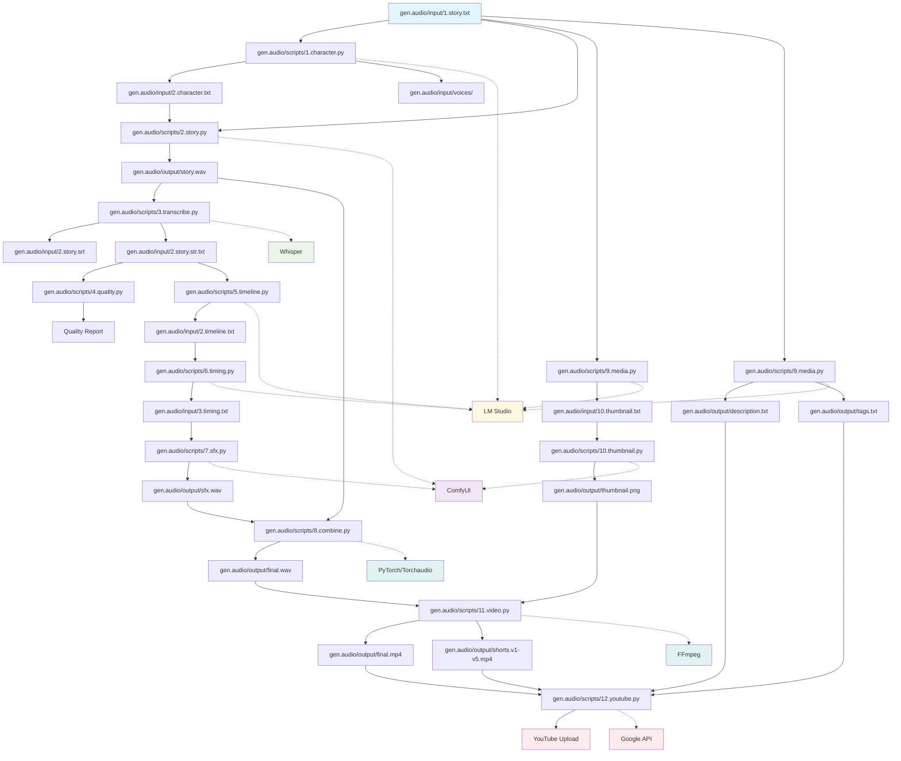
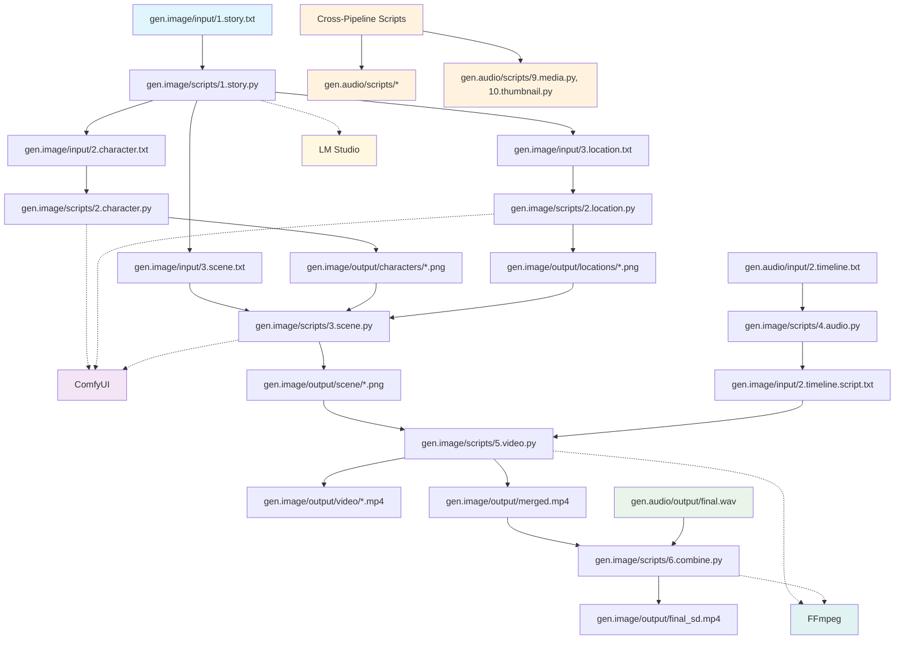
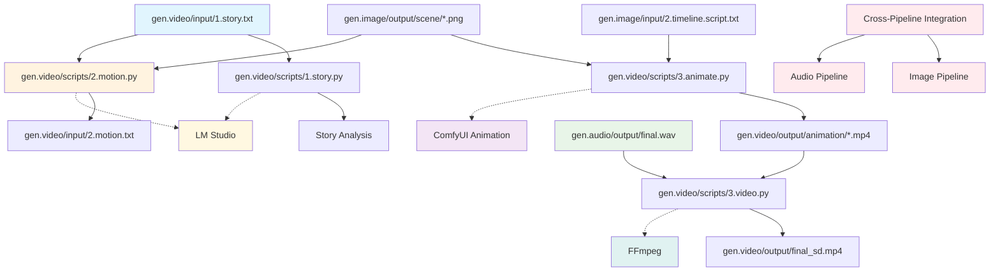
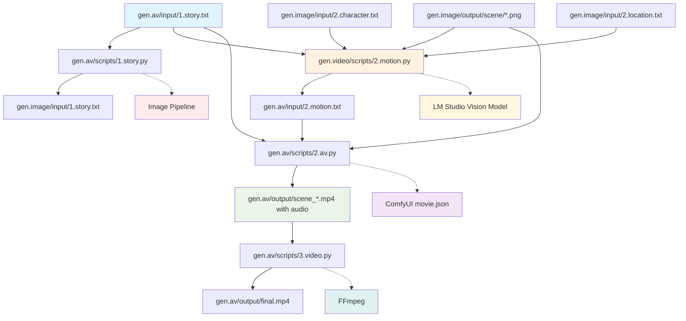

# AI Content Pipelines

A comprehensive AI-powered content generation system that creates narrated stories, character images, scene visualizations, and video content from text stories using ComfyUI workflows and LM Studio.

## 🎯 What It Does

Transform text stories into rich multimedia content:
- **🎵 Audio Stories** - Character voices, sound effects, and narration
- **🖼️ Visual Content** - Character portraits and scene images  
- **🎬 Video Production** - Animated videos with thumbnails
- **🎥 AV Production** - Audio-visual videos with built-in audio generation
- **📺 YouTube Ready** - Automated upload with metadata
- **🔄 Resumable Operations** - Fault-tolerant processing with checkpoint recovery

## 🔧 System Architecture Overview

The AI Content Studio is built on a modular pipeline architecture with four main processing stages:

### Core Services
- **ComfyUI** (Port 8188) - AI model inference server for TTS, image generation, and video animation
- **LM Studio** (Port 1234) - Local language model (nvidia_nemotron-3-nano-30b-a3b) for text processing and content analysis
- **FFmpeg** - Video/audio processing and compilation
- **Whisper** - Audio transcription

### Pipeline Orchestration
Each pipeline (`gen.audio`, `gen.image`, `gen.video`, `gen.av`) includes:
- **Service Management** - Automatic startup/shutdown of ComfyUI and LM Studio
- **Dependency Detection** - Smart service lifecycle management
- **Error Handling** - Graceful cleanup on failures
- **Logging** - Comprehensive execution tracking with performance metrics
- **Resumable Processing** - Checkpoint-based recovery from interruptions

## 🏗️ System Architecture

Four integrated pipelines work together:

```
Text Story → Audio Pipeline → Image Pipeline → Video Pipeline → YouTube
     ↓             ↓              ↓              ↓           ↓
 1.story.txt → final.wav → characters/*.png → animation/*.mp4 → Upload

Text Story → Image Pipeline → AV Pipeline → YouTube
     ↓             ↓              ↓           ↓
 1.story.txt → scene/*.png → scene_*.mp4 → Upload
```

### Pipeline Overview
- **Audio Pipeline** (`gen.audio/`) - 13 scripts for TTS, SFX, and video creation
- **Image Pipeline** (`gen.image/`) - 6 scripts for character/scene generation  
- **Video Pipeline** (`gen.video/`) - 4 scripts for animation and compilation (includes shared `2.motion.py`)
- **AV Pipeline** (`gen.av/`) - 3 scripts for audio-visual video generation with built-in audio (uses shared `2.motion.py` from video folder)

## 📁 Project Structure

```
.comfyui/
├── ComfyUI/                    # AI model server
│   ├── models/                 # AI models (TTS, image, video)
│   ├── custom_nodes/           # Extensions (TTS, GGUF, animation)
│   └── output/                 # Generated content
├── gen.audio/                  # Audio pipeline (13 scripts)
│   ├── generate.py             # Main orchestrator
│   ├── input/                  # Input files
│   │   ├── 1.story.txt         # Source story text
│   │   ├── 2.story.srt         # SRT transcription
│   │   ├── 2.story.str.txt     # Plain text transcription
│   │   ├── 2.timeline.txt      # SFX timeline
│   │   ├── 2.timeline.script.txt # Enhanced timeline script
│   │   ├── 3.timing.txt        # Refined SFX timing
│   │   ├── 4.sfx.txt           # SFX descriptions
│   │   ├── 9.summary.txt       # Story summary
│   │   ├── 10.thumbnail.txt    # Thumbnail description
│   │   ├── 10.title.txt        # Video title
│   │   ├── 12.chapters.txt     # Chapter summaries
│   │   └── voices/             # Character voice samples
│   │       ├── female/         # Female voices by language/region
│   │       ├── male/           # Male voices by language/region
│   │       └── narrator.wav    # Narrator voice
│   ├── output/                 # Generated content
│   │   ├── story/              # Individual chunk files
│   │   ├── sfx/                # Generated SFX files
│   │   ├── tracking/           # Resumable checkpoints (*.state.json)
│   │   ├── story.wav           # Final story audio
│   │   ├── sfx.wav             # Combined SFX audio
│   │   └── final.wav           # Story + SFX mixed
│   ├── scripts/                # Processing scripts (13)
│   ├── workflow/               # ComfyUI workflows
│   │   ├── story.json          # TTS workflow
│   │   ├── sfx.json            # SFX generation workflow
│   │   └── thumbnail.json      # Thumbnail generation workflow
│   ├── client_secrets.json     # YouTube API credentials
│   ├── token.json              # YouTube API token
│   └── prompt.story.audio.txt  # Audio generation prompts
├── gen.image/                  # Image pipeline (7 scripts)
│   ├── generate.py             # Main orchestrator
│   ├── input/                  # Input files
│   │   ├── 1.story.txt         # Source story text
│   │   ├── 2.character.txt     # Character descriptions
│   │   ├── 2.location.txt      # Location descriptions
│   │   ├── 3.character.txt     # Character summary
│   │   ├── 3.location.txt      # Location summary
│   │   ├── 3.scene.txt         # Scene descriptions
│   │   ├── 2.latent.character.body.{size}.png # Body input (IMAGE mode)
│   │   ├── 2.latent.character.face.{size}.png # Face input (IMAGE mode)
│   │   └── 2.latent.location.{size}.png # Location input (IMAGE mode)
│   ├── output/                 # Generated content
│   │   ├── characters/          # Character portraits
│   │   ├── locations/           # Location backgrounds
│   │   ├── scene/               # Scene compositions
│   │   ├── lora/                # LoRA intermediate results
│   │   ├── tracking/            # Resumable checkpoints (*.state.json)
│   │   ├── merged.mp4           # Combined scene videos
│   │   └── final_sd.mp4         # Final video with audio
│   ├── scripts/                # Processing scripts (7)
│   ├── workflow/               # ComfyUI workflows
│   │   ├── character_location.json # Character/location workflow
│   │   └── scene.json           # Scene generation workflow
│   └── prompt.story.image.txt  # Image generation prompts
└── gen.video/                  # Video pipeline (4 scripts)
    ├── generate.py             # Main orchestrator
    ├── input/                  # Input files
    │   ├── 1.story.txt         # Source story text
    │   └── 2.motion.txt         # Master prompts (generated by 2.motion.py)
    ├── output/                 # Generated content
    │   ├── animation/           # Animated video clips
    │   ├── frames/              # Extracted frame files
    │   ├── tracking/            # Resumable checkpoints (*.state.json)
    │   └── final_sd.mp4         # Final animated video with audio
    ├── scripts/                # Processing scripts (4)
    │   ├── 1.story.py          # Story analysis
    │   ├── 2.animate.py        # Video animation
    │   ├── 3.video.py          # Final video compilation
    │   └── 5.motion.py         # Motion generation (new)
    └── workflow/               # Animation workflows
        └── animate.json        # Animation workflow
└── gen.av/                     # AV pipeline (4 scripts)
    ├── generate.py             # Main orchestrator
    ├── input/                  # Input files
    │   ├── 1.story.txt         # Source story text
    │   └── 2.motion.txt         # Master prompts (generated by shared 2.motion.py from gen.video/scripts/)
    ├── output/                 # Generated content
    │   ├── frames/              # Extracted frame files
    │   ├── tracking/            # Resumable checkpoints (*.state.json)
    │   ├── scene_*.mp4          # Individual scene videos with audio
    │   └── final.mp4            # Final combined video with audio
    ├── scripts/                # Processing scripts (3)
    │   ├── 1.story.py          # Story parsing for image pipeline
    │   ├── 2.av.py              # AV video generation with built-in audio
    │   └── 3.video.py           # Final video compilation
    │   # Note: 2.motion.py is shared from gen.video/scripts/ (see Video Pipeline)
    └── workflow/               # ComfyUI workflows
        └── movie.json          # AV video generation workflow
```

## 🚀 Quick Start

### Prerequisites
1. **ComfyUI** - AI model server for TTS, image, and video generation
2. **LM Studio** - Local language model (nvidia_nemotron-3-nano-30b-a3b) 
3. **FFmpeg** - Video/audio processing
4. **Python Dependencies** - `pip install -r requirements.txt`
5. **YouTube API** (optional) - For automated uploads

### Running Pipelines
```bash
# Audio Pipeline (13 scripts)
cd gen.audio && python generate.py

# Image Pipeline (6 scripts) 
cd gen.image && python generate.py

# Video Pipeline (4 scripts)
cd gen.video && python generate.py

# AV Pipeline (3 scripts + shared 2.motion.py from gen.video/scripts/)
cd gen.av && python generate.py
```

### Resumable Operations
```bash
# Individual scripts with resumable processing
cd gen.image/scripts && python 1.story.py
cd gen.image/scripts && python 2.character.py --force-start
cd gen.audio/scripts && python 7.sfx.py --auto-confirm y

# Check progress and resume from interruptions
# Scripts automatically detect and resume from checkpoints
```

## 🎨 Advanced Image Generation Features

### Latent Input Mode
The image generation scripts now support two distinct modes for controlling the generation process:

#### LATENT Mode (Default)
- **Purpose**: Standard noise-based generation from scratch
- **Use Case**: Creating new images without reference
- **Configuration**: `LATENT_MODE = "LATENT"`
- **Workflow**: Uses `EmptySD3LatentImage` node with specified dimensions

#### IMAGE Mode
- **Purpose**: Image-to-image generation using existing images as starting point
- **Use Case**: Refining, editing, or enhancing existing images
- **Configuration**: `LATENT_MODE = "IMAGE"`
- **Workflow**: Replaces `EmptySD3LatentImage` with `LoadImage` + `VAEEncode` nodes
- **Denoising Control**: `LATENT_DENOISING_STRENGTH` (0.0-1.0) controls how much the input image is modified
- **Serial LoRA Support**: First LoRA in serial mode can also use IMAGE mode for enhanced control

### Image Latent Size Configuration

The system supports different latent input image sizes for IMAGE mode generation:

#### Latent Size Options
- **"small"**: Smaller resolution input images (faster processing, lower quality)
- **"medium"**: Balanced resolution input images (default for character generation)
- **"large"**: Higher resolution input images (slower processing, higher quality)

#### Configuration by Script
- **Character Script**: `IMAGE_LATENT_SIZE = "medium"` (configurable)
- **Location Script**: `IMAGE_LATENT_SIZE = "large"` (configurable)
- **Scene Script**: Uses fixed `3.latent.png` path (not size-configurable)
- **Thumbnail Script**: Uses fixed `10.latent.png` path (not size-configurable)

### Face Only Mode (Character Script)

The character generation script supports a special face-only mode for generating portrait-style character images:

#### Face Only Configuration
- **`FACE_ONLY = False`**: Generate full body character images (default)
- **`FACE_ONLY = True`**: Generate face-only character portraits

#### Dynamic File Path Generation
When `FACE_ONLY = True`, the script automatically uses face-specific latent input files:
```python
# Face-only mode
self.latent_image_path = f"../input/2.latent.character.face.{IMAGE_LATENT_SIZE}.png"

# Full body mode (default)
self.latent_image_path = f"../input/2.latent.character.body.{IMAGE_LATENT_SIZE}.png"
```

#### Implementation Details
```python
# Configuration in each script
LATENT_MODE = "LATENT"  # or "IMAGE"
IMAGE_LATENT_SIZE = "medium"  # "small", "medium", "large"
FACE_ONLY = False  # True for face-only, False for full body (character script only)
LATENT_DENOISING_STRENGTH = 0.8  # Only used in IMAGE mode

# File paths for IMAGE mode (dynamically generated based on configuration)
# Character script:
self.latent_image_path = f"../input/2.latent.character.face.{IMAGE_LATENT_SIZE}.png" if FACE_ONLY else f"../input/2.latent.character.body.{IMAGE_LATENT_SIZE}.png"
# Location script:
self.latent_image_path = f"../input/2.latent.location.{IMAGE_LATENT_SIZE}.png"
# Scene script:
self.latent_image_path = f"../input/3.latent.png"  # Uses fixed path
# Thumbnail script:
self.latent_image_path = f"../input/10.latent.png"  # Uses fixed path
```

### Serial LoRA Processing
Advanced LoRA handling with independent processing and intermediate storage:

#### Serial Mode Features
- **Independent Processing**: Each LoRA runs separately with its own parameters
- **Intermediate Storage**: Results saved between LoRA steps for debugging
- **Resumable Operations**: Can resume from any LoRA step if interrupted
- **Flexible Configuration**: Per-LoRA steps, denoising strength, and bypass options

#### LoRA Configuration
```python
LORAS = [
    {
        "name": "FLUX.1-Turbo-Alpha.safetensors",
        "strength_model": 3.0,    # Model strength (0.0 - 2.0)
        "strength_clip": 3.0,     # CLIP strength (0.0 - 2.0)
        "bypass_model": False,    # Set to True to bypass model part
        "bypass_clip": False,     # Set to True to bypass CLIP part
        "enabled": True,          # Set to False to disable entirely
        
        # Serial mode specific settings
        "steps": 9,               # Sampling steps for this LoRA
        "denoising_strength": 1,  # Denoising strength (0.0 - 1.0)
        "save_intermediate": True, # Save intermediate results
        "use_only_intermediate": False # Use only intermediate result, no character images
    }
]
```

#### Workflow Chain
```
LoRA 1: EmptySD3LatentImage → LoRA1 → Generated Image 1
LoRA 2: LoadImage(Image 1) → VAEEncode → LoRA2 → Generated Image 2
LoRA 3: LoadImage(Image 2) → VAEEncode → LoRA3 → Final Image
```

---

# 📋 PIPELINE DOCUMENTATION

## 🔄 Cross-Pipeline Feature: Resumable Processing System

The AI Content Studio features a robust resumable processing system that allows operations to be interrupted and resumed without losing progress. This is particularly valuable for expensive AI generation tasks that can take hours to complete.

### Resumable Features

#### Fault Tolerance
- **Checkpoint Recovery**: All expensive operations save progress to JSON checkpoint files
- **Interrupt Handling**: Scripts can be safely stopped (Ctrl+C) and resumed later
- **File Validation**: Cached results are validated to ensure files still exist on disk
- **Optional Cleanup**: Checkpoint files are preserved by default but can be deleted via `CLEANUP_TRACKING_FILES = True`

#### Supported Scripts Across All Pipelines
**Audio Pipeline:** 5 scripts  
**Image Pipeline:** 4 scripts  
**Video Pipeline:** 1 script  
**AV Pipeline:** 2 scripts

#### Usage Examples
```bash
# Normal resumable run
python 1.story.py

# Force start from beginning (ignores checkpoints)
python 2.character.py --force-start

# Story processing with custom chunk size
python 2.story.py --chunk-size 3

# Combine with existing flags
python 7.sfx.py --force-start --auto-confirm y

# Disable resumable mode for story processing
python 2.story.py --disable-resumable
```

#### Checkpoint Management
- **Location**: `../output/tracking/` directory in each pipeline
- **Naming**: Script-specific files (e.g., `1.story.state.json`, `2.character.state.json`, `2.story.state.json`)
- **Content**: JSON format with progress tracking and cached results
- **Lifecycle**: Automatically created, updated, and optionally cleaned up based on `CLEANUP_TRACKING_FILES` setting

---

## 🎵 AUDIO PIPELINE (gen.audio/)

**Purpose**: Generate narrated stories with sound effects and create YouTube-ready videos

**Total Scripts**: 12 scripts (all listed in `gen.audio/generate.py`)

### Workflow Overview
```
Story Text → Character Analysis → TTS → Transcription → SFX → Mixing → Video → YouTube
```

### Complete Script Inventory

All scripts listed in `gen.audio/generate.py`:

| # | Script | Purpose | Input Files | Output Files | Dependencies | Resumable |
|---|--------|---------|-------------|--------------|--------------|-----------|
| 1 | `gen.audio/scripts/1.character.py` | Character voice assignment & analysis | `gen.audio/input/1.story.txt`, `gen.audio/input/voices/` | `gen.audio/input/2.character.txt` | **LM Studio** | ✅ |
| 2 | `gen.audio/scripts/2.story.py` | Generate main story audio | `gen.audio/input/1.story.txt`, `gen.audio/input/2.character.txt` | `gen.audio/output/story.wav` | **ComfyUI** | ✅ |
| 3 | `gen.audio/scripts/3.transcribe.py` | Audio transcription | `gen.audio/output/story.wav` | `gen.audio/input/2.story.srt`, `gen.audio/input/2.story.str.txt` | Whisper | ✅ |
| 4 | `gen.audio/scripts/4.quality.py` | Transcription quality check | `gen.audio/input/2.story.str.txt` | Quality report | None | ❌ |
| 5 | `gen.audio/scripts/5.timeline.py` | SFX timeline generation | `gen.audio/input/2.story.str.txt` | `gen.audio/input/2.timeline.txt` | **LM Studio** | ✅ |
| 6 | `gen.audio/scripts/6.timing.py` | SFX timing refinement | `gen.audio/input/2.timeline.txt` | `gen.audio/input/3.timing.txt` | **LM Studio** | ✅ |
| 7 | `gen.audio/scripts/7.sfx.py` | Generate sound effects | `gen.audio/input/3.timing.txt` | `gen.audio/output/sfx.wav` | **ComfyUI** | ✅ |
| 8 | `gen.audio/scripts/8.combine.py` | Mix audio (story + SFX) | `gen.audio/output/story.wav`, `gen.audio/output/sfx.wav` | `gen.audio/output/final.wav` | PyTorch/Torchaudio | ❌ |
| 9 | `gen.audio/scripts/9.media.py` | YouTube metadata & thumbnail | `gen.audio/input/1.story.txt`, `gen.audio/input/9.summary.txt` | `gen.audio/input/10.thumbnail.txt`, `gen.audio/output/description.txt`, `gen.audio/output/tags.txt` | **LM Studio** | ❌ |
| 10 | `gen.audio/scripts/10.thumbnail.py` | Generate thumbnail image | `gen.audio/input/10.thumbnail.txt` | `gen.audio/output/thumbnail.png` | **ComfyUI** | ❌ |
| 11 | `gen.audio/scripts/11.video.py` | Create final video | `gen.audio/output/final.wav`, `gen.audio/output/thumbnail.png` | `gen.audio/output/final.mp4`, `gen.audio/output/shorts.v1-v5.mp4` | FFmpeg | ❌ |
| 12 | `gen.audio/scripts/12.youtube.py` | Upload to YouTube | `gen.audio/output/final.mp4`, `gen.audio/output/shorts.v1-v5.mp4`, `gen.audio/output/description.txt`, `gen.audio/output/tags.txt` | YouTube upload | Google API | ❌ |

### Key Features
- **Character Voice Assignment**: Automatic gender detection and voice selection with resumable processing
- **Chunked Story Audio**: TTS processing with progress tracking and resumable recovery (5-line chunks)
- **Multi-Character TTS**: Narration with voice consistency across characters
- **AI-Generated SFX**: Sound effects with precise timing and resumable generation
- **Professional Mixing**: Audio combination using PyTorch/Torchaudio
- **YouTube Integration**: Automated upload with metadata and Shorts generation

### Audio Pipeline File Structure

```
gen.audio/
├── generate.py                 # Main orchestrator
├── input/                      # Input files
│   ├── 1.story.txt            # Source story text
│   ├── 2.character.txt        # Character assignments (generated)
│   ├── 2.story.srt            # SRT transcription (generated)
│   ├── 2.story.str.txt        # Plain text transcription (generated)
│   ├── 2.timeline.txt         # SFX timeline (generated)
│   ├── 3.timing.txt           # Refined SFX timing (generated)
│   ├── 9.summary.txt          # Story summary (for metadata)
│   ├── 10.thumbnail.txt       # Thumbnail description (generated)
│   ├── 10.title.txt           # Video title (generated)
│   ├── 12.chapters.txt        # Chapter summaries (generated)
│   └── voices/                # Character voice samples
│       ├── m_*.wav            # Male voice samples
│       └── f_*.wav            # Female voice samples
├── output/                     # Output files
│   ├── story/                 # Individual chunk files
│   │   ├── 1_5.wav           # Lines 1-5 audio
│   │   ├── 6_10.wav          # Lines 6-10 audio
│   │   └── ...
│   ├── sfx/                   # Generated sound effects
│   ├── shorts/                # YouTube Shorts videos
│   │   ├── shorts.v1.mp4
│   │   ├── shorts.v2.mp4
│   │   └── ...
│   ├── tracking/              # Resumable checkpoints
│   │   ├── 1.character.state.json
│   │   ├── 2.story.state.json
│   │   ├── 5.timeline.state.json
│   │   ├── 6.timing.state.json
│   │   └── 7.sfx.state.json
│   ├── story.wav              # Final story audio
│   ├── sfx.wav                # Combined SFX audio
│   ├── final.wav              # Story + SFX mixed
│   ├── final.mp4              # Final video
│   ├── thumbnail.png          # Generated thumbnail
│   ├── description.txt        # YouTube description
│   └── tags.txt               # YouTube tags
├── scripts/                    # Processing scripts (13)
└── workflow/                   # ComfyUI workflows
    ├── story.json             # TTS workflow
    ├── sfx.json               # SFX generation workflow
    └── thumbnail.json         # Thumbnail generation workflow
```

### Resumable Story Processing (`2.story.py`)

The story audio generation supports advanced resumable processing with chunked generation:

#### Key Features
- **Chunked Processing**: Splits story into 5-line chunks (configurable)
- **Progress Tracking**: Real-time percentage completion with detailed status
- **Individual Chunk Output**: Saves each chunk as `output/story/{start}_{end}.wav`
- **Final Concatenation**: Combines all chunks into final `story.wav`
- **Checkpoint Recovery**: Resumes from any completed chunk if interrupted

#### CLI Arguments
```bash
# Basic resumable processing
python 2.story.py

# Force start from beginning
python 2.story.py --force-start

# Disable resumable mode
python 2.story.py --disable-resumable

# Custom chunk size (3 lines per chunk)
python 2.story.py --chunk-size 3
```

### Audio Pipeline Configuration Constants

#### Script-Specific Settings

##### `1.character.py` - Character Voice Assignment
```python
LANGUAGE = "en"
REGION = "in"
MODEL_CHARACTER_CHAPTER_SUMMARY = "nvidia_nemotron-3-nano-30b-a3b"
CHUNK_SIZE = 50  # Lines per chapter chunk
GENERATE_TITLE = True
ENABLE_RESUMABLE_MODE = True
CLEANUP_TRACKING_FILES = False
```

##### `2.story.py` - Story Audio Generation  
```python
CHUNK_SIZE = 5  # Lines per chunk
ENABLE_RESUMABLE_MODE = True
CLEANUP_TRACKING_FILES = False
WORKFLOW_SUMMARY_ENABLED = False
comfyui_url = "http://127.0.0.1:8188/"
```

##### `5.timeline.py` - SFX Timeline Generation
```python
MODEL_TIMELINE_GENERATION = "nvidia_nemotron-3-nano-30b-a3b"
ENABLE_RESUMABLE_MODE = True
CLEANUP_TRACKING_FILES = False
```

##### `6.timing.py` - SFX Timing Refinement
```python
MODEL_TIMING_GENERATION = "nvidia_nemotron-3-nano-30b-a3b"
ENABLE_RESUMABLE_MODE = True
CLEANUP_TRACKING_FILES = False
```

##### `7.sfx.py` - Sound Effects Generation
```python
ENABLE_RESUMABLE_MODE = True
CLEANUP_TRACKING_FILES = False
WORKFLOW_SUMMARY_ENABLED = False
max_workers = 3  # Concurrent processing
```

##### `9.media.py` - YouTube Metadata
```python
MODEL_MEDIA_TAGS = "nvidia_nemotron-3-nano-30b-a3b"
MODEL_MEDIA_TITLE = "nvidia_nemotron-3-nano-30b-a3b"
MODEL_DESCRIPTION_GENERATION = "nvidia_nemotron-3-nano-30b-a3b"
```

##### `10.thumbnail.py` - Thumbnail Generation
```python
USE_RANDOM_SEED = True
USE_TITLE_TEXT = True  # Text overlay
TITLE_POSITION = "middle"  # "top", "middle", "bottom"
OUTPUT_WIDTH = 1280
OUTPUT_HEIGHT = 720
SHORTS_WIDTH = 1080
SHORTS_HEIGHT = 1920
SHORTS_VARIATIONS = 5
IMAGE_WIDTH = 1280
IMAGE_HEIGHT = 720
LATENT_MODE = "LATENT"
USE_LORA = True
LORA_MODE = "serial"
SAMPLING_STEPS = 25
ART_STYLE = "Realistic Anime"
```

##### `12.youtube.py` - YouTube Upload
```python
YOUTUBE_PRIVACY_STATUS = "private"  # "private", "unlisted", "public"
YOUTUBE_CATEGORY_ID = "22"  # People & Blogs
```

### Audio Pipeline Detailed Flowchart



---

## 🖼️ IMAGE PIPELINE (gen.image/)

**Purpose**: Create character portraits, location backgrounds, and scene visualizations from story text

**Total Scripts**: 15 scripts (all listed in `gen.image/generate.py`)

### Workflow Overview
```
Story Text → Parse Characters/Locations → Generate Images → Combine into Scenes → Video Sync
```

### Complete Script Inventory

All scripts listed in `gen.image/generate.py`:

| Category | Script | Purpose | Input Files | Output Files | Dependencies | Resumable |
|----------|--------|---------|-------------|--------------|--------------|-----------|
| Speech | `gen.image/scripts/1.story.py` | Parse story and extract entities | `gen.image/input/1.story.txt`, `gen.image/input/9.summary.txt` | `gen.image/input/2.character.txt`, `gen.image/input/3.character.txt`, `gen.image/input/2.location.txt`, `gen.image/input/3.location.txt`, `gen.image/input/3.scene.txt` | **LM Studio** | ✅ |
| Speech | `gen.audio/scripts/1.character.py` | Character generation | Character inputs | Character outputs | **LM Studio** | ✅ |
| Speech | `gen.audio/scripts/2.story.py` | Story audio generation | `gen.audio/input/1.story.txt`, `gen.audio/input/2.character.txt` | `gen.audio/output/story.wav` | **ComfyUI** | ✅ |
| Speech | `gen.audio/scripts/3.transcribe.py` | Transcription | Audio inputs | Transcription outputs | **LM Studio** | ❌ |
| Speech | `gen.audio/scripts/4.quality.py` | Quality processing | Audio inputs | Quality outputs | **ComfyUI** | ❌ |
| SFX | `gen.image/scripts/4.audio.py` | Process audio timeline for video | `gen.image/input/2.timeline.txt`, `gen.image/input/1.story.txt`, `gen.image/input/3.scene.txt` | `gen.image/input/2.timeline.script.txt` | None | ❌ |
| SFX | `gen.audio/scripts/5.timeline.py` | Timeline generation | Story inputs | Timeline outputs | **LM Studio** | ✅ |
| SFX | `gen.audio/scripts/6.timing.py` | Timing processing | Timing inputs | Timing outputs | **LM Studio** | ✅ |
| SFX | `gen.audio/scripts/7.sfx.py` | SFX generation | SFX inputs | SFX outputs | **ComfyUI** | ✅ |
| SFX | `gen.audio/scripts/8.combine.py` | Audio combining | Audio inputs | Combined audio | FFmpeg | ❌ |
| Video | `gen.image/scripts/2.character.py` | Generate character portraits | `gen.image/input/2.character.txt` | `gen.image/output/characters/*.png` | **ComfyUI** | ✅ |
| Video | `gen.image/scripts/2.location.py` | Generate location backgrounds | `gen.image/input/3.location.txt` | `gen.image/output/locations/*.png` | **ComfyUI** | ✅ |
| Video | `gen.image/scripts/3.scene.py` | Generate scene compositions | `gen.image/input/3.scene.txt`, `gen.image/output/characters/*.png`, `gen.image/output/locations/*.png` | `gen.image/output/scene/*.png` | **ComfyUI** | ✅ |
| Thumbnail | `gen.audio/scripts/9.media.py` | Media processing | Media inputs | Media outputs | **ComfyUI** | ❌ |
| Thumbnail | `gen.audio/scripts/10.thumbnail.py` | Thumbnail generation | Thumbnail inputs | Thumbnail outputs | **ComfyUI** | ❌ |

### Key Features
- **LLM Story Parsing**: Extract characters, locations, and scenes from text with resumable processing
- **Character Generation**: High-quality character portraits with consistent styling (633x950)
- **Location Generation**: Background images for story locations (1280x720)
- **Scene Visualization**: Composite scenes with character and location integration
- **Latent Input Modes**: LATENT (noise) or IMAGE (image-to-image) generation
- **Serial LoRA Processing**: Independent LoRA application with intermediate storage
- **Image Stitching**: Automatic combination of multiple images (up to 5)
- **Timeline Processing**: Audio-visual synchronization for video generation

### Image Pipeline File Structure

```
gen.image/
├── generate.py                 # Main orchestrator
├── input/                      # Input files
│   ├── 1.story.txt            # Source story text
│   ├── 9.summary.txt          # Story summary (for parsing)
│   ├── 2.character.txt        # Character descriptions (generated)
│   ├── 3.character.txt        # Character summary (generated)
│   ├── 2.location.txt         # Location descriptions (generated)
│   ├── 3.location.txt         # Location summary (generated)
│   ├── 3.scene.txt            # Scene descriptions (generated)
│   ├── 2.latent.character.face.{size}.png    # Face input (IMAGE mode)
│   ├── 2.latent.character.body.{size}.png    # Body input (IMAGE mode)
│   ├── 2.latent.location.{size}.png          # Location input (IMAGE mode)
│   ├── 3.latent.png           # Scene input (IMAGE mode)
│   └── 10.latent.png          # Thumbnail input (IMAGE mode)
├── output/                     # Output files
│   ├── characters/            # Character portraits (633x950)
│   ├── locations/             # Location backgrounds (1280x720)
│   ├── scene/                 # Scene compositions (1280x720)
│   ├── backgrounds/           # Background intermediate results
│   ├── lora/                  # LoRA intermediate results
│   ├── video/                 # Per-scene video clips
│   ├── tracking/              # Resumable checkpoints
│   │   ├── 1.story.state.json
│   │   ├── 2.character.state.json
│   │   ├── 2.location.state.json
│   │   └── 3.scene.state.json
│   ├── merged.mp4             # Combined scene videos
│   └── final_sd.mp4           # Final video with audio
├── scripts/                    # Processing scripts (7)
└── workflow/                   # ComfyUI workflows
    ├── character_location.json # Character/location generation workflow
    └── scene.json             # Scene generation workflow
```

### Image Pipeline Flowchart



### Image Pipeline Configuration Constants

#### Script-Specific Settings

##### `1.story.py` - Story Parsing
```python
WORD_FACTOR = 6
CHARACTER_SUMMARY_WORD_MIN = 60
CHARACTER_SUMMARY_WORD_MAX = 120
LOCATION_SUMMARY_WORD_MIN = 60
LOCATION_SUMMARY_WORD_MAX = 120
MODEL_STORY_DESCRIPTION = "nvidia_nemotron-3-nano-30b-a3b"
MODEL_CHARACTER_GENERATION = "nvidia_nemotron-3-nano-30b-a3b"
ENABLE_RESUMABLE_MODE = True
CLEANUP_TRACKING_FILES = False
ART_STYLE = "Realistic Anime"
```

##### `2.character.py` - Character Generation
```python
ENABLE_RESUMABLE_MODE = True
CLEANUP_TRACKING_FILES = False
WORKFLOW_SUMMARY_ENABLED = False
VARIATIONS_PER_CHARACTER = 1
IMAGE_WIDTH = 320
IMAGE_HEIGHT = 640
LATENT_MODE = "LATENT"  # or "IMAGE"
IMAGE_LATENT_SIZE = "medium"  # "small", "medium", "large"
FACE_ONLY = False  # True: face only, False: full body
LATENT_DENOISING_STRENGTH = 0.85
USE_LORA = False  # Currently disabled
LORA_MODE = "serial"
SAMPLING_STEPS = 25
USE_NEGATIVE_PROMPT = False
USE_RANDOM_SEED = True
ART_STYLE = "Realistic Anime"
```

##### `2.location.py` - Location Generation
```python
ENABLE_RESUMABLE_MODE = True
CLEANUP_TRACKING_FILES = False
WORKFLOW_SUMMARY_ENABLED = False
VARIATIONS_PER_LOCATION = 1
IMAGE_WIDTH = 1280
IMAGE_HEIGHT = 720
LATENT_MODE = "LATENT"  # or "IMAGE"
IMAGE_LATENT_SIZE = "large"  # "small", "medium", "large"
LATENT_DENOISING_STRENGTH = 0.82
USE_LORA = True
LORA_MODE = "serial"
SAMPLING_STEPS = 25
USE_NEGATIVE_PROMPT = False
USE_SUMMARY_TEXT = False
USE_RANDOM_SEED = True
ART_STYLE = "Realistic Anime"
```

##### `3.scene.py` - Scene Generation
```python
ENABLE_RESUMABLE_MODE = True
CLEANUP_TRACKING_FILES = False
IMAGE_WIDTH = 1280
IMAGE_HEIGHT = 720
CHARACTER_RESIZE_FACTOR = 1  # 100% original size
LOCATION_RESIZE_FACTOR = 1.0  # Location resize: 1.0 = no resize, 2.0 = double size, 0.5 = half size
IMAGE_COMPRESSION_QUALITY = 95
ACTIVE_CHARACTER_MODE = "IMAGE"  # "IMAGE_TEXT", "TEXT", "IMAGE", "NONE"
ACTIVE_LOCATION_MODE = "TEXT"   # "IMAGE_TEXT", "TEXT", "IMAGE", "NONE"
LATENT_MODE = "LATENT"
LATENT_DENOISING_STRENGTH = 0.90
IMAGE_STITCH_COUNT = 1  # 1-5 images
USE_LORA = True
LORA_MODE = "serial"
SAMPLING_STEPS = 25
USE_RANDOM_SEED = True
ART_STYLE = "Realistic Anime"
```

### Advanced Image Features

#### Latent Input Modes
- **LATENT Mode**: Standard noise-based generation from scratch
- **IMAGE Mode**: Image-to-image generation using existing images as starting point
- **Dynamic File Paths**: Automatically selects face/body latent inputs based on `FACE_ONLY` setting

#### Serial LoRA Processing
```python
LORAS = [
    {
        "name": "FLUX.1-Turbo-Alpha.safetensors",
        "strength_model": 2.0,
        "strength_clip": 2.0,
        "bypass_model": False,
        "bypass_clip": False,
        "enabled": True,
        "steps": 6,  # Serial mode only
        "denoising_strength": 1,  # Serial mode only
        "save_intermediate": True,
        "use_only_intermediate": False
    }
]
```

#### Prompt Handling Modes (Scene Script)
- **IMAGE_TEXT**: Character image + text description
- **TEXT**: Text description only
- **IMAGE**: Character image only
- **NONE**: No character/location reference

---

## 🎬 VIDEO PIPELINE (gen.video/)

**Purpose**: Create animated videos from static scene images using AI animation models

**Total Scripts**: 16 scripts (all listed in `gen.video/generate.py`)

### Workflow Overview
```
Scene Images + Timeline → AI Animation → Combine with Audio → Final Video
```

### Complete Script Inventory

All scripts listed in `gen.video/generate.py`:

| Category | Script | Purpose | Input Files | Output Files | Dependencies | Resumable |
|----------|--------|---------|-------------|--------------|--------------|-----------|
| Speech | `gen.video/scripts/1.story.py` | Parse story structure | `gen.video/input/1.story.txt` | Story analysis | **LM Studio** | ❌ |
| Speech | `gen.image/scripts/1.story.py` | Parse story for image pipeline | `gen.video/input/1.story.txt` | `gen.image/input/1.story.txt` | None | ❌ |
| Speech | `gen.audio/scripts/1.character.py` | Character generation | Character inputs | Character outputs | **LM Studio** | ✅ |
| Speech | `gen.audio/scripts/2.story.py` | Story audio generation | `gen.audio/input/1.story.txt`, `gen.audio/input/2.character.txt` | `gen.audio/output/story.wav` | **ComfyUI** | ✅ |
| Speech | `gen.audio/scripts/3.transcribe.py` | Transcription | Audio inputs | Transcription outputs | **LM Studio** | ❌ |
| Speech | `gen.audio/scripts/4.quality.py` | Quality processing | Audio inputs | Quality outputs | **ComfyUI** | ❌ |
| SFX | `gen.image/scripts/4.audio.py` | Audio processing | Audio inputs | Audio outputs | **ComfyUI** | ❌ |
| SFX | `gen.audio/scripts/5.timeline.py` | Timeline generation | Story inputs | Timeline outputs | **LM Studio** | ✅ |
| SFX | `gen.audio/scripts/6.timing.py` | Timing processing | Timing inputs | Timing outputs | **LM Studio** | ✅ |
| SFX | `gen.audio/scripts/7.sfx.py` | SFX generation | SFX inputs | SFX outputs | **ComfyUI** | ✅ |
| SFX | `gen.audio/scripts/8.combine.py` | Audio combining | Audio inputs | Combined audio | FFmpeg | ❌ |
| Images | `gen.image/scripts/2.character.py` | Character image generation | Character inputs | `gen.image/output/characters/*.png` | **ComfyUI** | ❌ |
| Images | `gen.image/scripts/2.location.py` | Location image generation | Location inputs | `gen.image/output/locations/*.png` | **ComfyUI** | ❌ |
| Images | `gen.image/scripts/3.scene.py` | Scene image generation | Scene inputs | `gen.image/output/scene/*.png` | **ComfyUI** | ❌ |
| Video | `gen.video/scripts/2.motion.py` (shared) | Generate master prompts for video generation | `gen.video/input/1.story.txt`, `gen.image/output/scene/*.png` (optional), `gen.image/input/2.character.txt` (optional), `gen.image/input/2.location.txt` (optional) | `gen.video/input/2.motion.txt` | **LM Studio** | ✅ |
| Video | `gen.video/scripts/3.animate.py` | Animate static scene images | `gen.image/output/scene/*.png`, `gen.image/input/2.timeline.script.txt` | `gen.video/output/animation/*.mp4` | **ComfyUI** | ✅ |

### Key Features
- **Story Analysis**: Parse and structure story content for animation
- **AI Scene Animation**: Transform static images into animated sequences
- **Cross-Pipeline Integration**: Seamless integration with audio and image pipelines
- **Resumable Animation**: Checkpoint-based recovery for long animation tasks
- **Motion Control**: Configure character, location, and scene motion parameters

### Video Pipeline File Structure

```
gen.video/
├── generate.py                 # Main orchestrator
├── input/                      # Input files
│   ├── 1.story.txt            # Source story text
│   └── 2.motion.txt           # Master prompts (generated by 2.motion.py)
├── output/                     # Output files
│   ├── animation/             # Animated video clips
│   ├── frames/                # Extracted frame files
│   ├── tracking/              # Resumable checkpoints
│   │   └── 2.animate.state.json
│   └── final_sd.mp4           # Final animated video with audio
├── scripts/                    # Processing scripts (3)
└── workflow/                   # ComfyUI workflows
    └── animate.json           # Animation workflow
```

### Video Pipeline Configuration Constants

#### Script-Specific Settings

##### `3.animate.py` - Video Animation
```python
# Feature Flags
ENABLE_RESUMABLE_MODE = True
CLEANUP_TRACKING_FILES = False  # Set to True to delete tracking JSON files after completion, False to preserve them
WORKFLOW_SUMMARY_ENABLED = False  # Set to True to enable workflow summary printing

# Video Configuration Constants
VIDEO_WIDTH = 1024
VIDEO_HEIGHT = 576
FRAMES_PER_SECOND = 24
CHUNK_SIZE = 3  # Maximum seconds per chunk (3 seconds max for video animation)

# Feature flags (moved to 2.motion.py)
# Note: Master prompts are now generated in 2.motion.py with all features integrated

# ComfyUI URL (default parameter in class, not a constant)
# comfyui_url = "http://127.0.0.1:8188/"  # Default URL for ComfyUI API
```

##### `3.video.py` - Final Video Compilation
```python
# Input files
animation_dir = "../output/animation"
audio_file = "../../gen.audio/output/final.wav"
# Output file
output_file = "../output/final_sd.mp4"
# Uses FFmpeg for final video assembly
```

##### `2.motion.py` - Master Prompt Generation (Shared Script)
**Location**: `gen.video/scripts/2.motion.py` (shared by both video and AV pipelines)

```python
# Model Constants for easy switching
MODEL_MOTION_GENERATION = "qwen_qwen3-vl-30b-a3b-instruct"  # Vision model for motion generation

# Feature Flags
ENABLE_RESUMABLE_MODE = True  # Set to False to disable resumable mode
CLEANUP_TRACKING_FILES = False  # Set to True to delete tracking JSON files after completion, False to preserve them

# Prompt Generation Feature Flags
USE_SCENE_IMAGE = True  # Set to True to include scene image in prompt generation
USE_LOCATION = False  # Set to True to include location data from 3.location.txt
USE_CHARACTER = False  # Set to True to include character data from 2.character.txt
USE_SUMMARY_TEXT = False  # Set to True to use summary text files (3.character.txt, 3.location.txt) instead of 2.character.txt, 2.location.txt

# File Paths (relative to script location)
input_file = "../input/1.story.txt"
output_file = "../input/2.motion.txt"  # Configurable via --output argument
scene_image_base_path = "../../gen.image/output/scene"
checkpoint_dir = "../output/tracking"

# Command Line Arguments
# --output OUTPUT_FILE  # Specify output file path (default: ../input/2.motion.txt)
# --force-start         # Force start from beginning, ignoring checkpoints
```

**Key Features**:
- Generates complete master prompts for video generation (not just motion descriptions)
- Integrates dialogue, scene descriptions, character data, and location data
- Uses advanced system prompt for image-to-video prompt generation
- Output path configurable via `--output` argument (allows sharing between pipelines)
- Supports optional scene image analysis via vision model

### Video Pipeline Flowchart



---

## 🎥 AV PIPELINE (gen.av/)

**Purpose**: Create audio-visual videos with built-in audio generation from story text and scene images

**Total Scripts**: 13 scripts (all listed in `gen.av/generate.py`) | **Resumable**: 2 scripts

### Workflow Overview
```
Story Text → Scene Images → Motion Descriptions → AV Video Generation → Final Video
     ↓            ↓              ↓                      ↓                  ↓
 1.story.txt → scene/*.png → 2.motion.txt → scene_*.mp4 (with audio) → final.mp4
```

### Complete Script Inventory

All scripts listed in `gen.av/generate.py`:

| Category | Script | Purpose | Input Files | Output Files | Dependencies | Resumable |
|----------|--------|---------|-------------|--------------|--------------|-----------|
| Story | `gen.av/scripts/1.story.py` | Parse story for image pipeline | `gen.av/input/1.story.txt` | `gen.image/input/1.story.txt` | None | ❌ |
| Story | `gen.image/scripts/1.story.py` | Parse story for image pipeline | `gen.av/input/1.story.txt` | `gen.image/input/1.story.txt` | None | ❌ |
| Story | `gen.audio/scripts/1.character.py` | Character generation | Character inputs | Character outputs | **LM Studio** | ✅ |
| Images | `gen.image/scripts/2.character.py` | Character image generation | Character inputs | `gen.image/output/characters/*.png` | **ComfyUI** | ❌ |
| Images | `gen.image/scripts/2.location.py` | Location image generation | Location inputs | `gen.image/output/locations/*.png` | **ComfyUI** | ❌ |
| Images | `gen.image/scripts/3.scene.py` | Scene image generation | Scene inputs | `gen.image/output/scene/*.png` | **ComfyUI** | ❌ |
| Video | `gen.video/scripts/2.motion.py` (shared) | Generate master prompts for video generation | `gen.av/input/1.story.txt`, `gen.image/output/scene/*.png` (optional), `gen.image/input/2.character.txt` (optional), `gen.image/input/2.location.txt` (optional) | `gen.av/input/2.motion.txt` | **LM Studio** | ✅ |
| Video | `gen.av/scripts/2.av.py` | Generate AV videos with built-in audio | `gen.av/input/1.story.txt`, `gen.image/output/scene/*.png`, `gen.av/input/2.motion.txt` (master prompts) | `gen.av/output/scene_*.mp4` | **ComfyUI** | ✅ |
| Thumbnail | `gen.audio/scripts/9.media.py` | Media processing | Media inputs | Media outputs | **ComfyUI** | ❌ |
| Thumbnail | `gen.audio/scripts/10.thumbnail.py` | Thumbnail generation | Thumbnail inputs | Thumbnail outputs | **ComfyUI** | ❌ |
| YouTube | `gen.av/scripts/3.video.py` | Combine scene videos | `gen.av/output/scene_*.mp4` | `gen.av/output/final.mp4` | FFmpeg | ❌ |
| YouTube | `gen.audio/scripts/11.video.py` | Video processing | Video inputs | Video outputs | FFmpeg | ❌ |
| YouTube | `gen.audio/scripts/12.youtube.py` | YouTube upload | Video file | YouTube upload | YouTube API | ❌ |

### Key Features
- **Built-in Audio**: Videos include audio generated directly by the workflow (no separate audio pipeline needed)
- **Dialogue-based Duration**: Video length calculated from dialogue word count using `WORDS_TO_SPEECH_RATIO`
- **5-Second Chunking**: Automatic splitting of longer scenes into 5-second chunks for generation
- **Frame Continuity**: Smooth transitions between chunks using last frame as input
- **Master Prompt Generation**: `2.motion.py` generates complete video prompts with integrated audio, motion, and scene descriptions
- **Shared Motion Script**: Both video and AV pipelines use the same `gen.video/scripts/2.motion.py` script with configurable output paths
- **LoRA Control**: Configurable LoRA switches for depth, canny, pose, and detailer control
- **Resumable Generation**: Checkpoint-based recovery for long video generation tasks

### AV Pipeline File Structure

```
gen.av/
├── generate.py                 # Main orchestrator
├── input/                      # Input files
│   ├── 1.story.txt            # Source story text
│   └── 2.motion.txt           # Master prompts (generated by shared 2.motion.py from gen.video/scripts/)
├── output/                     # Output files
│   ├── frames/                # Extracted frame files
│   ├── tracking/              # Resumable checkpoints
│   │   └── 3.av.state.json
│   ├── scene_*.mp4            # Individual scene videos with built-in audio
│   └── final.mp4              # Final combined video with audio
├── scripts/                    # Processing scripts (3)
│   ├── 1.story.py            # Story parsing for image pipeline
│   ├── 2.av.py                # AV video generation with built-in audio
│   └── 3.video.py             # Final video compilation
│   # Note: 2.motion.py is shared from gen.video/scripts/ (see Video Pipeline section)
└── workflow/                   # ComfyUI workflows
    └── movie.json             # AV video generation workflow
```

### AV Pipeline Configuration Constants

#### Script-Specific Settings

##### `2.motion.py` - Master Prompt Generation (Shared Script)
**Location**: `gen.video/scripts/2.motion.py` (shared by both video and AV pipelines)

```python
# Model Configuration
MODEL_MOTION_GENERATION = "qwen_qwen3-vl-30b-a3b-instruct"  # Vision model

# Feature Flags
ENABLE_RESUMABLE_MODE = True
CLEANUP_TRACKING_FILES = False

# Prompt Generation Feature Flags
USE_SCENE_IMAGE = True   # Include scene image in prompt generation
USE_LOCATION = False     # Include location data from 2.location.txt or 3.location.txt
USE_CHARACTER = False    # Include character data from 2.character.txt or 3.character.txt
USE_SUMMARY_TEXT = False # Use summary text files (3.*.txt) instead of 2.*.txt

# File Paths
input_file = "../input/1.story.txt"
output_file = "../input/2.motion.txt"  # Configurable via --output argument
scene_image_base_path = "../../gen.image/output/scene"

# Command Line Arguments
# --output OUTPUT_FILE  # Specify output file path (default: ../input/2.motion.txt)
# --force-start         # Force start from beginning, ignoring checkpoints
```

**Key Features**:
- Generates complete master prompts for video generation (not just motion descriptions)
- Integrates dialogue, scene descriptions, character data, and location data
- Uses advanced system prompt for image-to-video prompt generation
- Output path configurable via `--output` argument (allows sharing between pipelines)
- Supports optional scene image analysis via vision model

##### `2.av.py` - AV Video Generation
```python
# Feature Flags
ENABLE_RESUMABLE_MODE = True
CLEANUP_TRACKING_FILES = False  # Set to True to delete tracking JSON files after completion, False to preserve them
WORKFLOW_SUMMARY_ENABLED = False  # Set to True to enable workflow summary printing

# Feature flags (moved to 2.motion.py)
# Note: Master prompts are now generated in 2.motion.py with all features integrated

# Video Configuration Constants
VIDEO_WIDTH = 1024
VIDEO_HEIGHT = 576
FRAMES_PER_SECOND = 24
CHUNK_SIZE = 5  # Maximum seconds per chunk (5 seconds max for AV)

# Duration Calculation
# Words to speech ratio: seconds per word
WORDS_TO_SPEECH_RATIO = 0.15  # 0.15 seconds per word (approximately 6.67 words per second)

# LoRA Switch Configuration (controls LoRA chain in movie.json workflow)
# Each switch controls a specific part of the LoRA chain
ENABLE_SWITCH_279_286 = True   # Node 279:286 - Controls depth-control LoRA (ltx-2-19b-ic-lora-depth-control.safetensors)
ENABLE_SWITCH_279_288 = True   # Node 279:288 - Controls canny-control LoRA (ltx-2-19b-ic-lora-canny-control.safetensors)
ENABLE_SWITCH_279_289 = True   # Node 279:289 - Controls pose-control LoRA (ltx-2-19b-ic-lora-pose-control.safetensors)
ENABLE_SWITCH_279_290 = True   # Node 279:290 - Controls detailer LoRA (ltx-2-19b-ic-lora-detailer.safetensors)
ENABLE_SWITCH_279_291 = True   # Node 279:291 - Final switch for first CFGGuider (279:239)
ENABLE_SWITCH_279_292 = True   # Node 279:292 - Final switch for second CFGGuider (279:252)

# File Paths
story_file = "../input/1.story.txt"
motion_file = "../input/2.motion.txt"
workflow_file = "../workflow/movie.json"
scene_images_dir = "../../gen.image/output/scene"
```

##### `3.video.py` - Final Video Compilation
```python
# Input/Output
output_dir = "../output"
final_video = "../output/final.mp4"

# Uses FFmpeg for video concatenation with -c copy to preserve audio
```

### AV Pipeline Flowchart



### Differences from Video Pipeline

| Feature | Video Pipeline | AV Pipeline |
|---------|---------------|-------------|
| **Audio Source** | Separate audio file (`final.wav`) | Built-in audio generation |
| **Duration Calculation** | Timeline-based | Dialogue word count (`WORDS_TO_SPEECH_RATIO`) |
| **Chunking** | Timeline-based chunks | 5-second max chunks |
| **Workflow** | `animate.json` | `movie.json` |
| **Input Images** | Single scene image | Single scene image (no multi-image support) |
| **Motion** | Optional from `2.motion.txt` (master prompts) | Optional from `2.motion.txt` (master prompts) |
| **Output Format** | `animation/*.mp4` | `scene_*.mp4` |

---

# 🔗 CROSS-PIPELINE INTEGRATION & SYSTEM CONFIGURATION

## 🔄 Cross-Pipeline Dependencies

The four pipelines are designed to work together seamlessly:

### Pipeline Data Flow

```
Audio Pipeline          Image Pipeline          Video Pipeline          AV Pipeline
==============          ==============          ==============          ============
1.story.txt    ────┬──→ 1.story.txt    ────┐   1.story.txt    ────┐
               │    9.summary.txt      │   │                    │
               │                       │   │                    │
2.character.txt────┐                   │   │                    │
               │   └──→ 2.character.py │   │                    │
               │        3.character.txt │   │                    │
               │                       │   │                    │
story.wav      │                       │   │                    │
  ↓            │                       │   │                    │
2.timeline.txt ├──→ 4.audio.py        │   │                    │
  ↓            │    2.timeline.script.txt │                    │
               │                       │   │                    │
               │    scene/*.png ───────┼───┼──→ 1.story.py     │
               │                       │   │    (for images)   │
               │                       │   │                    │
               │                       │   │    scene/*.png ────┼──→ 2.motion.py
               │                       │   │                    │    (motion gen)
               │                       │   │                    │
               │                       │   │    scene/*.png ────┼──→ 2.av.py
               │                       │   │    2.motion.txt    │    (AV video)
               │                       │   │                    │
               │                       │   │    scene_*.mp4 ────┼──→ 3.video.py
               │                       │   │                    │    (combine)
final.wav      │         ↓             │
               │    5.video.py         │
               │    merged.mp4         │
               │         ↓             │
               └──→ 6.combine.py       │
                    final_sd.mp4       │
                                      │
                    scene/*.png    ───┴──→ 2.animate.py
                                           animation/*.mp4
                                                ↓
                    final.wav    ─────────→ 3.video.py
                                           final_sd.mp4
```

### File Dependencies by Pipeline

#### Audio → Image
- `gen.audio/output/final.wav` → `gen.image/scripts/6.combine.py`
- `gen.audio/input/2.timeline.txt` → `gen.image/scripts/4.audio.py`

#### Image → Video
- `gen.image/output/scene/*.png` → `gen.video/scripts/2.animate.py`
- `gen.image/input/2.timeline.script.txt` → `gen.video/scripts/2.animate.py`

#### Audio → Video
- `gen.audio/output/final.wav` → `gen.video/scripts/3.video.py`

#### Video → Video (Internal)
- `gen.video/input/1.story.txt` → `gen.video/scripts/2.motion.py` → `gen.video/input/2.motion.txt`

#### Image → AV
- `gen.image/output/scene/*.png` → `gen.video/scripts/2.motion.py` (shared script, outputs to gen.av/input/2.motion.txt)
- `gen.image/output/scene/*.png` → `gen.av/scripts/2.av.py` (for AV video generation)
- `gen.image/input/2.character.txt` → `gen.video/scripts/2.motion.py` (integrated into master prompts)
- `gen.image/input/2.location.txt` → `gen.video/scripts/2.motion.py` (integrated into master prompts)

#### AV → AV (Internal)
- `gen.av/input/1.story.txt` → `gen.av/scripts/1.story.py` → `gen.image/input/1.story.txt`
- `gen.av/input/1.story.txt` → `gen.video/scripts/2.motion.py` (via --output argument) → `gen.av/input/2.motion.txt`
- `gen.av/input/1.story.txt` + `gen.av/input/2.motion.txt` → `gen.av/scripts/2.av.py` → `gen.av/output/scene_*.mp4`
- `gen.av/output/scene_*.mp4` → `gen.av/scripts/3.video.py` → `gen.av/output/final.mp4`

---

## ⚙️ Global Configuration & Settings

### Service URLs & Endpoints

#### ComfyUI Configuration
```python
COMFYUI_BASE_URL = "http://127.0.0.1:8188"  # Default URL
comfyui_output_folder = "../../ComfyUI/output"
comfyui_input_folder = "../../ComfyUI/input"
```

#### LM Studio Configuration
```python
LM_STUDIO_BASE_URL = "http://127.0.0.1:1234/v1"  # Default URL
LM_STUDIO_MODEL = "nvidia_nemotron-3-nano-30b-a3b"  # Default model
models_url = "http://127.0.0.1:1234/v1/models"
```

### Environment Variables
```bash
# Service Configuration
COMFYUI_BASE_URL=http://127.0.0.1:8188
LM_STUDIO_BASE_URL=http://127.0.0.1:1234/v1
COMFYUI_DIR=/path/to/ComfyUI
LM_STUDIO_CMD=lms

# Model Configuration
LM_STUDIO_MODEL=nvidia_nemotron-3-nano-30b-a3b
PYTHONIOENCODING=utf-8
PYTHONUNBUFFERED=1

# YouTube Configuration (Optional)
YOUTUBE_PRIVACY_STATUS=private
YOUTUBE_CATEGORY_ID=22
```

### Service Timeouts & Polling
```python
# Ready check intervals (seconds)
COMFYUI_READY_CHECK_INTERVAL = 15
LM_STUDIO_READY_CHECK_INTERVAL = 15

# Shutdown timeouts (seconds)
SERVICE_SHUTDOWN_TIMEOUT = 10
SERVICE_KILL_TIMEOUT = 5
SERVICE_STOPPED_CHECK_INTERVAL = 3
```

---

## 📂 Complete File Inventory

###Checkpoint File Inventory

| Pipeline | Checkpoint File | Script | Purpose |
|----------|----------------|--------|---------|
| **Audio** | `1.character.state.json` | `1.character.py` | Character analysis results |
| **Audio** | `2.story.state.json` | `2.story.py` | Story chunk processing |
| **Audio** | `5.timeline.state.json` | `5.timeline.py` | SFX timeline generation |
| **Audio** | `6.timing.state.json` | `6.timing.py` | SFX timing refinement |
| **Audio** | `7.sfx.state.json` | `7.sfx.py` | Sound effect generation |
| **Image** | `1.story.state.json` | `1.story.py` | Story parsing (LLM operations) |
| **Image** | `2.character.state.json` | `2.character.py` | Character image generation |
| **Image** | `2.location.state.json` | `2.location.py` | Location image generation |
| **Image** | `3.scene.state.json` | `3.scene.py` | Scene image generation |
| **Video** | `2.animate.state.json` | `2.animate.py` | Video animation generation |

---

## 🔍 Advanced Features

### Workflow Summary Feature

The `WORKFLOW_SUMMARY_ENABLED` feature provides detailed workflow execution summaries for debugging ComfyUI operations.

**Scripts Using This Feature:**
- Audio: `2.story.py`, `7.sfx.py`, `10.thumbnail.py`
- Image: `2.character.py`, `2.location.py`, `3.scene.py`

**Configuration:**
```python
WORKFLOW_SUMMARY_ENABLED = False  # Set to True to enable detailed logging
```

**When to Use:**
- Development and debugging
- Troubleshooting generation failures
- Performance optimization
- Understanding workflow structure

---

# 🛠️ SYSTEM DEPENDENCIES & SETUP

##### `1.character.py` - Character Voice Assignment
```python
# Language and Region Configuration
LANGUAGE = "en"
REGION = "in"

# Model Configuration
MODEL_CHARACTER_CHAPTER_SUMMARY = "nvidia_nemotron-3-nano-30b-a3b"
MODEL_CHARACTER_TITLE_GENERATION = "nvidia_nemotron-3-nano-30b-a3b"
MODEL_CHARACTER_META_SUMMARY = "nvidia_nemotron-3-nano-30b-a3b"
MODEL_DESCRIPTION_GENERATION = "nvidia_nemotron-3-nano-30b-a3b"

# Story Processing
CHUNK_SIZE = 50  # Lines per chapter chunk
GENERATE_TITLE = True  # Auto title generation

# Feature Flags
ENABLE_RESUMABLE_MODE = True  # Set to False to disable resumable mode
CLEANUP_TRACKING_FILES = False  # Set to True to delete tracking JSON files after completion

# Non-interactive Defaults (overridden by CLI flags)
AUTO_GENDER = "m"  # Default gender assignment
AUTO_CONFIRM = "y"  # Auto-confirm prompts
AUTO_CHANGE_SETTINGS = "n"  # Allow setting changes

# File Paths
checkpoint_dir = "../output/tracking"
voices_dir = "../voices"
output_file = "../input/2.character.txt"
```

##### `2.story.py` - Story Audio Generation
```python
# Configuration Constants
CHUNK_SIZE = 5  # Number of dialogues/lines per chunk
ENABLE_RESUMABLE_MODE = True  # Set to False to disable resumable mode
CLEANUP_TRACKING_FILES = False  # Set to True to delete tracking JSON files after completion
WORKFLOW_SUMMARY_ENABLED = False  # Set to True to enable workflow summary printing

# TTS Configuration
comfyui_url = "http://127.0.0.1:8188/"
output_folder = "../../ComfyUI/output/audio"
final_output = "../output/story.wav"
chunk_output_dir = "../output/story"
checkpoint_dir = "../output/tracking"

# Input Files
story_file = "../input/1.story.txt"
character_file = "../input/2.character.txt"

# Processing Features
# - Chunked Processing: Splits story into manageable chunks
# - Progress Tracking: Real-time percentage completion
# - Individual Chunk Output: Saves each chunk as output/story/{start}_{end}.wav
# - Final Concatenation: Combines all chunks into final story.wav
# - Checkpoint Recovery: Resumes from any completed chunk if interrupted
```

##### `3.transcribe.py` - Audio Transcription
```python
# Feature Flags
ENABLE_RESUMABLE_MODE = True
CLEANUP_TRACKING_FILES = False

# Input/Output Files
audio_file = "../output/story.wav"
srt_output = "../input/2.story.srt"
text_output = "../input/2.story.str.txt"
timeline_file = "../input/2.timeline.txt"

# Checkpoint Configuration
checkpoint_dir = "../output/tracking"

# Uses Whisper for transcription
```

##### `4.quality.py` - Transcription Quality Check
```python
# Input File
transcription_file = "../input/2.story.str.txt"

# No external dependencies - standalone quality analysis
```

##### `5.timeline.py` - SFX Timeline Generation
```python
# Model Configuration
MODEL_TIMELINE_GENERATION = "nvidia_nemotron-3-nano-30b-a3b"

# Feature Flags
ENABLE_RESUMABLE_MODE = True
CLEANUP_TRACKING_FILES = False

# File Paths
input_file = "../input/2.story.str.txt"
output_file = "../input/2.timeline.txt"
checkpoint_dir = "../output/tracking"
```

##### `6.timing.py` - SFX Timing Refinement
```python
# Model Configuration
MODEL_TIMING_GENERATION = "nvidia_nemotron-3-nano-30b-a3b"

# Feature Flags
ENABLE_RESUMABLE_MODE = True
CLEANUP_TRACKING_FILES = False

# File Paths
timeline_file = "../input/2.timeline.txt"
output_file = "../input/3.timing.txt"
checkpoint_dir = "../output/tracking"
```

##### `7.sfx.py` - Sound Effects Generation
```python
# Feature Flags
ENABLE_RESUMABLE_MODE = True
CLEANUP_TRACKING_FILES = False
WORKFLOW_SUMMARY_ENABLED = False

# SFX Processing
comfyui_url = "http://127.0.0.1:8188/"
output_folder = "../../ComfyUI/output/audio/sfx"
final_output_folder = "../output/sfx"
max_workers = 3  # Concurrent processing

# File Paths
input_file = "../input/3.timing.txt"
checkpoint_dir = "../output/tracking"
```

##### `8.combine.py` - Audio Mixing
```python
# Audio Processing
story_audio_path = "../output/story.wav"
sfx_audio_path = "../output/sfx.wav"
final_output_path = "../output/final.wav"

# Uses PyTorch/Torchaudio for professional mixing
```

##### `9.media.py` - YouTube Metadata Generation
```python
# Model Configuration
MODEL_MEDIA_TAGS = "nvidia_nemotron-3-nano-30b-a3b"
MODEL_MEDIA_TITLE = "nvidia_nemotron-3-nano-30b-a3b"
MODEL_MEDIA_HOOK = "nvidia_nemotron-3-nano-30b-a3b"
MODEL_MEDIA_BULLETS = "nvidia_nemotron-3-nano-30b-a3b"
MODEL_DESCRIPTION_GENERATION = "nvidia_nemotron-3-nano-30b-a3b"

# File Paths
story_file = "../input/1.story.txt"
summary_file = "../input/9.summary.txt"
thumbnail_output = "../input/10.thumbnail.txt"
description_output = "../output/description.txt"
tags_output = "../output/tags.txt"
title_output = "../input/10.title.txt"
```

##### `10.thumbnail.py` - Thumbnail Generation
```python
# Feature Flags
ENABLE_RESUMABLE_MODE = True
CLEANUP_TRACKING_FILES = False
WORKFLOW_SUMMARY_ENABLED = False

# Random Seed Configuration
USE_RANDOM_SEED = True
RANDOM_SEED = 333555666

# Title Text Configuration
USE_TITLE_TEXT = True  # True: use text overlay, False: Flux generates text
TITLE_POSITION = "middle"  # "top", "middle", "bottom"
TITLE_FONT_SCALE = 1.5
TITLE_LAYOUT = "overlay"  # "overlay", "expand", "fit"

# Output Canvas Size
OUTPUT_WIDTH = 1280
OUTPUT_HEIGHT = 720

# YouTube Shorts (9:16 aspect ratio)
SHORTS_WIDTH = 1080
SHORTS_HEIGHT = 1920
SHORTS_VARIATIONS = 5

# Image Resolution
IMAGE_WIDTH = 1280
IMAGE_HEIGHT = 720

# Latent Input Mode
LATENT_MODE = "LATENT"
LATENT_DENOISING_STRENGTH = 0.8

# LoRA Configuration
USE_LORA = True
LORA_MODE = "serial"
LORAS = [
    {
        "name": "FLUX.1-Turbo-Alpha.safetensors",
        "strength_model": 3.6,
        "strength_clip": 3.6,
        "bypass_model": False,
        "bypass_clip": False,
        "enabled": True,
        "steps": 9,
        "denoising_strength": 1,
        "save_intermediate": True,
        "use_only_intermediate": False
    }
]

# Sampling Configuration
SAMPLING_STEPS = 25
USE_NEGATIVE_PROMPT = True
NEGATIVE_PROMPT = "blur, distorted, text, watermark, extra limbs, bad anatomy, poorly drawn, asymmetrical, malformed, disfigured, ugly, bad proportions, plastic texture, artificial looking, cross-eyed, missing fingers, extra fingers, bad teeth, missing teeth, unrealistic"

ART_STYLE = "Realistic Anime"

# File Paths
comfyui_url = "http://127.0.0.1:8188/"
comfyui_output_folder = "../../ComfyUI/output"
input_file = "../input/10.thumbnail.txt"
output_file = "../output/thumbnail.png"
checkpoint_dir = "../output/tracking"
```

##### `11.video.py` - Final Video Creation
```python
# Input Files
audio_file = "../output/final.wav"
thumbnail_file = "../output/thumbnail.png"

# Output Files
output_file = "../output/final.mp4"
shorts_output = "../output/shorts.v{1-5}.mp4"

# Uses FFmpeg for video compilation
```

##### `12.youtube.py` - YouTube Upload
```python
# Input Files
video_file = "../output/final.mp4"
shorts_files = "../output/shorts/shorts.v{1-5}.mp4"
description_file = "../output/description.txt"
tags_file = "../output/tags.txt"

# YouTube API Configuration
client_secrets = "../client_secrets.json"
token_file = "../token.json"

# Upload Settings
YOUTUBE_PRIVACY_STATUS = "private"  # "private", "unlisted", "public"
YOUTUBE_CATEGORY_ID = "22"  # People & Blogs
```

#### Image Pipeline Scripts

##### `1.story.py` - Story Parsing
```python
# Word to Character Ratio
WORD_FACTOR = 6

# Processing Limits (min-max ranges)
CHARACTER_SUMMARY_WORD_MIN = 60
CHARACTER_SUMMARY_WORD_MAX = 120
CHARACTER_SUMMARY_CHARACTER_MIN = 360  # 60 * 6
CHARACTER_SUMMARY_CHARACTER_MAX = 720  # 120 * 6

LOCATION_SUMMARY_WORD_MIN = 60
LOCATION_SUMMARY_WORD_MAX = 120
LOCATION_SUMMARY_CHARACTER_MIN = 360
LOCATION_SUMMARY_CHARACTER_MAX = 720

# Feature Flags
ENABLE_RESUMABLE_MODE = True
CLEANUP_TRACKING_FILES = False

# Model Configuration
MODEL_STORY_DESCRIPTION = "nvidia_nemotron-3-nano-30b-a3b"
MODEL_CHARACTER_GENERATION = "nvidia_nemotron-3-nano-30b-a3b"
MODEL_CHARACTER_SUMMARY = "nvidia_nemotron-3-nano-30b-a3b"
MODEL_LOCATION_EXPANSION = "nvidia_nemotron-3-nano-30b-a3b"

ART_STYLE = "Realistic Anime"

# File Paths
story_file = "../input/1.story.txt"
summary_file = "../input/9.summary.txt"
character_output = "../input/2.character.txt"
character_summary_output = "../input/3.character.txt"
location_output = "../input/2.location.txt"
location_summary_output = "../input/3.location.txt"
scene_output = "../input/3.scene.txt"
checkpoint_dir = "../output/tracking"
```

##### `2.character.py` - Character Generation
```python
# Feature Flags
ENABLE_RESUMABLE_MODE = True
CLEANUP_TRACKING_FILES = False
WORKFLOW_SUMMARY_ENABLED = False

# Variation Configuration
VARIATIONS_PER_CHARACTER = 1

# Image Resolution
IMAGE_WIDTH = 633
IMAGE_HEIGHT = 950

# Latent Input Mode
LATENT_MODE = "LATENT"
IMAGE_LATENT_SIZE = "medium"  # "small", "medium", "large"
FACE_ONLY = False  # True: face only, False: full body
LATENT_DENOISING_STRENGTH = 0.85

# LoRA Configuration
USE_LORA = True
LORA_MODE = "serial"
LORAS = [
    {
        "name": "FLUX.1-Turbo-Alpha.safetensors",
        "strength_model": 2.0,
        "strength_clip": 2.0,
        "bypass_model": False,
        "bypass_clip": False,
        "enabled": True,
        "steps": 6,
        "denoising_strength": 1,
        "save_intermediate": True,
        "use_only_intermediate": False
    },
    {
        "name": "FLUX.1-Turbo-Alpha.safetensors",
        "strength_model": 3.6,
        "strength_clip": 3.6,
        "bypass_model": False,
        "bypass_clip": False,
        "enabled": False,
        "steps": 6,
        "denoising_strength": 0.1,
        "save_intermediate": True,
        "use_only_intermediate": True
    }
]

# Sampling Configuration
SAMPLING_STEPS = 25
USE_NEGATIVE_PROMPT = True
NEGATIVE_PROMPT = "blur, distorted, text, watermark, extra limbs, bad anatomy, poorly drawn, asymmetrical, malformed, disfigured, ugly, bad proportions, plastic texture, artificial looking, cross-eyed, missing fingers, extra fingers, bad teeth, missing teeth, unrealistic"

# Random Seed
USE_RANDOM_SEED = True
FIXED_SEED = 333555666

# Character Overlay Settings
USE_CHARACTER_NAME_OVERLAY = False
CHARACTER_NAME_FONT_SCALE = 1
CHARACTER_NAME_BAND_HEIGHT_RATIO = 0.30

# Text Processing
USE_SUMMARY_TEXT = False

ART_STYLE = "Realistic Anime"

# File Paths
comfyui_url = "http://127.0.0.1:8188/"
comfyui_output_folder = "../../ComfyUI/output"
workflow_file = "../workflow/character.flux.json"  # or "../workflow/character.json"
input_file = "../input/2.character.txt"  # or "../input/3.character.txt" if USE_SUMMARY_TEXT
output_dir = "../output/characters"
checkpoint_dir = "../output/tracking"
```

#### `2.location.py` - Location Generation
```python
# Feature Flags
ENABLE_RESUMABLE_MODE = True
CLEANUP_TRACKING_FILES = False  # Set to True to delete tracking JSON files after completion
WORKFLOW_SUMMARY_ENABLED = False  # Set to True to enable workflow summary printing

# Variation Configuration
VARIATIONS_PER_LOCATION = 1  # Number of variations to generate per location (in addition to original)

# Image Resolution Constants
IMAGE_WIDTH = 1280
IMAGE_HEIGHT = 720

# Latent Input Mode Configuration
LATENT_MODE = "LATENT"  # "LATENT" for normal noise generation, "IMAGE" for load image input
IMAGE_LATENT_SIZE = "large"  # Size for latent input images: "small", "medium", "large"
LATENT_DENOISING_STRENGTH = 0.82  # Denoising strength when using IMAGE mode (0.0-1.0, higher = more change)

# LoRA Configuration
USE_LORA = True  # Set to False to disable LoRA usage in workflow
LORA_MODE = "serial"  # "serial" for independent LoRA application, "chained" for traditional chaining
LORAS = [
    {
        "name": "FLUX.1-Turbo-Alpha.safetensors",
        "strength_model": 2.0,    # Model strength (0.0 - 2.0)
        "strength_clip": 2.0,     # CLIP strength (0.0 - 2.0)
        "bypass_model": False,
        "bypass_clip": False,
        "enabled": True,
        "steps": 6,               # Serial mode only
        "denoising_strength": 1,  # Serial mode only
        "save_intermediate": True,
        "use_only_intermediate": False
    },
    {
        "name": "FLUX.1-Turbo-Alpha.safetensors",
        "strength_model": 3.6,    # Model strength (0.0 - 2.0)
        "strength_clip": 3.6,     # CLIP strength (0.0 - 2.0)
        "bypass_model": False,
        "bypass_clip": False,
        "enabled": False,          # Set to False to disable this LoRA entirely
        "steps": 6,               # Serial mode only
        "denoising_strength": 0.1, # Serial mode only
        "save_intermediate": True,
        "use_only_intermediate": True
    }
]

# Sampling Configuration
SAMPLING_STEPS = 25  # Number of sampling steps (higher = better quality, slower)
USE_NEGATIVE_PROMPT = True
NEGATIVE_PROMPT = "blur, distorted, text, watermark, extra limbs, bad anatomy, poorly drawn, asymmetrical, malformed, disfigured, ugly, bad proportions, plastic texture, artificial looking, cross-eyed, missing fingers, extra fingers, bad teeth, missing teeth, unrealistic"

# Random Seed Configuration
USE_RANDOM_SEED = True  # Set to True to use random seeds, False to use fixed seed
FIXED_SEED = 333555666  # Fixed seed value when USE_RANDOM_SEED is False

# Text Overlay Settings
USE_CHARACTER_NAME_OVERLAY = False  # Set to False to disable name overlay
CHARACTER_NAME_FONT_SCALE = 1
CHARACTER_NAME_BAND_HEIGHT_RATIO = 0.30  # 30% of image height for name band

# Text Processing
USE_SUMMARY_TEXT = True  # Set to True to use summary text

ART_STYLE = "Realistic Anime"

# File Paths
comfyui_url = "http://127.0.0.1:8188/"
comfyui_output_folder = "../../ComfyUI/output"
workflow_file = "../workflow/character.flux.json"
input_file = "../input/3.location.txt"  # or "../input/2.location.txt" if not USE_SUMMARY_TEXT
output_dir = "../output/locations"
checkpoint_dir = "../output/tracking"
```

##### `3.scene.py` - Scene Generation
```python
# Feature Flags
ENABLE_RESUMABLE_MODE = True
CLEANUP_TRACKING_FILES = False
WORKFLOW_SUMMARY_ENABLED = False

# Image Resolution
IMAGE_WIDTH = 1280
IMAGE_HEIGHT = 720

# Image Processing
CHARACTER_RESIZE_FACTOR = 1  # Character resize: 1 = 100% original size
LOCATION_RESIZE_FACTOR = 1.0  # Location resize: 1.0 = no resize, 2.0 = double size, 0.5 = half size
IMAGE_COMPRESSION_QUALITY = 95  # JPEG quality: 1-100

# Prompt Handling Modes
ACTIVE_CHARACTER_MODE = "IMAGE"  # "IMAGE_TEXT", "TEXT", "IMAGE", "NONE"
ACTIVE_LOCATION_MODE = "TEXT"    # "IMAGE_TEXT", "TEXT", "IMAGE", "NONE"
LOCATION_CHAR_LIMIT = 30

# Latent Input Mode
LATENT_MODE = "LATENT"
LATENT_DENOISING_STRENGTH = 0.90

# Image Stitching
IMAGE_STITCH_COUNT = 1  # Number of images to stitch (1-5)

# LoRA Configuration
USE_LORA = True
LORA_MODE = "serial"
LORAS = [
    {
        "name": "FLUX.1-Turbo-Alpha.safetensors",
        "strength_model": 2.0,
        "strength_clip": 2.0,
        "bypass_model": False,
        "bypass_clip": False,
        "enabled": True,
        "steps": 9,
        "denoising_strength": 1,
        "save_intermediate": True,
        "use_only_intermediate": False
    },
    {
        "name": "FLUX.1-Turbo-Alpha.safetensors",
        "strength_model": 2.0,
        "strength_clip": 2.0,
        "bypass_model": False,
        "bypass_clip": False,
        "enabled": False,
        "steps": 9,
        "denoising_strength": 0.1,
        "save_intermediate": True,
        "use_only_intermediate": True
    }
]

# Sampling Configuration
SAMPLING_STEPS = 25
USE_NEGATIVE_PROMPT = True
NEGATIVE_PROMPT = "blur, distorted, text, watermark, extra limbs, bad anatomy, poorly drawn, asymmetrical, malformed, disfigured, ugly, bad proportions, plastic texture, artificial looking, cross-eyed, missing fingers, extra fingers, bad teeth, missing teeth, unrealistic"

# Random Seed
USE_RANDOM_SEED = True
FIXED_SEED = 333555666

# Text Processing
USE_SUMMARY_TEXT = True

ART_STYLE = "Realistic Anime"

# File Paths
comfyui_url = "http://127.0.0.1:8188/"
comfyui_output_folder = "../../ComfyUI/output"
comfyui_input_folder = "../../ComfyUI/input"
scene_file = "../input/3.scene.txt"
character_file = "../input/3.character.txt"  # or "../input/2.character.txt"
location_file = "../input/3.location.txt"    # or "../input/2.location.txt"
workflow_file = "../workflow/scene.json"
output_dir = "../output/scene"
character_images_dir = "../output/characters"
location_images_dir = "../output/locations"
checkpoint_dir = "../output/tracking"
```

##### `4.audio.py` - Audio Timeline Processing
```python
# File Paths
timeline_file = "../../gen.audio/input/2.timeline.txt"
story_file = "../input/1.story.txt"
scene_file = "../input/3.scene.txt"
output_file = "../../gen.audio/input/2.timeline.script.txt"

# No external dependencies - processes timeline data
```

##### `5.video.py` - Per-Scene Video Creation
```python
# Input Files
scene_images_dir = "../output/scene"
timeline_file = "../../gen.audio/input/2.timeline.script.txt"

# Output Files
output_dir = "../output/video"
merged_output = "../output/merged.mp4"

# Uses FFmpeg for video compilation
```

##### `6.combine.py` - Video Audio Combination
```python
# Input Files
video_file = "../output/merged.mp4"
audio_file = "../../gen.audio/output/final.wav"

# Output File
output_file = "../output/final_sd.mp4"

# Uses FFmpeg for video/audio merging
```

#### Video Pipeline Scripts

##### `1.story.py` - Video Story Analysis
```python
# File Paths
story_file = "../input/1.story.txt"

# Uses LM Studio for story structure analysis
# (Currently commented out in generate.py)
```

##### `2.animate.py` - Video Animation
```python
# Feature Flags
ENABLE_RESUMABLE_MODE = True
CLEANUP_TRACKING_FILES = False

# Video Configuration
VIDEO_WIDTH = 1024
VIDEO_HEIGHT = 576
FRAMES_PER_SECOND = 24

# Content Replacement Flags
ENABLE_MOTION = True
ENABLE_SCENE = True
ENABLE_LOCATION = True

ART_STYLE = "Anime"

# File Paths
comfyui_url = "http://127.0.0.1:8188/"
comfyui_output_folder = "../../ComfyUI/output"
comfyui_input_folder = "../../ComfyUI/input"
scene_images_dir = "../../gen.image/output/scene"
final_output_dir = "../output/animation"
frames_output_dir = "../output/frames"
timeline_file = "../../gen.audio/input/2.timeline.script.txt"
workflow_file = "../workflow/animate.json"
character_file = "../../gen.image/input/3.character.txt"
location_file = "../../gen.image/input/3.location.txt"
motion_file = "../input/2.motion.txt"
checkpoint_dir = "../output/tracking"
```

##### `3.video.py` - Final Video Compilation
```python
# Input Files
animation_dir = "../output/animation"
audio_file = "../../gen.audio/output/final.wav"

# Output File
output_file = "../output/final_sd.mp4"

# Uses FFmpeg for final video assembly
```

### 🌐 Global Pipeline Settings

#### Service Management (generate.py files)

**Service URLs:**
```python
# Environment variable defaults
COMFYUI_BASE_URL = "http://127.0.0.1:8188"
LM_STUDIO_BASE_URL = "http://127.0.0.1:1234/v1"
```

**Service Polling Intervals:**
```python
# Ready check intervals (seconds)
COMFYUI_READY_CHECK_INTERVAL = 15
LM_STUDIO_READY_CHECK_INTERVAL = 15

# Shutdown timeouts (seconds)
SERVICE_SHUTDOWN_TIMEOUT = 10
SERVICE_KILL_TIMEOUT = 5
SERVICE_STOPPED_CHECK_INTERVAL = 3
```

**Service Dependencies:**
```python
# Audio Pipeline (gen.audio/generate.py)
NEEDS_COMFYUI = {"2.story.py", "7.sfx.py", "10.thumbnail.py"}
NEEDS_LMSTUDIO = {"1.character.py", "5.timeline.py", "6.timing.py", "9.media.py"}

# Image Pipeline (gen.image/generate.py)
NEEDS_COMFYUI = {"2.story.py", "2.character.py", "3.scene.py", "7.sfx.py", "10.thumbnail.py", "2.location.py"}
NEEDS_LMSTUDIO = {"1.character.py", "1.story.py", "5.timeline.py", "6.timing.py", "9.media.py"}

# Video Pipeline (gen.video/generate.py)
NEEDS_COMFYUI = {"2.story.py", "2.character.py", "3.scene.py", "7.sfx.py", "10.thumbnail.py", "2.animate.py", "2.location.py"}
NEEDS_LMSTUDIO = {"1.character.py", "1.story.py", "5.timeline.py", "6.timing.py", "9.media.py"}
```

#### Script Arguments (generate.py files)

**Audio Pipeline:**
```python
SCRIPT_ARGS = {
    "1.character.py": ["--auto-gender", "m", "--auto-confirm", "y", "--change-settings", "n"],
    "10.thumbnail.py": ["--mode", "flux"],
    "12.youtube.py": ["--video-file", "../output/final.mp4", "--upload-shorts"]
}
```

**Image Pipeline:**
```python
SCRIPT_ARGS = {
    "1.character.py": ["--auto-gender", "m", "--auto-confirm", "y", "--change-settings", "n"],
    "10.thumbnail.py": ["--mode", "flux"],
    "2.character.py": ["--mode", "flux"],
    "5.timeline.py": ["../input/2.timeline.script.txt"],
    "7.sfx.py": ["--auto-confirm", "y"],
    "12.youtube.py": ["--video-file", "../../gen.image/output/final_sd.mp4", "--upload-shorts", "--shorts-dir", "../../gen.audio/output/shorts"]
}
```

**Video Pipeline:**
```python
SCRIPT_ARGS = {
    "1.character.py": ["--auto-gender", "m", "--auto-confirm", "y", "--change-settings", "n"],
    "10.thumbnail.py": ["--mode", "flux"],
    "2.character.py": ["--mode", "flux"],
    "5.timeline.py": ["../input/2.timeline.script.txt"],
    "7.sfx.py": ["--auto-confirm", "y"],
    "12.youtube.py": ["--video-file", "../../gen.video/output/final.mp4", "--upload-shorts", "--shorts-dir", "../../gen.audio/output/shorts"]
}
```

#### Active Scripts Configuration

**Audio Pipeline (gen.audio/generate.py):**
```python
SCRIPTS = [
    # All 13 scripts currently commented out
    # Uncomment to activate full audio pipeline
]
```

**Image Pipeline (gen.image/generate.py):**
```python
SCRIPTS = [
    "1.story.py",
    "2.character.py",
    "3.scene.py",
    # Other scripts commented out
]
```

**Video Pipeline (gen.video/generate.py):**
```python
SCRIPTS = [
    # All scripts currently commented out
    # Empty pipeline - configure as needed
]
```

### Environment Variables
```bash
# Service Configuration
COMFYUI_BASE_URL=http://127.0.0.1:8188
LM_STUDIO_BASE_URL=http://127.0.0.1:1234/v1
COMFYUI_DIR=/path/to/ComfyUI
LM_STUDIO_CMD=lms

# Model Configuration
LM_STUDIO_MODEL=nvidia_nemotron-3-nano-30b-a3b
PYTHONIOENCODING=utf-8
PYTHONUNBUFFERED=1

# YouTube Configuration (Optional)
YOUTUBE_PRIVACY_STATUS=private
YOUTUBE_CATEGORY_ID=22
```

## 🔧 Dependencies

### Core Services

#### ComfyUI
- **Purpose**: AI model inference server for TTS, image generation, and video animation
- **Port**: 8188 (default)
- **Required For**:
  - **Audio Pipeline**: `2.story.py` (TTS), `7.sfx.py` (SFX generation), `10.thumbnail.py` (thumbnail generation)
  - **Image Pipeline**: `2.character.py` (character portraits), `3.scene.py` (scene images)
  - **Video Pipeline**: `1.animate.py` (video animation)
- **Custom Nodes**:
  - **TTS Audio Suite** - Text-to-speech generation
  - **LTXV/STG** - Video animation models  
  - **Flux** - Image generation models

#### LM Studio
- **Purpose**: Local language model for text processing and content analysis
- **Model**: nvidia_nemotron-3-nano-30b-a3b (default)
- **Port**: 1234 (default)
- **Required For**:
  - **Audio Pipeline**: `1.character.py` (character analysis), `5.timeline.py` (SFX descriptions), `6.timing.py` (timing refinement), `9.media.py` (thumbnail prompts & metadata), `12.youtube.py` (YouTube upload)
  - **Image Pipeline**: `1.story.py` (story parsing) + all cross-pipeline audio scripts
  - **Video Pipeline**: All cross-pipeline audio and image scripts

#### Whisper
- **Purpose**: Audio transcription
- **Required For**: `3.transcribe.py` (audio transcription)

#### FFmpeg
- **Purpose**: Video/audio processing and compilation
- **Required For**: `11.video.py` (final video), `5.video.py` (per-scene videos), `6.combine.py` (video merging), `3.video.py` (video combination)

### Python Libraries

#### Core Dependencies
- **requests>=2.25.1** - HTTP API calls to ComfyUI and LM Studio
- **pydub>=0.25.1** - Audio manipulation and mixing
- **pathlib2>=2.3.5** - Enhanced path handling
- **futures>=3.1.1** - Concurrent execution support

#### Windows-Specific Dependencies
- **triton-windows** - Triton compiler for Windows (required for some PyTorch operations)
  ```bash
  python -m pip install -U "triton-windows"
  ```

#### AI/ML Frameworks
- **torch** - PyTorch for deep learning operations
- **torchaudio** - Audio processing and mixing (primary for `8.combine.py`)

#### Audio Processing
- **openai-whisper** - Audio transcription for `3.transcribe.py`
- **pydub** - Audio manipulation and mixing (fallback for `8.combine.py`, used for `7.sfx.py` silence generation)

#### Image Processing
- **Pillow>=10.0.0** - Image manipulation and text overlay (for `10.thumbnail.py`)

#### YouTube Integration
- **google-api-python-client==2.108.0** - YouTube API client
- **google-auth-httplib2==0.1.1** - HTTP transport for Google APIs
- **google-auth-oauthlib==1.1.0** - OAuth2 authentication

#### System Dependencies (Install Separately)
- **FFmpeg** - Video/audio processing and compilation
- **ComfyUI** - AI workflow engine
- **LM Studio** - Language model inference

## 🚀 Quick Start

### Prerequisites
1. Install ComfyUI and required custom nodes
2. Install LM Studio and load nvidia_nemotron-3-nano-30b-a3b model
3. Install FFmpeg
4. Install Python dependencies: `pip install -r requirements.txt`
5. Set up YouTube API credentials (optional)

## 🤖 Model Downloads & Setup

The AI Content Studio requires several AI models for different generation tasks. Here's a comprehensive guide for downloading and setting up all required models.

### LM Studio Models (Language Processing)

#### Primary Model: nvidia_nemotron-3-nano-30b-a3b
- **Format**: GGUF (recommended for LM Studio)
- **Size**: ~8GB (Q4_K_M quantization)
- **Download Sources**:
  - **Hugging Face**: [Qwen/Qwen2.5-14B-Instruct-GGUF](https://huggingface.co/Qwen/Qwen2.5-14B-Instruct-GGUF)
  - **GGUF Model List**: [Comprehensive GGUF Models](https://mitjafelicijan.github.io/gguf-list/)
  - **MyGGUF Repository**: [MyGGUF Models](https://mygguf.com/models/)
  - **Local AI Zone**: [Local AI Zone GGUF](https://local-ai-zone.github.io/)
  - **LM Studio Hub**: Search "qwen" in LM Studio interface
  - **Direct Download**: Use LM Studio's built-in model browser

#### Vision Model: qwen_qwen3-vl-30b-a3b-instruct
- **Format**: GGUF (for motion generation)
- **Size**: ~4GB (Q4_K_M quantization)
- **Purpose**: Master prompt generation for video (integrates dialogue, scene, motion, audio, character, and location data)
- **Download Sources**:
  - **Hugging Face**: [Qwen/qwen_qwen3-vl-30b-a3b-instruct-GGUF](https://huggingface.co/Qwen/qwen_qwen3-vl-30b-a3b-instruct-GGUF)
  - **Local AI Zone**: [Qwen2.5-VL Models](https://local-ai-zone.github.io/)

#### Recommended Quantization Levels
- **Q4_K_M**: Best balance of quality and performance (8GB)
- **Q5_K_M**: Higher quality, larger size (9GB)
- **Q8_0**: Near full precision (15GB)

#### Alternative Models
- **Llama 3.1 8B**: 
  - [meta-llama/Llama-3.1-8B-Instruct-GGUF](https://huggingface.co/meta-llama/Llama-3.1-8B-Instruct-GGUF)
  - [Local AI Zone Llama 3.1](https://local-ai-zone.github.io/)
- **Mistral 7B**: 
  - [mistralai/Mistral-7B-Instruct-v0.2-GGUF](https://huggingface.co/mistralai/Mistral-7B-Instruct-v0.2-GGUF)
  - [GGUF List Mistral](https://mitjafelicijan.github.io/gguf-list/)
- **CodeLlama 7B**: 
  - [codellama/CodeLlama-7b-Instruct-GGUF](https://huggingface.co/codellama/CodeLlama-7b-Instruct-GGUF)
  - [MyGGUF CodeLlama](https://mygguf.com/models/)

### ComfyUI Models

#### TTS (Text-to-Speech) Models
- **XTTS-v2**: Download via ComfyUI Manager
- **Bark**: Available in ComfyUI custom nodes
- **Tortoise TTS**: High-quality but slower generation

#### Currently Installed Models

##### Image Generation (UNET Directory)
- **SD 3.5 Large**: `sd3.5_large-Q8_0.gguf` - Text-to-Image (8B params)
- **Flux Kontext**: `flux1-kontext-dev-Q8_0.gguf` - Image-to-Image editing (11.9B params)
- **Flux.1 Dev**: [city96/FLUX.1-dev-gguf](https://huggingface.co/city96/FLUX.1-dev-gguf) - Text-to-Image (12B params)
- **Flux.1 Schnell**: [city96/FLUX.1-schnell-gguf](https://huggingface.co/city96/FLUX.1-schnell-gguf) - Fast Text-to-Image (12B params)
- **Flux.1 Kontext Dev**: [QuantStack/FLUX.1-Kontext-dev-GGUF](https://huggingface.co/QuantStack/FLUX.1-Kontext-dev-GGUF) - Image-to-Image editing (11.9B params)
- **Qwen Image**: [city96/Qwen-Image-gguf](https://huggingface.co/city96/Qwen-Image-gguf) - Text-to-Image (20B params)
- **HiDream I1 Fast**: [city96/HiDream-I1-Fast-gguf](https://huggingface.co/city96/HiDream-I1-Fast-gguf) - Text-to-Image (17B params)
- **HiDream I1 Full**: [city96/HiDream-I1-Full-gguf](https://huggingface.co/city96/HiDream-I1-Full-gguf) - Text-to-Image (17B params)
- **HiDream I1 Dev**: [city96/HiDream-I1-Dev-gguf](https://huggingface.co/city96/HiDream-I1-Dev-gguf) - Text-to-Image (17B params)
- **Cosmos Predict2 14B**: [city96/Cosmos-Predict2-14B-Text2Image-gguf](https://huggingface.co/city96/Cosmos-Predict2-14B-Text2Image-gguf) - Text-to-Image (14B params)

##### Video Generation (UNET Directory)  
- **LTX Video**: `LTXV-13B-0.9.8-distilled-Q8_0.gguf` - Image-to-Video (13B params)
- **LTX Video 0.9.6 Dev**: [city96/LTX-Video-0.9.6-dev-gguf](https://huggingface.co/city96/LTX-Video-0.9.6-dev-gguf) - Image-to-Video (2B params)
- **LTX Video 0.9.6 Distilled**: [city96/LTX-Video-0.9.6-distilled-gguf](https://huggingface.co/city96/LTX-Video-0.9.6-distilled-gguf) - Image-to-Video (2B params)
- **Wan 2.1 FLF2V 720P**: [city96/Wan2.1-FLF2V-14B-720P-gguf](https://huggingface.co/city96/Wan2.1-FLF2V-14B-720P-gguf) - Image-to-Video (16B params)
- **Wan 2.1 Fun Control**: [city96/Wan2.1-Fun-14B-Control-gguf](https://huggingface.co/city96/Wan2.1-Fun-14B-Control-gguf) - Text-to-Video (16B params)
- **Wan 2.1 Fun InP**: [city96/Wan2.1-Fun-14B-InP-gguf](https://huggingface.co/city96/Wan2.1-Fun-14B-InP-gguf) - Text-to-Video (16B params)
- **Wan 2.2 I2V Low Noise**: `Wan2.2-I2V-A14B-LowNoise-Q4_0.gguf` - Image-to-Video (14B params)
- **Wan 2.2 T2V High Noise**: `Wan2.2-T2V-A14B-HighNoise-Q4_0.gguf` - Text-to-Video (14B params)

##### LTX2 Video Models (Latest - GGUF Format)
- **LTX2 GGUF Models**: [Kijai/LTXV2_comfy](https://huggingface.co/Kijai/LTXV2_comfy/tree/main) - Text-to-Video and Image-to-Video (19B params)
  - Download one GGUF model of your choice from the `diffusion_models` folder
  - Recommended: Q4_0 or Q6_K for best quality/performance balance

##### Audio Generation (Checkpoints Directory)
- **Stable Audio Open**: `stable-audio-open-1.0.safetensors` - Audio generation

##### Text Encoders (TEXT_ENCODERS Directory)
- **T5 Base**: `t5-base.safetensors` - Text encoding
- **UMT5 XXL**: `umt5_xxl_fp8_e4m3fn_scaled.safetensors` - Advanced text encoding
- **LTX2 Embeddings Connector**: `ltx-2-19b-embeddings_connector_bf16.safetensors` - LTX2 text encoding ([Download](https://huggingface.co/Kijai/LTXV2_comfy/blob/main/ltx-2-19b-embeddings_connector_bf16.safetensors))
- **Gemma 3 12B FP8**: `gemma_3_12B_it_fp8_e4m3fn.safetensors` - Alternative text encoder ([Download](https://huggingface.co/GitMylo/LTX-2-comfy_gemma_fp8_e4m3fn/blob/main/gemma_3_12B_it_fp8_e4m3fn.safetensors))

##### CLIP Models (CLIP Directory)
- **CLIP G**: `clip_g.safetensors` - Large CLIP model
- **CLIP L**: `clip_l.safetensors` - Standard CLIP model
- **T5 XXL**: `t5xxl_fp16.safetensors` - T5 text encoder

##### Vision Models (CLIP_VISION Directory)
- **CLIP ViT BigG**: `CLIP-ViT-bigG-14-laion2B-39B-b160k.safetensors` - Large vision model
- **CLIP ViT H**: `CLIP-ViT-H-14-laion2B-s32B-b79K.safetensors` - High-res vision model

##### LoRA Models (LORAS Directory)
- **Wan 2.2 T2V LightX2V High Noise**: `wan2.2_t2v_lightx2v_4steps_lora_v1.1_high_noise.safetensors`
- **Wan 2.2 T2V LightX2V Low Noise**: `wan2.2_t2v_lightx2v_4steps_lora_v1.1_low_noise.safetensors`
- **LTX2 Distilled LoRA**: `ltx-2-19b-distilled-lora-384.safetensors` - LTX2 distilled LoRA for faster generation ([Download](https://huggingface.co/Lightricks/LTX-2/blob/main/ltx-2-19b-distilled-lora-384.safetensors))
- **LTX2 IC-LoRA Detailer**: `ltx-2-19b-ic-lora-detailer.safetensors` - Video detailer IC-LoRA for enhancing fine details and textures in generated videos ([Download](https://huggingface.co/Lightricks/LTX-2-19b-IC-LoRA-Detailer))
- **LTX2 IC-LoRA Pose Control**: `ltx-2-19b-ic-lora-pose-control.safetensors` - Pose control IC-LoRA for video generation ([Download](https://huggingface.co/Lightricks/LTX-2-19b-IC-LoRA-Pose-Control/tree/main))
- **LTX2 IC-LoRA Depth Control**: `ltx-2-19b-ic-lora-depth-control.safetensors` - Depth control IC-LoRA for geometry-aware and structure-preserving video generation ([Download](https://huggingface.co/Lightricks/LTX-2-19b-IC-LoRA-Depth-Control))
- **LTX2 IC-LoRA Canny Control**: `ltx-2-19b-ic-lora-canny-control.safetensors` - Canny control IC-LoRA for structure-preserving video generation ([Download](https://huggingface.co/Lightricks/LTX-2-19b-IC-LoRA-Canny-Control))

##### VAE Models (VAE Directory)
- **Flux Kontext VAE**: `flux_kontext_vae.safetensors` - Flux image decoder
- **LTX Video VAE**: `LTXV-13B-0.9.8-dev-VAE.safetensors` - Video decoder
- **SD 3.5 VAE**: `sd3.5_vae.safetensors` - SD 3.5 decoder
- **Wan 2.1 VAE**: `wan2.1_vae.safetensors` - Wan video decoder
- **LTX2 Video VAE (Old)**: `LTX2_video_vae_old_bf16.safetensors` - LTX2 video decoder for video folder (gen.video) ([Download](https://huggingface.co/Kijai/LTXV2_comfy/blob/main/VAE/LTX2_video_vae_old_bf16.safetensors))
- **LTX2 Video VAE**: `LTX2_video_vae_bf16.safetensors` - LTX2 video decoder for av folder (gen.av) ([Download](https://huggingface.co/Kijai/LTXV2_comfy/blob/main/LTX2_video_vae_bf16.safetensors))
- **LTX2 Audio VAE**: `LTX2_audio_vae_bf16.safetensors` - LTX2 audio decoder ([Download](https://huggingface.co/Kijai/LTXV2_comfy/blob/main/LTX2_audio_vae_bf16.safetensors))

##### Upscale Models (UPSCALE_MODELS Directory)
- **LTXV Spatial Upscaler**: `ltxv-spatial-upscaler-0.9.8.safetensors` - Video upscaling

##### Latent Upscale Models (LATENT_UPSCALE_MODELS Directory)
- **LTX2 Spatial Upscaler**: `ltx-2-spatial-upscaler-x2-1.0.safetensors` - LTX2 2x spatial upscaling ([Download](https://huggingface.co/Lightricks/LTX-2/blob/main/ltx-2-spatial-upscaler-x2-1.0.safetensors))

##### Detection Models (ULTRALYTICS Directory)
- **Face Detection**: `face_yolov8m.pt` - Face detection
- **Hand Detection**: `hand_yolov8s.pt` - Hand detection  
- **Person Segmentation**: `person_yolov8m-seg.pt` - Person segmentation

##### SAM Models (SAMS Directory)
- **SAM ViT B**: `sam_vit_b_01ec64.pth` - Segment Anything Model

### Model Installation Guide

#### 1. LM Studio Setup
```bash
# Install LM Studio
# Download from: https://lmstudio.ai/

# Load model in LM Studio
1. Open LM Studio
2. Go to "Local Server" tab
3. Click "Select a model to load"
4. Choose downloaded GGUF model
5. Start server (default port: 1234)
```

#### 2. ComfyUI Model Installation
```bash
# Navigate to ComfyUI models directory
cd ComfyUI/models

# Model directories (already exist with placeholder files)
ls -la
# checkpoints/          - Diffusion model checkpoints
# unet/                 - GGUF models (UNET architecture)
# vae/                  - Variational Autoencoders
# clip/                 - CLIP text encoders
# clip_vision/          - CLIP vision models
# text_encoders/        - Advanced text encoders (T5, UMT5)
# loras/                - LoRA fine-tuning models
# upscale_models/       - Image/video upscaling models
# controlnet/           - ControlNet models
# embeddings/           - Text embeddings
# ultralytics/          - YOLO detection models
# sams/                 - Segment Anything models
# audio_encoders/       - Audio processing models
# configs/              - Model configuration files
```

#### 3. Custom Nodes Installation
```bash
# Install ComfyUI Manager
cd ComfyUI/custom_nodes
git clone https://github.com/ltdrdata/ComfyUI-Manager.git

# Install TTS Audio Suite
git clone https://github.com/BlenderNeko/ComfyUI_TTS.git

# Install video animation nodes
git clone https://github.com/Kosinkadink/ComfyUI-AnimateDiff-Evolved.git

# Install ComfyUI-GGUF (required for GGUF image/video models)
git clone https://github.com/city96/ComfyUI-GGUF.git

# Install ComfyUI-KJNodes (required for LTX2 workflows)
git clone https://github.com/kijai/ComfyUI-KJNodes.git
```

#### 4. LTX2 Workflow Setup (Text-to-Video & Image-to-Video)

LTX2 is the latest high-quality video generation model supporting both Text-to-Video (T2V) and Image-to-Video (I2V) workflows.

##### Workflow Files
- **Text-to-Video (T2V)**: [LTX2_T2V_GGUF.json](https://github.com/HerrDehy/SharePublic/blob/main/LTX2_T2V_GGUF.json)
- **Image-to-Video (I2V)**: [LTX2_I2V_GGUF v0.3.json](https://github.com/HerrDehy/SharePublic/blob/main/LTX2_I2V_GGUF%20v0.3.json)

##### Required Models
Download from [Kijai/LTXV2_comfy](https://huggingface.co/Kijai/LTXV2_comfy/tree/main):

**VAE Models** (Place in `models/vae/`):
- `LTX2_audio_vae_bf16.safetensors`
- `LTX2_video_vae_old_bf16.safetensors` (for video folder - gen.video)
- `LTX2_video_vae_bf16.safetensors` (for av folder - gen.av)

**Text Encoders** (Place in `models/text_encoders/`):
- `ltx-2-19b-embeddings_connector_bf16.safetensors`
- `gemma_3_12B_it_fp8_e4m3fn.safetensors` ([Alternative download](https://huggingface.co/GitMylo/LTX-2-comfy_gemma_fp8_e4m3fn/blob/main/gemma_3_12B_it_fp8_e4m3fn.safetensors))

**Diffusion Models** (Place in `models/unet/` or `models/diffusion_models/`):
- Choose one GGUF model from the `diffusion_models` folder
- Recommended: Q4_0 or Q6_K for best quality/performance balance

**Optional Models**:
- **Latent Upscaler** (Place in `models/latent_upscale_models/`): [ltx-2-spatial-upscaler-x2-1.0.safetensors](https://huggingface.co/Lightricks/LTX-2/blob/main/ltx-2-spatial-upscaler-x2-1.0.safetensors)
- **LoRA** (Place in `models/loras/`): [ltx-2-19b-distilled-lora-384.safetensors](https://huggingface.co/Lightricks/LTX-2/blob/main/ltx-2-19b-distilled-lora-384.safetensors)

##### Installation Steps

1. **Initial Setup**
   ```bash
   # Run ComfyUI once to initialize
   cd ComfyUI
   python main.py
   ```

2. **Install Required Nodes**
   - Install or update **ComfyUI-KJNodes** via ComfyUI Manager
   - Install or update **ComfyUI-GGUF** via ComfyUI Manager
   - Close ComfyUI after installation

3. **Update ComfyUI-GGUF (Critical)**
   
   The ComfyUI-GGUF node requires a non-official commit for LTX2 support:
   
   ```bash
   # Backup existing files first
   cd ComfyUI/custom_nodes/ComfyUI-GGUF
   copy loader.py loader.py.backup
   copy nodes.py nodes.py.backup
   
   # Download updated files
   # Download loader.py from:
   # https://github.com/city96/ComfyUI-GGUF/blob/f083506720f2f049631ed6b6e937440f5579f6c7/loader.py
   
   # Download nodes.py from:
   # https://github.com/city96/ComfyUI-GGUF/blob/f083506720f2f049631ed6b6e937440f5579f6c7/nodes.py
   
   # Replace the existing files with the downloaded versions
   ```
   
   **Direct Download Links**:
   - [loader.py](https://raw.githubusercontent.com/city96/ComfyUI-GGUF/f083506720f2f049631ed6b6e937440f5579f6c7/loader.py)
   - [nodes.py](https://raw.githubusercontent.com/city96/ComfyUI-GGUF/f083506720f2f049631ed6b6e937440f5579f6c7/nodes.py)

4. **Verify Installation**
   ```bash
   # Launch ComfyUI
   cd ComfyUI
   python main.py
   
   # Open the "Text to Video" workflow node
   # Verify that:
   # - All GGUF models appear in the model selection dropdown
   # - LTX2 VAE models are available
   # - Text encoder models are loaded
   ```

5. **Load Workflow**
   - Download the workflow JSON files from the links above
   - In ComfyUI, click "Load" and select the appropriate workflow:
     - `LTX2_T2V_GGUF.json` for Text-to-Video
     - `LTX2_I2V_GGUF v0.3.json` for Image-to-Video

##### Troubleshooting LTX2 Setup

**Models Not Appearing**:
- Ensure models are in the correct directories
- Restart ComfyUI after adding models
- Check ComfyUI console for model loading errors

**GGUF Node Errors**:
- Verify you've updated to the specific commit mentioned above
- Check that both `loader.py` and `nodes.py` are from the same commit
- Restore backups if issues persist: `copy loader.py.backup loader.py`

**Out of Memory**:
- Use a smaller GGUF quantization (Q4_0 instead of Q6_K)
- Reduce video resolution or frame count
- Enable model offloading in ComfyUI settings

**Missing Dependencies**:
- Ensure ComfyUI-KJNodes is properly installed
- Update ComfyUI to the latest version
- Reinstall ComfyUI-GGUF if necessary

### Model Configuration

#### Environment Variables for Model Paths
```bash
# ComfyUI model directories
export COMFYUI_MODEL_PATH="/path/to/ComfyUI/models"
export COMFYUI_CHECKPOINTS_PATH="/path/to/ComfyUI/models/checkpoints"

# LM Studio configuration
export LM_STUDIO_MODEL_PATH="/path/to/models"
export LM_STUDIO_MODEL_NAME="qwen:14b"
```

#### Model Performance Optimization

##### GPU Memory Requirements
- **Minimum**: 8GB VRAM (for Q4_K_M models)
- **Recommended**: 16GB VRAM (for Q5_K_M models)
- **Optimal**: 24GB+ VRAM (for full precision models)

##### CPU Fallback
```bash
# For systems without sufficient GPU memory
export CUDA_VISIBLE_DEVICES=""
export PYTORCH_CUDA_ALLOC_CONF="max_split_size_mb:512"
```

### Model Download Scripts

#### Model Status Check
```bash
#!/bin/bash
# check_models.sh

echo "=== ComfyUI Models Status ==="
cd ComfyUI/models

echo "Image Generation Models (UNET):"
ls -lh unet/*.gguf 2>/dev/null || echo "No GGUF models found"

echo -e "\nVideo Generation Models (UNET):"
ls -lh unet/*LTX* unet/*Wan* 2>/dev/null || echo "No video models found"

echo -e "\nAudio Models (CHECKPOINTS):"
ls -lh checkpoints/*audio* checkpoints/*stable* 2>/dev/null || echo "No audio models found"

echo -e "\nVAE Models:"
ls -lh vae/*.safetensors 2>/dev/null || echo "No VAE models found"

echo -e "\nText Encoders:"
ls -lh text_encoders/*.safetensors 2>/dev/null || echo "No text encoders found"

echo -e "\nCLIP Models:"
ls -lh clip/*.safetensors 2>/dev/null || echo "No CLIP models found"

echo -e "\nLoRA Models:"
ls -lh loras/*.safetensors 2>/dev/null || echo "No LoRA models found"

echo "=== Model Summary ==="
echo "Total GGUF models: $(find unet -name "*.gguf" 2>/dev/null | wc -l)"
echo "Total VAE models: $(find vae -name "*.safetensors" 2>/dev/null | wc -l)"
echo "Total LoRA models: $(find loras -name "*.safetensors" 2>/dev/null | wc -l)"
```

#### GGUF Download Resources
- **Hugging Face GGUF Models**: [Browse all GGUF models](https://huggingface.co/models?library=gguf&sort=trending)
- **Download Guide**: [How to download GGUF models from Hugging Face](https://ozeki-ai-server.com/p_8456-how-to-download-gguf-ai-models-from-huggingface.html)
- **Ollama GGUF**: [Download GGUF models from Ollama](https://www.linkedin.com/pulse/download-gguf-models-from-ollama-library-talles-carvalho-hn5vf)

#### Specialized GGUF Collections
- **city96's GGUF Image Models**: [city96 GGUF Image Model Quants](https://huggingface.co/city96) - Comprehensive collection of text-to-image GGUF models
  - **FLUX Models**: FLUX.1-dev, FLUX.1-schnell, FLUX.1-Kontext
  - **Stable Diffusion 3.5**: Large and Large Turbo variants
  - **HiDream Models**: I1 Fast, Full, and Dev versions
  - **Qwen Image**: Advanced text-to-image generation
  - **Cosmos Predict2**: 14B parameter text-to-image model
- **city96's Video Models**: Advanced video generation GGUF models
  - **LTX Video**: Multiple versions (0.9.6 dev/distilled)
  - **Wan Models**: 2.1 FLF2V, Fun Control, Fun InP variants
- **QuantStack FLUX Kontext**: [QuantStack/FLUX.1-Kontext-dev-GGUF](https://huggingface.co/QuantStack/FLUX.1-Kontext-dev-GGUF) - Image-to-Image editing model
- **Direct GGUF Links**:
  - Qwen 2.5 14B: [Q4_K_M](https://huggingface.co/Qwen/Qwen2.5-14B-Instruct-GGUF/resolve/main/qwen2.5-14b-instruct-q4_k_m.gguf) | [Q5_K_M](https://huggingface.co/Qwen/Qwen2.5-14B-Instruct-GGUF/resolve/main/qwen2.5-14b-instruct-q5_k_m.gguf) | [Q8_0](https://huggingface.co/Qwen/Qwen2.5-14B-Instruct-GGUF/resolve/main/qwen2.5-14b-instruct-q8_0.gguf)
  - Llama 3.1 8B: [Q4_K_M](https://huggingface.co/meta-llama/Llama-3.1-8B-Instruct-GGUF/resolve/main/llama-3.1-8b-instruct-q4_k_m.gguf)
  - Mistral 7B: [Q4_K_M](https://huggingface.co/mistralai/Mistral-7B-Instruct-v0.2-GGUF/resolve/main/mistral-7b-instruct-v0.2-q4_k_m.gguf)

#### Model Validation
```bash
# Check model integrity
python -c "
import torch
from transformers import AutoTokenizer, AutoModelForCausalLM

# Test LM Studio connection
import requests
response = requests.get('http://localhost:1234/v1/models')
print('LM Studio Status:', response.status_code)

# Test ComfyUI connection
response = requests.get('http://localhost:8188/system_stats')
print('ComfyUI Status:', response.status_code)
"
```

### Troubleshooting Model Issues

#### Common Problems
- **Out of Memory**: Use smaller quantization (Q4_K_M instead of Q8_0)
- **Slow Generation**: Ensure GPU acceleration is enabled
- **Model Not Found**: Check file paths and permissions
- **Incompatible Format**: Ensure models are in correct format (GGUF for LM Studio, .safetensors for ComfyUI)

#### Performance Tuning
```bash
# Optimize for speed
export OMP_NUM_THREADS=4
export CUDA_LAUNCH_BLOCKING=1

# Optimize for memory
export PYTORCH_CUDA_ALLOC_CONF="max_split_size_mb:256"
```

### Model Updates & Maintenance

#### Regular Updates
- **LM Studio Models**: Check for new GGUF quantizations monthly
- **ComfyUI Models**: Update via ComfyUI Manager
- **Custom Nodes**: Keep dependencies updated

#### Backup Strategy
```bash
# Backup model configurations
tar -czf model_backup_$(date +%Y%m%d).tar.gz \
    ComfyUI/models/ \
    ~/.lmstudio/models/ \
    gen.audio/voices/
```

## 📺 YouTube Integration Setup

The AI Content Studio includes YouTube upload functionality for automated video publishing.

### YouTube API Setup

#### 1. Create Google Cloud Project
1. Go to [Google Cloud Console](https://console.cloud.google.com/)
2. Create a new project or select existing project
3. Enable the **YouTube Data API v3**

#### 2. Create OAuth 2.0 Credentials
1. Navigate to **APIs & Services** > **Credentials**
2. Click **Create Credentials** > **OAuth 2.0 Client IDs**
3. Select **Desktop application** as application type
4. Download the `client_secret.json` file
5. Place the file in the `gen.audio/` directory

#### 3. Install Google API Dependencies
```bash
pip install google-auth google-auth-oauthlib google-auth-httplib2 google-api-python-client
```

#### 4. First-Time Authentication
1. Run the YouTube upload script: `python gen.audio/scripts/13.youtube.py`
2. Browser will open for Google OAuth authentication
3. Grant permissions to your Google account
4. `token.json` file will be created automatically

### YouTube Upload Configuration

#### Environment Variables
```bash
# Optional: Custom upload settings
export YOUTUBE_PRIVACY_STATUS="private"  # private, unlisted, public
export YOUTUBE_CATEGORY_ID="22"         # People & Blogs (default)
```

#### Upload Process
1. **Automatic Upload**: Run `python gen.audio/scripts/13.youtube.py` after video generation
2. **Manual Upload**: Place `final.mp4`, `description.txt`, and `tags.txt` in `gen.audio/output/`
3. **Batch Upload**: Modify script for multiple video uploads

#### Video Requirements
- **Format**: MP4 (H.264 video, AAC audio)
- **Resolution**: 1920x1080 (recommended)
- **Duration**: 1 second to 12 hours
- **File Size**: Up to 256GB
- **Aspect Ratio**: 16:9 (YouTube standard)

#### Metadata Files
- `description.txt` - Video description with hooks, bullet points, and CTAs
- `tags.txt` - Comma-separated YouTube tags for discoverability
- `thumbnail.png` - Custom thumbnail (generated automatically)

### YouTube Script Usage

#### Basic Upload
```bash
cd gen.audio
python scripts/13.youtube.py
```

#### Upload with Custom Settings
```bash
python scripts/13.youtube.py --privacy private --category 22
```

#### Upload Specific Video
```bash
python scripts/13.youtube.py --video custom_video.mp4 --title "Custom Title"
```

### Troubleshooting YouTube Upload

#### Common Issues
- **Authentication Errors**: Delete `token.json` and re-authenticate
- **Quota Exceeded**: YouTube API has daily limits (10,000 units/day)
- **File Format Issues**: Ensure MP4 with H.264/AAC codecs
- **Permission Denied**: Check OAuth scopes include YouTube upload

#### API Quota Management
- **Upload**: 1,600 units per video
- **Metadata Update**: 50 units per request
- **Daily Limit**: 10,000 units (approximately 6 videos/day)

#### Error Recovery
```bash
# Reset authentication
rm gen.audio/token.json
python gen.audio/scripts/13.youtube.py

# Check API quota
# Visit Google Cloud Console > APIs & Services > Quotas
```

### Running the Pipelines

1. **Audio Pipeline**: `cd gen.audio && python generate.py`
2. **Image Pipeline**: `cd gen.image && python generate.py`  
3. **Video Pipeline**: `cd gen.video && python generate.py`

Each pipeline will:
- Start required services (ComfyUI, LM Studio)
- Execute scripts in sequence
- Handle service lifecycle automatically
- Provide detailed logging

## 📋 Service Management

The orchestrator scripts automatically manage service dependencies with intelligent lifecycle management:

### Service Dependency Detection

#### Audio Pipeline (`gen.audio/generate.py`)
- **NEEDS_COMFYUI**: `{"2.story.py", "7.sfx.py", "10.thumbnail.py"}`
- **NEEDS_LMSTUDIO**: `{"1.character.py", "5.timeline.py", "6.timing.py", "9.media.py", "12.youtube.py"}`
- **Active Scripts**: All 13 scripts active (full pipeline enabled)
- **Resumable Scripts**: `1.character.py`, `2.story.py`, `5.timeline.py`, `6.timing.py`, `7.sfx.py`

#### Image Pipeline (`gen.image/generate.py`)  
- **NEEDS_COMFYUI**: `{"2.story.py", "2.character.py", "3.scene.py", "7.sfx.py", "10.thumbnail.py", "2.location.py"}`
- **NEEDS_LMSTUDIO**: `{"1.character.py", "1.story.py", "5.timeline.py", "6.timing.py", "9.media.py", "12.youtube.py"}`
- **Active Scripts**: `["2.character.py"]` (only character generation active)
- **Available Scripts**: `["1.story.py", "2.character.py", "2.location.py", "3.scene.py", "4.audio.py", "5.video.py", "6.combine.py"]`
- **Resumable Scripts**: `1.story.py`, `2.character.py`, `2.location.py`, `3.scene.py`

#### Video Pipeline (`gen.video/generate.py`)
- **NEEDS_COMFYUI**: `{"2.story.py", "2.character.py", "3.scene.py", "7.sfx.py", "10.thumbnail.py", "2.animate.py", "2.location.py"}`
- **NEEDS_LMSTUDIO**: `{"1.character.py", "1.story.py", "5.timeline.py", "6.timing.py", "9.media.py", "12.youtube.py"}`
- **Active Scripts**: Currently all commented out (empty pipeline)
- **Available Scripts**: `["1.story.py", "2.animate.py", "3.video.py"]`
- **Resumable Scripts**: `2.animate.py`

### Service Lifecycle Management

- **Smart Startup**: Services are started only when needed by upcoming scripts
- **Consecutive Optimization**: Services remain running across consecutive scripts that require them
- **Intelligent Shutdown**: Services are stopped only when no longer needed by subsequent scripts
- **Error Handling**: Automatic cleanup on script failure or interruption (Ctrl+C)
- **Health Monitoring**: Continuous polling to ensure services are ready before script execution
- **Graceful Termination**: Proper shutdown sequences with timeout handling
- **Resumable Integration**: Checkpoint-aware service management for interrupted operations

### Service Communication

- **ComfyUI**: HTTP API calls for workflow execution and status monitoring
- **LM Studio**: HTTP API calls for text generation and model management
- **Port Management**: Automatic detection of available ports and conflict resolution

## 📁 Complete File Mapping & Data Flow

### Audio Pipeline File Flow

| Script | Input Files | Output Files | Intermediate Files |
|--------|-------------|--------------|-------------------|
| `gen.audio/scripts/1.character.py` | `gen.audio/input/1.story.txt`, `gen.audio/input/voices/` | `gen.audio/input/2.character.txt` | Character analysis, voice assignments |
| `gen.audio/scripts/2.story.py` | `gen.audio/input/1.story.txt`, `gen.audio/input/2.character.txt` | `gen.audio/output/story.wav` | TTS generation logs |
| `gen.audio/scripts/3.transcribe.py` | `gen.audio/output/story.wav` | `gen.audio/input/2.story.srt`, `gen.audio/input/2.story.str.txt` | Whisper transcription |
| `gen.audio/scripts/4.quality.py` | `gen.audio/input/2.story.str.txt` | Quality report | Quality metrics |
| `gen.audio/scripts/5.timeline.py` | `gen.audio/input/2.story.str.txt` | `gen.audio/input/2.timeline.txt` | Timeline analysis |
| `gen.audio/scripts/6.timing.py` | `gen.audio/input/2.timeline.txt` | `gen.audio/input/3.timing.txt` | SFX timing refinement |
| `gen.audio/scripts/7.sfx.py` | `gen.audio/input/3.timing.txt` | `gen.audio/output/sfx.wav` | SFX generation logs |
| `gen.audio/scripts/8.combine.py` | `gen.audio/output/story.wav`, `gen.audio/output/sfx.wav` | `gen.audio/output/final.wav` | Audio mixing logs |
| `gen.audio/scripts/9.media.py` | `gen.audio/input/1.story.txt`, `gen.audio/input/9.summary.txt` | `gen.audio/input/10.thumbnail.txt`, `gen.audio/output/description.txt`, `gen.audio/output/tags.txt` | YouTube metadata & thumbnail description |
| `gen.audio/scripts/10.thumbnail.py` | `gen.audio/input/10.thumbnail.txt` | `gen.audio/output/thumbnail.png` | Image generation logs |
| `gen.audio/scripts/11.video.py` | `gen.audio/output/final.wav`, `gen.audio/output/thumbnail.png` | `gen.audio/output/final.mp4`, `gen.audio/output/shorts.v1-v5.mp4` | Video compilation logs |
| `gen.audio/scripts/12.youtube.py` | `gen.audio/output/final.mp4`, `gen.audio/output/shorts.v1-v5.mp4`, `gen.audio/output/description.txt`, `gen.audio/output/tags.txt` | YouTube upload | Upload logs |

### Image Pipeline File Flow

| Script | Input Files | Output Files | Intermediate Files |
|--------|-------------|--------------|-------------------|
| `gen.image/scripts/1.story.py` | `gen.image/input/1.story.txt`, `gen.image/input/9.summary.txt` | `gen.image/input/2.character.txt`, `gen.image/input/3.character.txt`, `gen.image/input/2.location.txt`, `gen.image/input/3.location.txt`, `gen.image/input/3.scene.txt` | Story parsing logs |
| `gen.image/scripts/2.character.py` | `gen.image/input/2.character.txt` | `gen.image/output/characters/*.png` | Character generation logs |
| `gen.image/scripts/2.location.py` | `gen.image/input/3.location.txt` | `gen.image/output/locations/*.png` | Location generation logs |
| `gen.image/scripts/3.scene.py` | `gen.image/input/3.scene.txt`, `gen.image/output/characters/*.png`, `gen.image/output/locations/*.png` | `gen.image/output/scene/*.png` | Scene generation logs |
| `gen.image/scripts/4.audio.py` | `gen.audio/input/2.timeline.txt`, `gen.image/input/1.story.txt`, `gen.image/input/3.scene.txt` | `gen.image/input/2.timeline.script.txt` | Timeline processing logs |
| `gen.image/scripts/5.video.py` | `gen.image/output/scene/*.png`, `gen.image/input/2.timeline.script.txt` | `gen.image/output/video/*.mp4`, `gen.image/output/merged.mp4` | Video compilation logs |
| `gen.image/scripts/6.combine.py` | `gen.image/output/merged.mp4`, `gen.audio/output/final.wav` | `gen.image/output/final_sd.mp4` | Video merging logs |

### Video Pipeline File Flow

| Script | Input Files | Output Files | Intermediate Files |
|--------|-------------|--------------|-------------------|
| `gen.video/scripts/1.story.py` | `gen.video/input/1.story.txt` | Story analysis | Story structure logs |
| `gen.video/scripts/2.motion.py` (shared) | `gen.video/input/1.story.txt`, `gen.image/output/scene/*.png` (optional), `gen.image/input/2.character.txt` (optional), `gen.image/input/2.location.txt` (optional) | `gen.video/input/2.motion.txt` | Master prompt generation logs |
| `gen.video/scripts/3.animate.py` | `gen.image/output/scene/*.png`, `gen.image/input/2.timeline.script.txt` | `gen.video/output/animation/*.mp4` | Animation generation logs |
| `gen.video/scripts/3.video.py` | `gen.video/output/animation/*.mp4`, `gen.audio/output/final.wav` | `gen.video/output/final_sd.mp4` | Video compilation logs |

### AV Pipeline File Flow

All scripts listed in `gen.av/generate.py`:

| Script | Input Files | Output Files | Intermediate Files |
|--------|-------------|--------------|-------------------|
| `gen.av/scripts/1.story.py` | `gen.av/input/1.story.txt` | `gen.image/input/1.story.txt` | Story parsing logs |
| `gen.image/scripts/1.story.py` | `gen.av/input/1.story.txt` | `gen.image/input/1.story.txt` | Story parsing logs |
| `gen.audio/scripts/1.character.py` | Character inputs | Character outputs | Character generation logs |
| `gen.image/scripts/2.character.py` | Character inputs | `gen.image/output/characters/*.png` | Character generation logs |
| `gen.image/scripts/2.location.py` | Location inputs | `gen.image/output/locations/*.png` | Location generation logs |
| `gen.image/scripts/3.scene.py` | Scene inputs | `gen.image/output/scene/*.png` | Scene generation logs |
| `gen.video/scripts/2.motion.py` (shared) | `gen.av/input/1.story.txt`, `gen.image/output/scene/*.png` (optional), `gen.image/input/2.character.txt` (optional), `gen.image/input/2.location.txt` (optional) | `gen.av/input/2.motion.txt` | Master prompt generation logs |
| `gen.av/scripts/2.av.py` | `gen.av/input/1.story.txt`, `gen.image/output/scene/*.png`, `gen.av/input/2.motion.txt` (master prompts) | `gen.av/output/scene_*.mp4` (with built-in audio) | AV video generation logs, frames |
| `gen.audio/scripts/9.media.py` | Media inputs | Media outputs | Media processing logs |
| `gen.audio/scripts/10.thumbnail.py` | Thumbnail inputs | Thumbnail outputs | Thumbnail generation logs |
| `gen.av/scripts/3.video.py` | `gen.av/output/scene_*.mp4` | `gen.av/output/final.mp4` | Video compilation logs |
| `gen.audio/scripts/11.video.py` | Video inputs | Video outputs | Video processing logs |
| `gen.audio/scripts/12.youtube.py` | Video file | YouTube upload | YouTube upload logs |

### Cross-Pipeline File Dependencies

#### Audio → Image Pipeline
- `gen.audio/output/final.wav` → `gen.image/scripts/6.combine.py`
- `gen.audio/input/2.timeline.txt` → `gen.image/scripts/4.audio.py`

#### Image → Video Pipeline
- `gen.image/output/scene/*.png` → `gen.video/scripts/2.animate.py`
- `gen.image/output/characters/*.png` → `gen.image/scripts/3.scene.py`
- `gen.image/output/locations/*.png` → `gen.image/scripts/3.scene.py`

#### Audio → Video Pipeline
- `gen.audio/output/final.wav` → `gen.video/scripts/3.video.py`
- `gen.audio/input/2.timeline.script.txt` → `gen.video/scripts/2.animate.py`

#### Image → AV Pipeline
- `gen.image/output/scene/*.png` → `gen.video/scripts/2.motion.py` (shared script, outputs to gen.av/input/2.motion.txt)
- `gen.image/output/scene/*.png` → `gen.av/scripts/2.av.py` (for AV video generation)
- `gen.image/input/2.character.txt` → `gen.video/scripts/2.motion.py` (integrated into master prompts)
- `gen.image/input/2.location.txt` → `gen.video/scripts/2.motion.py` (integrated into master prompts)

#### AV → AV (Internal)
- `gen.av/input/1.story.txt` → `gen.av/scripts/1.story.py` → `gen.image/input/1.story.txt`
- `gen.av/input/1.story.txt` → `gen.video/scripts/2.motion.py` (via --output argument) → `gen.av/input/2.motion.txt`
- `gen.av/input/1.story.txt` + `gen.av/input/2.motion.txt` → `gen.av/scripts/2.av.py` → `gen.av/output/scene_*.mp4`
- `gen.av/output/scene_*.mp4` → `gen.av/scripts/3.video.py` → `gen.av/output/final.mp4`

## 🔍 File Formats

### Input Files

#### Story Files
- `1.story.txt` - Main story text with dialogue `[character]` and scene `(scene_id)` descriptions
- `voices/` - Character voice samples for TTS (organized by gender prefixes: `m_*` for male, `f_*` for female)

#### Input File Structure
**Audio Pipeline Inputs:**
- `1.story.txt` - Source story text
- `voices/` - Character voice samples (organized by gender and language)
  - `female/` - Female voice samples by language/region
    - `en/` - English female voices
    - `hi/` - Hindi female voices  
    - `ba/` - Bengali female voices
  - `male/` - Male voice samples by language/region
    - `en/` - English male voices
    - `hi/` - Hindi male voices
    - `ba/` - Bengali male voices
  - `narrator.wav` - Narrator voice sample
- `2.character.txt` - Character assignments (generated by `1.character.py`)
- `2.story.srt` - Audio transcription (generated by `3.transcribe.py`)
- `2.story.str.txt` - Plain text transcription
- `2.timeline.txt` - SFX timeline (generated by `5.timeline.py`)
- `2.timeline.script.txt` - Enhanced timeline script (generated by `4.audio.py`)
- `3.timing.txt` - Refined SFX timing (generated by `6.timing.py`)
- `4.sfx.txt` - SFX descriptions (generated by `6.timing.py`)
- `9.summary.txt` - Story summary (generated by `1.character.py`)
- `10.thumbnail.txt` - Thumbnail description (generated by `9.media.py`)
- `10.title.txt` - Video title (generated by `9.media.py`)
- `12.chapters.txt` - Chapter summaries (generated by `1.character.py`)

**Image Pipeline Inputs:**
- `1.story.txt` - Source story text
- `9.summary.txt` - Story description (from audio pipeline)
- `2.character.txt` - Character descriptions (generated by `1.story.py`)
- `3.character.txt` - Character summary descriptions (generated by `1.story.py`)
- `2.location.txt` - Location descriptions (generated by `1.story.py`)
- `3.location.txt` - Location summary descriptions (generated by `1.story.py`)
- `3.scene.txt` - Scene descriptions (generated by `1.story.py`)
- `characters/*.png` - Character images (generated by `2.character.py`)
- `locations/*.png` - Location images (generated by `2.location.py`)
- **Latent Input Images (IMAGE mode):**
  - `2.latent.character.face.{size}.png` - Face-only input for character generation
  - `2.latent.character.body.{size}.png` - Full body input for character generation
  - `2.latent.location.{size}.png` - Location input for background generation
  - Available sizes: `small`, `medium`, `large`, `original`

**Video Pipeline Inputs:**
- `1.story.txt` - Source story text
- `2.motion.txt` - Master prompts (generated by `2.motion.py`)
- `scene/*.png` - Scene images from image pipeline
- `2.timeline.script.txt` - Audio timeline for synchronization

**AV Pipeline Inputs:**
- `1.story.txt` - Source story text
- `2.motion.txt` - Motion descriptions (optional, generated by `2.motion.py`)
- `scene/*.png` - Scene images from image pipeline
- `2.character.txt` - Character descriptions (optional, from image pipeline)
- `2.location.txt` - Location descriptions (optional, from image pipeline)

#### Configuration Files
- `workflow/*.json` - ComfyUI workflow definitions for different generation tasks
- `prompt.story.audio.md` - Audio generation prompts and templates

### ComfyUI Workflow Structure
The current workflow files use direct resolution settings instead of dynamic `FluxResolutionNode` calculations:

#### Standard Workflow Nodes
- **EmptySD3LatentImage**: Direct width/height input (1280x720 for characters, 1920x1080 for scenes)
- **LoadImage + VAEEncode**: Used in IMAGE mode for latent input replacement
- **KSampler**: Configurable sampling with denoising strength control
- **LoRA Nodes**: Dynamic LoRA application with serial or chained modes

#### Removed Components
- **FluxResolutionNode**: Replaced with direct resolution constants
- **PreviewImage**: Removed from all workflows for cleaner processing

### Key Output Files

#### Audio Pipeline
- `story.wav` - Main narrated story audio
- `sfx.wav` - Generated sound effects
- `final.wav` - Mixed story + SFX audio
- `final.mp4` - Final video with thumbnail
- `thumbnail.png` - Generated thumbnail image
- `description.txt` - YouTube video description
- `tags.txt` - YouTube video tags

#### AV Pipeline
- `scene_*.mp4` - Individual scene videos with built-in audio
- `final.mp4` - Final combined video with audio
- `2.motion.txt` - Master prompts (generated by `2.motion.py`)

#### Image Pipeline
- `characters/*.png` - Character portrait images (1280x720)
- `locations/*.png` - Location background images (1280x720)
- `scene/*.png` - Scene visualization images (1280x720)
- `backgrounds/*.png` - Background generation intermediate results
- `lora/*.png` - LoRA intermediate results (serial mode)
- `video/*.mp4` - Per-scene video clips

#### Video Pipeline
- `animation/*.mp4` - Animated video clips from scene images
- `final_sd.mp4` - Final animated video with audio
- `merged.mp4` - Combined scene videos
- `final_sd.mp4` - Final video with audio

#### Video Pipeline
- `animation/*.mp4` - Animated video clips
- `final_sd.mp4` - Final animated video with audio

#### Latent Input Files (for IMAGE mode)
- `2.latent.character.face.{size}.png` - Face-only input image for character generation (when FACE_ONLY = True)
- `2.latent.character.body.{size}.png` - Full body input image for character generation (when FACE_ONLY = False)
- `2.latent.location.{size}.png` - Input image for location generation
- `3.latent.small.png` - Input image for scene generation (fixed filename)
- `3.latent.png` - Input image for scene generation (fixed path)
- `10.latent.png` - Input image for thumbnail generation (fixed path)

Where `{size}` can be "small", "medium", or "large" based on `IMAGE_LATENT_SIZE` configuration.

### Intermediate Files

#### Timeline Files
- `2.timeline.txt` - Audio transcription with durations and segment boundaries
- `2.timeline.script.txt` - Enhanced timeline with scene and character information
- `3.timing.txt` - SFX descriptions for each timeline segment
- `4.sfx.txt` - Refined SFX timing and descriptions with realistic durations

#### Character & Scene Files
- `2.character.txt` - Parsed character descriptions and metadata
- `3.scene.txt` - Parsed scene descriptions and metadata
- `10.thumbnail.txt` - Generated thumbnail description prompt
- `12.chapters.txt` - Chapter summaries and structure

#### Transcription Files
- `2.story.srt` - SRT subtitle format transcription
- `2.story.str.txt` - Plain text transcription

## 🛠️ Configuration

### Environment Variables

#### Service Configuration
- `COMFYUI_BASE_URL` - ComfyUI server URL (default: http://127.0.0.1:8188)
- `LM_STUDIO_BASE_URL` - LM Studio server URL (default: http://127.0.0.1:1234/v1)
- `COMFYUI_DIR` - Custom ComfyUI directory path (overrides default ../ComfyUI)
- `LM_STUDIO_CMD` - Custom LM Studio command (overrides default lms)

#### Model Configuration
- `LM_STUDIO_MODEL` - Model name (default: nvidia_nemotron-3-nano-30b-a3b)
- `PYTHONIOENCODING` - Python encoding (default: utf-8)
- `PYTHONUNBUFFERED` - Python output buffering (default: 1)

### Script Arguments

#### Global Arguments
- `--force` - Force regeneration of existing outputs
- `--auto-confirm` - Skip interactive confirmations
- `--bypass-validation` - Skip validation checks
- `--force-start` - Force start from beginning, ignoring checkpoint files
- `--disable-resumable` - Disable resumable mode for story processing
- `--chunk-size N` - Set custom chunk size for story processing (default: 5)

#### Pipeline-Specific Arguments
- `--mode` - Select generation modes (e.g., "flux" for image generation)
- `--auto-gender` - Auto-assign character genders based on names
- `--change-settings` - Allow setting changes during execution
- `--bypass-validation` - Skip story validation checks

#### Resumable System Configuration
```python
# Feature flags in each script
ENABLE_RESUMABLE_MODE = True  # Enable/disable resumable processing
CLEANUP_TRACKING_FILES = False  # Set to True to delete tracking JSON files after completion, False to preserve them

# Checkpoint directory structure
../output/tracking/           # Checkpoint files location
├── 1.story.state.json       # Story parsing checkpoints
├── 2.character.state.json   # Character generation checkpoints
├── 2.location.state.json    # Location generation checkpoints
├── 2.story.state.json       # Story audio generation checkpoints
├── 3.scene.state.json       # Scene generation checkpoints
├── 5.timeline.state.json    # Timeline generation checkpoints
├── 6.timing.state.json      # Timing refinement checkpoints
├── 7.sfx.state.json         # SFX generation checkpoints
└── 2.animate.state.json     # Animation generation checkpoints
```

### Service Timeouts
- **ComfyUI Ready Check**: 15-second intervals
- **LM Studio Ready Check**: 15-second intervals
- **Service Shutdown**: 10-second timeout with 5-second kill timeout

## 📝 Logging

### Log Files
- `gen.audio/log.txt` - Audio pipeline execution log
- `gen.image/log.txt` - Image pipeline execution log  
- `gen.video/log.txt` - Video pipeline execution log

### Log Content
- **Service Management**: Startup/shutdown times, health checks, port availability
- **Script Execution**: Start/end times, exit codes, execution duration
- **Error Handling**: Detailed error messages, recovery attempts, cleanup operations
- **Performance Metrics**: Timing statistics, memory usage, I/O operations
- **Progress Tracking**: Real-time status updates, completion percentages
- **Resumable Processing**: Checkpoint creation, progress recovery, file validation

### Log Format
```
===== START script_name @ YYYY-MM-DD HH:MM:SS =====
[Script execution output]
===== END script_name @ YYYY-MM-DD HH:MM:SS (exit=0, took=123.45s) =====
```

### Performance Monitoring
- **Log Overhead Tracking**: Time spent in write/flush operations
- **Runtime Statistics**: Total execution time vs. logging overhead percentage
- **Service Health**: Connection status, response times, error rates

## 🔄 Pipeline Integration

The pipelines are designed to work together:

1. **Audio Pipeline** creates the core content (audio, thumbnails, metadata)
2. **Image Pipeline** generates visual assets and processes timeline data
3. **Video Pipeline** creates animated content from the visual assets

Cross-pipeline dependencies:
- Audio pipeline references image pipeline outputs for thumbnails
- Image pipeline processes audio timeline data for video generation
- Video pipeline uses both audio and image pipeline outputs

## 🤝 Contributing

This is a modular system designed for easy extension. Each script is self-contained and can be modified independently. The orchestrator handles service management and execution order. Key areas for extension:

- Additional TTS models in ComfyUI
- New image generation workflows
- Enhanced video animation techniques
- Additional output formats and platforms

## 🆕 Recent Updates & Improvements

### Major Enhancements (December 2024)

#### 📺 YouTube Integration & Content Creation
- **YouTube Shorts Support**: Automatic generation of 9:16 aspect ratio videos (`shorts.v1.mp4` through `shorts.v5.mp4`)
- **Enhanced Metadata Generation**: Improved YouTube descriptions, tags, and thumbnail descriptions
- **Script Consolidation**: Merged `9.description.py` → `9.media.py` and `12.media.py` → `12.youtube.py`
- **Story Summary Integration**: New `9.summary.txt` file for enhanced media generation prompts

#### 🎨 Advanced Image Generation
- **Location Background Generation**: New location generation pipeline with `locations/` directory
- **Latent Input Mode**: Switch between noise generation (`LATENT`) and image input (`IMAGE`) modes
- **Denoising Control**: Configurable denoising strength (0.0-1.0) for image-to-image generation
- **Serial LoRA Processing**: Independent LoRA application with intermediate storage and extensive results tracking

#### 🔄 Enhanced Resumable Processing
- **Expanded Checkpoint Support**: 10 scripts now support resumable processing across all pipelines
- **Advanced State Management**: Sophisticated checkpoint recovery with file validation
- **Progress Tracking**: Real-time status updates with completion percentages
- **Force Restart Options**: `--force-start` flag available on all resumable scripts

#### 🔧 Workflow Optimization
- **Pipeline Reconfiguration**: Audio pipeline fully active (13 scripts), Image pipeline focused (character generation), Video pipeline disabled
- **Standardized Configurations**: Consistent settings across all image generation scripts
- **Enhanced LoRA Support**: Serial and chained modes with per-LoRA configuration
- **Improved Error Handling**: Better fault tolerance and recovery mechanisms

#### 📁 File Structure Improvements
- **Enhanced Input Files**: New latent input images for different sizes (small, medium, large, original)
- **Comprehensive Output Structure**: Organized directories for characters, locations, scenes, LoRA results, and tracking
- **Better Organization**: Clear separation of input files and generated outputs with extensive intermediate storage

### Configuration Standardization

#### Image Generation Scripts Comparison

| Setting | Characters (2) | Locations (3L) | Scenes (3S) | Thumbnails (10) |
|---------|----------------|----------------|-------------|-----------------|
| **Resolution** | 1280x720 | 1280x720 | 1280x720 | 1280x720 |
| **Latent Mode** | IMAGE | LATENT | LATENT | LATENT |
| **Latent Size** | medium | large | N/A | N/A |
| **Face Only** | False | N/A | N/A | N/A |
| **Denoising** | 0.85 | 0.82 | 0.90 | 0.8 |
| **LoRA Enabled** | ✅ True | ✅ True | ✅ True | ✅ True |
| **LoRA Strength** | 2.0/2.0 | 2.0/2.0 | 3.6/3.6 | 3.6/3.6 |
| **Sampling Steps** | 25 | 25 | 25 | 25 |
| **LoRA Mode** | serial | serial | serial | serial |
| **LoRA Steps** | 6 | 6 | 6 | 9 |
| **ART_STYLE** | "Realistic Anime" | "Realistic Anime" | "Realistic Anime" | "Realistic Anime" |
| **Negative Prompt** | ✅ Enabled | ✅ Enabled | ✅ Enabled | ✅ Enabled |
| **Random Seed** | ✅ True | ✅ True | ✅ True | ✅ True |
| **Resumable** | ✅ Yes | ✅ Yes | ✅ Yes | ❌ No |
| **Workflow Summary** | ❌ False | ❌ False | ❌ False | ❌ False |

#### Special Features by Script

| Feature | Characters | Locations | Scenes | Notes |
|---------|------------|-----------|--------|-------|
| **Character Overlay** | ✅ Supported | ✅ Supported | ❌ N/A | Text overlay on images |
| **Character Mode** | ❌ N/A | ❌ N/A | ✅ IMAGE_TEXT | How characters are handled |
| **Location Mode** | ❌ N/A | ❌ N/A | ✅ TEXT | How locations are handled |
| **Image Stitching** | ❌ N/A | ❌ N/A | ✅ 1 image | Combine multiple images |
| **Character Resize** | ❌ N/A | ❌ N/A | ✅ 0.5 (50%) | Resize factor for stitching |
| **Compression Quality** | ❌ N/A | ❌ N/A | ✅ 90 | JPEG quality 1-100 |
| **Title Text Overlay** | ❌ N/A | ❌ N/A | ❌ N/A | Thumbnail only |
| **Title Position** | ❌ N/A | ❌ N/A | ❌ N/A | Thumbnail only |
| **Workflow Summary** | ✅ Enabled | ❌ Disabled | ❌ Disabled | Debug mode |
| **Variations** | 1 | 1 | N/A | Variations per item |
| **Summary Text** | ❌ Disabled | ✅ Enabled | N/A | Use summary text files |

### Breaking Changes & Script Reorganization

#### Script Renaming & Consolidation
- **`9.description.py`** → **`9.media.py`**: Enhanced YouTube metadata generation with story summary integration
- **`12.media.py`** → **`12.youtube.py`**: Consolidated YouTube upload functionality
- **`13.youtube.py`**: Merged into `12.youtube.py` for streamlined workflow

#### New File Dependencies
- **`9.summary.txt`**: New input file for enhanced media generation prompts
- **`10.thumbnail.txt`**: Enhanced thumbnail descriptions with detailed visual prompts
- **Location Generation**: New `locations/` directory with background images

#### Technical Changes
- **Resolution Constants**: Replaced `IMAGE_MEGAPIXEL` with direct `IMAGE_WIDTH`/`IMAGE_HEIGHT`
- **Workflow Structure**: Removed `FluxResolutionNode` and `PreviewImage` nodes
- **LoRA Configuration**: Updated to array format with serial mode support
- **YouTube Integration**: Enhanced with Shorts support and improved metadata generation

## 📊 Current System State Summary

### Active Pipeline Scripts (December 2024)

#### Audio Pipeline (`gen.audio/generate.py`)
- **Total Scripts**: 12 scripts (all listed in `gen.audio/generate.py`)
- **Resumable Scripts**: 5 scripts (`1.character.py`, `2.story.py`, `5.timeline.py`, `6.timing.py`, `7.sfx.py`)
- **Requires ComfyUI**: 3 scripts (`2.story.py`, `7.sfx.py`, `10.thumbnail.py`)
- **Requires LM Studio**: 5 scripts (`1.character.py`, `5.timeline.py`, `6.timing.py`, `9.media.py`, `12.youtube.py`)
- **New Features**: YouTube Shorts generation, enhanced metadata creation, story summary integration

#### Image Pipeline (`gen.image/generate.py`)
- **Total Scripts**: 15 scripts (all listed in `gen.image/generate.py`)
- **Resumable Scripts**: 4 scripts (`1.story.py`, `2.character.py`, `2.location.py`, `3.scene.py`)
- **Requires ComfyUI**: 4 scripts (`2.character.py`, `2.location.py`, `3.scene.py`)
- **Requires LM Studio**: 1 script (`1.story.py`)
- **New Features**: Location background generation, extensive LoRA processing, latent input modes
- **Cross-folder References**: Includes scripts from `gen.audio/scripts/`

#### Video Pipeline (`gen.video/generate.py`)
- **Total Scripts**: 16 scripts (all listed in `gen.video/generate.py`)
- **Shared Script**: `gen.video/scripts/2.motion.py` is also used by AV pipeline with configurable output path
- **Resumable Scripts**: 2 scripts (`2.motion.py`, `3.animate.py`)
- **Requires ComfyUI**: 1 script (`3.animate.py`)
- **Requires LM Studio**: 1 script (`2.motion.py`)
- **Cross-folder References**: Includes scripts from `gen.image/scripts/`, `gen.audio/scripts/`

#### AV Pipeline (`gen.av/generate.py`)
- **Total Scripts**: 13 scripts (all listed in `gen.av/generate.py`)
- **Shared Script**: `gen.video/scripts/2.motion.py` (located in `gen.video/scripts/`, used by both video and AV pipelines)
- **Resumable Scripts**: 2 scripts (`2.motion.py` from video folder, `2.av.py`)
- **Requires ComfyUI**: 1 script (`2.av.py`)
- **Requires LM Studio**: 1 script (`2.motion.py` from video folder)
- **New Features**: Built-in audio generation, dialogue-based duration calculation, 5-second chunking, configurable LoRA switches
- **Cross-folder References**: Includes scripts from `gen.image/scripts/`, `gen.audio/scripts/`, `gen.video/scripts/`

### Key Features & Capabilities

#### Resumable Processing System
- **Total Resumable Scripts**: 13 across all pipelines
- **Checkpoint Location**: `../output/tracking/` in each pipeline
- **Checkpoint Files**: 13 distinct `.state.json` files tracking progress
- **File Validation**: Automatic validation of cached results before skipping
- **Force Restart**: `--force-start` flag available on all resumable scripts
- **Cleanup Option**: `CLEANUP_TRACKING_FILES` configuration flag

#### Image Generation Modes
- **Latent Modes**: LATENT (noise-based) and IMAGE (image-to-image)
- **LoRA Support**: Serial and chained modes with independent configuration
- **Prompt Modes**: IMAGE_TEXT, TEXT, IMAGE for character and location handling
- **Resolution**: Standardized 1280x720 for characters/locations/scenes (changed from 1920x1080)
- **Image Stitching**: Support for combining multiple images (up to 5 images)

#### Advanced Configuration Options
- **Workflow Summary**: Debug mode available on all ComfyUI scripts (currently disabled)
- **Random Seeds**: Configurable random or fixed seed generation
- **Negative Prompts**: Enabled on all image generation scripts
- **Denoising Strength**: Configurable per-script (0.1 to 0.82 across scripts)
- **Sampling Steps**: Range from 25 (scenes/thumbnails) to 45 (characters/locations)
- **LoRA Strength**: Range from 2.0 (chars/locs) to 3.6 (scenes/thumbnails)

### File Structure & Outputs

#### Input Files
- **Audio**: `1.story.txt`, `2.character.txt`, voice samples
- **Image**: `1.story.txt`, `9.summary.txt`, `2.character.txt`, `3.location.txt`, `3.scene.txt`
- **Image (Optional)**: `2.latent.png`, `3.latent.png` for IMAGE mode
- **Video**: Scene images, timeline scripts
- **AV**: `1.story.txt`, `scene/*.png`, `2.motion.txt` (optional), `2.character.txt` (optional), `2.location.txt` (optional)

#### Output Files
- **Audio**: `story.wav`, `sfx.wav`, `final.wav`, `final.mp4`, `thumbnail.png`, `shorts.v1-v5.mp4` (YouTube Shorts)
- **Image**: `characters/*.png`, `locations/*.png` (NEW), `scene/*.png`, `lora/*.png` (extensive LoRA results)
- **Video**: `animation/*.mp4`, `final_sd.mp4`
- **AV**: `scene_*.mp4` (with built-in audio), `final.mp4`
- **Tracking**: 13 checkpoint files across 4 pipelines
- **YouTube**: `description.txt`, `tags.txt` (enhanced metadata generation)

### Model Configuration
- **LM Studio Model**: `nvidia_nemotron-3-nano-30b-a3b` (14B parameter language model)
- **Image Models**: FLUX.1, SD 3.5, HiDream, Qwen Image (GGUF format)
- **Video Models**: LTX Video, Wan 2.1/2.2 (GGUF format)
- **LoRA**: FLUX.1-Turbo-Alpha (primary LoRA for all scripts)
- **VAE**: Flux Kontext, LTX Video, SD 3.5, Wan 2.1 decoders

### Service Dependencies
- **ComfyUI** (Port 8188): 9 scripts require it across pipelines
- **LM Studio** (Port 1234): 8 scripts require it across pipelines
- **FFmpeg**: 5 scripts for video/audio compilation
- **Whisper**: 1 script for audio transcription

---

**Note**: This system requires significant computational resources. For optimal performance, use a CUDA-compatible GPU with 8GB+ VRAM and ensure adequate cooling during extended generation sessions. The resumable processing system allows for safe interruption and recovery of long-running operations, making it suitable for extended generation sessions across multiple days.

**Last Updated**: December 2024 - Consolidated motion.py scripts into a single shared script with configurable output paths, implemented master prompt generation with advanced system instructions, simplified animate.py and av.py by removing redundant functions, and enhanced prompt generation with integrated character/location data support.
